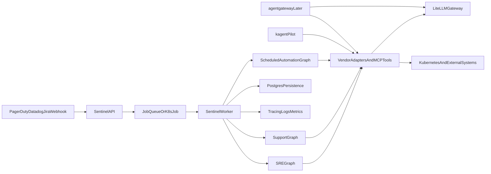

# Incorporating Kubernetes-Native Agent Management into Sentinel

## Recommendation

Sentinel already has a strong application-layer agent design: the SRE and support workflows are explicit Pydantic Graph pipelines in `[/Users/fengtian/projects/sentinel/src/sentinel/interfaces/graphs/sre_investigation.py](/Users/fengtian/projects/sentinel/src/sentinel/interfaces/graphs/sre_investigation.py)` and `[/Users/fengtian/projects/sentinel/src/sentinel/interfaces/graphs/support_review.py](/Users/fengtian/projects/sentinel/src/sentinel/interfaces/graphs/support_review.py)`, with model routing already centralized through LiteLLM in `[/Users/fengtian/projects/sentinel/src/sentinel/interfaces/graphs/agents/utils.py](/Users/fengtian/projects/sentinel/src/sentinel/interfaces/graphs/agents/utils.py)`.

The best path is not to migrate the workflow logic into a new framework immediately. Instead:

- Keep Sentinel as the orchestration and business-logic layer.
- Make execution more Kubernetes-native by separating API-triggered requests from long-running agent jobs.
- Use `kagent` first as an experiment for Kubernetes-local tool execution and cluster troubleshooting agents.
- Hold `agentgateway` for a later phase when Sentinel has multiple MCP/agent backends, needs policy-driven routing, or wants a shared gateway for agents/tools/models.

## Why This Fits the Current Codebase

- Current triggers are synchronous HTTP webhooks in `[/Users/fengtian/projects/sentinel/src/sentinel/interfaces/api/routers/sre/router.py](/Users/fengtian/projects/sentinel/src/sentinel/interfaces/api/routers/sre/router.py)` and `[/Users/fengtian/projects/sentinel/src/sentinel/interfaces/api/routers/support/router.py](/Users/fengtian/projects/sentinel/src/sentinel/interfaces/api/routers/support/router.py)`. That works for POCs but is the main blocker for scale and reliability.
- The Helm chart already anticipates a background runtime via the disabled `worker` deployment in `[/Users/fengtian/projects/sentinel/helm/sentinel/values.yaml](/Users/fengtian/projects/sentinel/helm/sentinel/values.yaml)`, but no worker process exists yet.
- Sentinel already has the right extension seams for job execution and outputs: persistence hooks in `[/Users/fengtian/projects/sentinel/src/sentinel/interfaces/graphs/common.py](/Users/fengtian/projects/sentinel/src/sentinel/interfaces/graphs/common.py)`, DB session lifecycle in `[/Users/fengtian/projects/sentinel/src/sentinel/data/database.py](/Users/fengtian/projects/sentinel/src/sentinel/data/database.py)`, and vendor/tool adapters under `[/Users/fengtian/projects/sentinel/src/sentinel/domain/](/Users/fengtian/projects/sentinel/src/sentinel/domain/)`.
- Holmes integration is currently still a placeholder in `[/Users/fengtian/projects/sentinel/src/sentinel/domain/sre/holmes_adapter.py](/Users/fengtian/projects/sentinel/src/sentinel/domain/sre/holmes_adapter.py)`, so adopting a Kubernetes-native execution framework before firming up that boundary would add platform complexity before solving the core investigation-runtime gap.

## Target Architecture

## Phase 1: Make Sentinel Runnable as a Reliable Platform Workload

Create a first-class asynchronous execution model before introducing new OSS control planes.

Work to plan:

- Add a worker entrypoint that can execute `investigate_alert()` and `review_ticket()` outside the request path, reusing the existing graphs in `[/Users/fengtian/projects/sentinel/src/sentinel/interfaces/graphs/sre_investigation.py](/Users/fengtian/projects/sentinel/src/sentinel/interfaces/graphs/sre_investigation.py)` and `[/Users/fengtian/projects/sentinel/src/sentinel/interfaces/graphs/support_review.py](/Users/fengtian/projects/sentinel/src/sentinel/interfaces/graphs/support_review.py)`.
- Refactor routers so webhooks enqueue work and return quickly instead of doing full investigations inline. The current sync execution happens in `[/Users/fengtian/projects/sentinel/src/sentinel/interfaces/api/routers/sre/router.py](/Users/fengtian/projects/sentinel/src/sentinel/interfaces/api/routers/sre/router.py)` and `[/Users/fengtian/projects/sentinel/src/sentinel/interfaces/api/routers/support/router.py](/Users/fengtian/projects/sentinel/src/sentinel/interfaces/api/routers/support/router.py)`.
- Decide on execution primitive for v1: Kubernetes `Job`/`CronJob` for coarse-grained runs, or an in-cluster queue-backed worker if throughput and retries matter. Given the current Helm scaffolding, a worker plus `CronJob` support is the most natural fit.
- Add first-class scheduled automation entrypoints so “every Thursday at 5pm, inspect repos and raise a PR” becomes a native Sentinel use case rather than ad hoc scripts.

## Phase 2: Strengthen Observability and Feedback Loops

Improve the “how do I make sure it keeps getting better over time” concern before adding more agent frameworks.

Work to plan:

- Standardize run-level identifiers, status transitions, and persisted outcomes for all agent executions using the existing DB and persistence hooks in `[/Users/fengtian/projects/sentinel/src/sentinel/application/sre/persist.py](/Users/fengtian/projects/sentinel/src/sentinel/application/sre/persist.py)` and `[/Users/fengtian/projects/sentinel/src/sentinel/application/support/persist.py](/Users/fengtian/projects/sentinel/src/sentinel/application/support/persist.py)`.
- Wire support persistence into the graph path, since the support side already has persistence primitives but not full pipeline integration.
- Add OpenTelemetry/Datadog tracing around graph runs, tool calls, and model invocations; Sentinel currently has structured logging and `instrument=True` on the PydanticAI agents, but not a full run-trace story.
- Define eval datasets and replayable regression checks for SRE and support workflows, using the roadmap’s evaluation direction in `[/Users/fengtian/projects/sentinel/docs/roadmap.md](/Users/fengtian/projects/sentinel/docs/roadmap.md)`.

## Phase 3: Pilot kagent Where It Has a Clear Advantage

Use `kagent` for the cluster-native parts Sentinel does not already do well.

Best-fit pilot:

- Build a Kubernetes troubleshooting agent that specializes in in-cluster diagnosis and tool invocation for scenarios like “deployment X failed on platform Y” or “investigate this Kubernetes alert”.
- Keep Sentinel as the external-facing product/API and let this pilot act as a specialized execution/tooling backend.
- Start with a narrow boundary: Kubernetes, Prometheus, Helm, Argo, or MCP-backed cluster tools that are awkward to embed directly into Sentinel.

Concrete integration shape:

- Sentinel remains the top-level orchestrator and delegates certain investigation steps to a `kagent`-backed tool/agent through a new adapter boundary near `[/Users/fengtian/projects/sentinel/src/sentinel/domain/sre/holmes_adapter.py](/Users/fengtian/projects/sentinel/src/sentinel/domain/sre/holmes_adapter.py)`.
- Do not rewrite the full SRE graph in `kagent` initially.
- Use the pilot to answer whether Kubernetes-native CRDs, dashboards, and OTEL traces improve operability enough to justify broader adoption.

## Phase 4: Introduce agentgateway Only If Sentinel Becomes Multi-Plane

`agentgateway` is most valuable once Sentinel has enough traffic, policies, and backends to need a dedicated control/data plane.

Adopt it when one or more become true:

- Sentinel exposes MCP servers or consumes many MCP backends that need auth, retries, policy, and routing.
- Multiple agent runtimes exist, such as Sentinel workers plus `kagent` agents plus external model/tool backends.
- You want centralized control over agent-to-agent communication, LLM/provider routing, backend auth, and traffic policy in Kubernetes.

Near-term position:

- Keep LiteLLM as the model gateway.
- Treat `agentgateway` as a future edge/control-plane candidate for MCP, A2A, and backend policy, not as the first thing to add.

## Deliverables

- Architecture note comparing `Sentinel-only`, `Sentinel + worker/CronJob`, `Sentinel + kagent pilot`, and `Sentinel + kagent + agentgateway`.
- A concrete worker/scheduler design for this repo and Helm chart.
- A pilot proposal for one Kubernetes-native troubleshooting agent.
- An observability/evaluation plan that ties run telemetry to quality improvement over time.

## Success Criteria

- Webhook and manual APIs stop depending on long synchronous in-request execution.
- Sentinel can run ad hoc, event-driven, and scheduled agents in Kubernetes with a clear home for each.
- SRE investigations gain a stronger cluster-native troubleshooting path without rewriting the whole system.
- The project has a measurable feedback loop for quality, latency, failures, and operator trust.
- Any adoption of `kagent` or `agentgateway` is justified by a specific operational pain point rather than novelty.

