# RFC-001: Sentinel for the hedge fund — AI SRE & global LLM observability

| | |
|---|---|
| **Status** | Draft v0.2 (week 2 of role) |
| **Author** | Ollie Tian |
| **Date** | 2026-04-25 |
| **Reviewers** | DevOps lead, Head of Platform Engineering, Compliance, Risk |
| **Decision deadline** | Before commit to v0 implementation (target: end of May 2026) |

**Revision history**

| Version | Date | Notes |
|---|---|---|
| v0.1 | 2026-04-25 | Initial draft |
| v0.2 | 2026-04-25 | Constraints update: PagerDuty exposes MTTA/MTTR (not MTTI); request_id UUID propagated as the OTEL trace_id; added §4.6 (runbook prompt vs skill), §12 (database schema), §13 (OTEL + Langfuse wiring), §3.3.1 (case-history retrieval), §14 (8-week delivery plan), three-team profile split (SRE/DevOps/ACE), per-team Langfuse projects |
| v0.3 | 2026-04-25 | Decisions ratified (tentative, validate week 1): D-11 on-prem LLMs only via LiteLLM proxy → vLLM; D-12 codebase as sub-package in firm's platform monorepo; D-13 reuse firm's LiteLLM/OTEL/Langfuse/shared Postgres; D-14 v0 publishes only to a compliance/platform shadow channel. Plan tightened in §14. |
| v0.4 | 2026-04-25 | Conflict scan + cleanup: **D-01 reset to PydanticAI + LangGraph** as the working choice (was tentatively OpenAI Agents SDK, re-opened with internal advocacy — recommendation in §15.14 carried through to all framework references); MTTI dropped as a top-level goal (unmeasurable from PD), replaced by MTTA delta + Sentinel-internal `time_to_first_AI_summary`; v0 approval flow scoped to **data structures only** (no Slack interactivity until v1); Appendix A library table rewritten; `TODO: /research` markers added on ambiguous topics (evals, HolmesGPT shape, vector DB, embedding model, judge implementation, WORM archive) so the implementation agent can trigger local research skills; package layout fixed (teams as packages, runbooks_path → runbooks_paths plural). |

---

## TL;DR

Build a tenant-aware AI SRE platform that ingests AlertManager/PagerDuty alerts, matches a deterministic runbook (with semantic fallback), enriches with VM and cluster context, runs a HolmesGPT + Harness-aware investigation agent, and publishes a redacted summary back to Slack. Every LLM call goes through the firm's **LiteLLM proxy → on-prem vLLM** (D-11). Every step — prompt, tool call, output, decision — is traced through **Langfuse** (per platform-eng team) plus a regulator-grade Postgres trace store with **per-PM row-level security**. Permissions are read-only by default, scoped per cluster × namespace × tenant, and never crossed. Agent harness on **PydanticAI + LangGraph** (D-01 v0.4); see §15.14.

**Strongest opinions, up front (so we can argue about them now, not later):**

1. **Runbooks live in git as the source of truth.** Confluence is a write-side editor only — pages are pulled into the repo nightly, normalised, hashed, and versioned. The agent never reads Confluence live at investigation time. RAG is a fallback retriever, not a generator-replacement. Web search is denied by default; only a curated allowlist of canonical upstream docs (Prometheus, ArgoCD, kube-prometheus-stack, Harness) is permitted.
2. **PM information barriers are enforced in five layers, not one.** RBAC, app-layer tenant scoping, LiteLLM per-tenant routing, output redaction, and trace-store row-level security. Any single layer can fail without breaching the barrier — that's the definition of a defence-in-depth control good enough for compliance.
3. **The agent is read-only.** No `kubectl exec`, no `kubectl delete`, no Harness pipeline triggers, no Grafana annotation writes. Any action that mutates state goes through a separately-authenticated approval flow with a human on the loop. We don't lift this restriction until eval-driven dev gives us 95th-percentile groundedness for at least two quarters.
4. **One agent harness, one trace ID, one replay bundle.** HolmesGPT and the custom investigation agent both run inside a wrapper that enforces capability tokens, evidence-grounded outputs, and full Langfuse + Postgres traceability. We do not let HolmesGPT call tools "out of band" of the harness.
5. **Deploy the agent control plane in the DevOps cluster, hub-and-spoke into target clusters.** One ServiceAccount per (target cluster, environment), namespace-scoped Roles bound at namespace level for per-PM isolation. Cross-account access via IRSA + assume-role chain. No agent pods inside PM namespaces.

---

## Table of contents

1. [Goals, non-goals, success criteria](#1-goals-non-goals-success-criteria)
2. [System overview & architecture](#2-system-overview--architecture)
3. [Data model — pipeline I/O at every stage](#3-data-model--pipeline-io-at-every-stage)
4. [Runbook management strategy](#4-runbook-management-strategy)
5. [Agent harness, guardrails, evals](#5-agent-harness-guardrails-evals)
6. [Deployment topology, RBAC, network](#6-deployment-topology-rbac-network)
7. [LLM observability with Langfuse](#7-llm-observability-with-langfuse)
8. [Risks, compliance, regulatory replay](#8-risks-compliance-regulatory-replay)
9. [Phased rollout & milestones](#9-phased-rollout--milestones)
10. [Requirements register](#10-requirements-register)
11. [Open questions & decision log](#11-open-questions--decision-log)
12. [Database schema — Sentinel app DB vs Langfuse DB](#12-database-schema--sentinel-app-db-vs-langfuse-db)
13. [OTEL pipeline + Langfuse integration](#13-otel-pipeline--langfuse-integration)
14. [The 2-month delivery plan — what to build, what to defer](#14-the-2-month-delivery-plan--what-to-build-what-to-defer)
15. [Code organisation — settings, common config, team plugins](#15-code-organisation--settings-common-config-team-plugins)

> **Note on file ordering:** §15 currently appears in the file *before* §12–§14 due to the order sections were appended. A clean re-order is in the v0.5 backlog; for now, follow the ToC for narrative order or jump via the anchors above.

---

## 1. Goals, non-goals, success criteria

### 1.1 Problem statement

The DevOps team operates a multi-region, multi-environment Kubernetes estate where each portfolio manager (PM) has a dedicated namespace (and in some cases a dedicated cluster slice). On-call engineers spend the majority of incident time on **triage and context-gathering** — pulling the same logs, checking the same dashboards, correlating the same Harness deploys, before any actual remediation begins. A PM-bound bug that surfaces as `pod CrashLoopBackOff` is investigated identically every time, by hand.

Three forces compound the cost:

- **Multi-tenancy of investigators.** Two PMs may both be experiencing alerts at the same minute; the on-call engineer cannot share context across them without breaching the information barrier. Every investigation starts from zero.
- **Runbook entropy.** Runbooks live in Confluence, in `.md` files in random repos, in Slack threads, in upstream Prometheus docs. Engineers either skip the runbook (faster but inconsistent) or trawl Confluence (slower and out of date).
- **Vendor sprawl in LLM tooling.** Without a central LiteLLM proxy and Langfuse, every team that wants to use an LLM ends up bringing their own SDK, their own keys, their own logging. Compliance cannot tell which calls saw MNPI.

### 1.2 Goals (in priority order)

1. **Reduce MTTA (mean-time-to-acknowledge) by 50% and MTTR (mean-time-to-resolve) by 25%** within two quarters of v1 deployment, measured from PagerDuty's `acknowledged_at` and `resolved_at` timestamps. Sentinel can't directly reduce time-to-resolve a bug, but it can shave the investigation portion of MTTR. As an internal leading indicator we track `time_to_first_AI_summary = published_at - alert_received_at`, logged in our DB.
2. **Standardise LLM observability** across the firm: every LLM call (regardless of vendor or model) is observable in Langfuse with prompt version, model, token usage, cost, latency, tenant, and trace ID — and is replayable end-to-end from a single `replay <trace_id>` command.
3. **Encode runbook knowledge** as machine-executable skills, with cryptographic versioning, tag-based selection, and a feedback loop from real incidents.
4. **Establish hedge-fund-grade information barriers** between PMs at the agent layer, audited and replayable for regulators.
5. **Build a foundation for further automation** (eg. Slack-driven investigation, `/sentinel` slash command, scheduled fleet health checks) without rewriting the agent harness.

### 1.3 Non-goals

- **Automated remediation.** v1 does not `kubectl rollout restart`, does not trigger Harness rollbacks, does not change feature flags. We may revisit in v3 once eval coverage and groundedness scores justify it.
- **AI Support Agent (Jira).** Out of scope for v1; the architecture must not preclude it, but we are not building it now. Concentrate the team on getting AI SRE production-grade for one PM first.
- **Cross-PM analytics.** No "incident postmortem across all PMs this quarter" features in v1 — too easy to get the information barrier wrong while still learning the operational shape.
- **Custom fine-tuned models.** v1 uses general-purpose models routed through LiteLLM. Fine-tuning is a v3 conversation once we have golden datasets and labelled feedback.
- **Replacement of Datadog / Grafana / PagerDuty.** Sentinel consumes from these tools, it does not replace them.

### 1.4 Sentinel serves three platform engineering teams (each with a different shape of customer)

Sentinel is one platform with **three opinionated profiles**, one per Platform Engineering team. Each team is a customer with its own runbooks, tools, alert sources, output channels, eval data, and Langfuse project. The platform shares: ingress, agent harness, LiteLLM proxy, trace store, RBAC plumbing, OTEL pipeline.

| Profile | Team | Primary alert sources | Primary tools | Output target | KPI |
|---|---|---|---|---|---|
| **`sre`** | SRE | AlertManager, Datadog, PagerDuty | Grafana, Prom/Loki/Tempo, K8s read API | On-call engineer in `#sre-oncall-<team>` | MTTA/MTTR reduction; alert fatigue down |
| **`devops`** | DevOps | Jenkins build/deploy webhooks, Harness pipeline events | Jenkins API, Harness API, K8s read API | DevOps on-call in `#devops-oncall` | Pipeline-failure first-response time; build-recovery rate |
| **`ace`** | Advanced Computing Engineering | Linux node alerts (disk, memory, process), VM monitoring | SSH-equivalent read-only commands, `df`, `top`, `vmstat`, journalctl reads | **The PM directly, via Slack DM, with self-serve guidance** | Reduce escalation rate to ACE engineer (PMs handling their own routine VM issues) |

**Why this matters for the design:**

- **Per-team runbook catalogues** (`runbooks/sre/`, `runbooks/devops/`, `runbooks/ace/`). Different vocabulary, different conventions. Cross-team runbooks are rare — keep the boundaries clean. Some shared primitives (a generic "container CrashLooping" runbook can be inherited by both SRE and DevOps) but the team profile owns the active set.
- **Per-team tool catalogues**. SRE doesn't need `jenkins_get_build_log`; DevOps doesn't need `loki_query`. Smaller per-team tool sets = tighter prompts = fewer hallucination opportunities. The harness loads only the tools the team's profile authorises.
- **Per-team Langfuse projects** (see §7.2). SRE engineers see SRE traces; they don't sift through DevOps noise. Each team owns its own eval datasets, prompt versions, and cost dashboards.
- **ACE's output flips the audience.** The other two teams' agents talk *to* an engineer. ACE's agent talks *to the PM directly*, with the explicit goal of resolving routine issues without involving an engineer at all. That changes:
  - **Tone of the published message** — instructional, step-by-step, accessible. Not "high-confidence root cause: ENOSPC on /var".
  - **Quality gate threshold** — much higher. Posting "rm -rf /var/log/*" to the wrong PM is a much worse failure than posting a wrong investigation to an engineer who can correct it.
  - **Approval flow** — the first time a particular guidance template is sent to a PM, ACE engineer reviews and approves. Subsequent identical guidance sends auto-approve, with daily digest to ACE for review. After 30 days of clean digests for a template, full auto-approve.
  - **Read-only tool surface** — the agent can `df`, `du`, `cat /proc/meminfo`, but cannot run anything mutating. The PM runs the actual fix; the agent walks them through it.
  - **Confirmation loop** — after the PM reports they've done the steps, the agent re-runs the diagnosis to confirm the issue is resolved. This is a multi-turn conversation, not a one-shot post.

**Cross-cutting:** all three profiles share the five-layer information barrier (§5.7). PM-namespace separation applies the same way regardless of which team's profile is running.

**Implementation cost of three profiles:** lower than building three separate platforms because the harness, primitive tools, PydanticAI + LangGraph runtime, redactor, trace store, and OTEL pipeline are shared. The team-specific bits are: runbook catalogue, tool subset, system prompts, Langfuse project, output channel routing, approval policy. All driven by Helm values and the `*TeamConfig` discriminator in §15.

**Rollout strategy implication:** v0/v1 ships with **one profile (SRE)** because that's the closest match to the prior Sentinel work, has the largest alert volume, and benefits most from the engineer-facing investigation pattern. v2 brings DevOps online (similar shape, different tools). v3 brings ACE online — ACE is the highest-stakes deployment because of the direct-to-PM channel; takes longest, ships latest, requires the most eval data first.

### 1.5 Success criteria (measurable)

| Metric | v1 target | v2 target | Measurement source |
|---|---|---|---|
| MTTA reduction (p50) | -50% | -75% | PagerDuty `acknowledged_at - triggered_at`. With Sentinel posting a useful summary in the PD note within seconds, the on-call's first ack is faster because they know what they're acking. |
| MTTR reduction (p50) | -25% | -45% | PagerDuty `resolved_at - triggered_at`. Sentinel doesn't fix the bug, but it shaves the investigation portion of MTTR. |
| Time-to-first-AI-summary (p95) | < 90s | < 60s | Sentinel `published_at - alert_received_at`. This is our internal SLO; Sentinel's analogue of MTTI. Logged in our DB, not PD. |
| **(ACE only)** Self-serve resolution rate | > 40% | > 65% | % of ACE alerts where PM completes guidance steps and confirms resolution without ACE-engineer involvement |
| **(ACE only)** ACE escalation reduction | -25% | -50% | Tickets that previously went to ACE rota but now self-served via Sentinel guidance |
| **(DevOps only)** Pipeline first-response time (p50) | -40% | -60% | `first_human_action - pipeline_failed_at` from Jenkins/Harness webhook |
| Agent investigation latency (p95) | < 90s | < 60s | OTEL trace duration (= Langfuse trace duration; same `trace_id`) |
| Investigation groundedness rate | > 90% | > 97% | Eval framework + manual sample audit |
| PM data leakage incidents | 0 | 0 | Compliance audit (zero-tolerance) |
| Engineer-rated usefulness (👍/👎 on Slack) | > 65% | > 80% | Slack reaction telemetry |
| Runbook coverage (alerts that match a runbook) | > 70% | > 90% | Pipeline metric |
| Cost per investigation (model) | < $0.20 | < $0.10 | Langfuse cost field |
| Replay reproducibility | 100% | 100% | `replay --diff` test job (regulatory requirement) |

---

## 2. System overview & architecture

### 2.0 One-page architecture (Excalidraw-editable SVG)

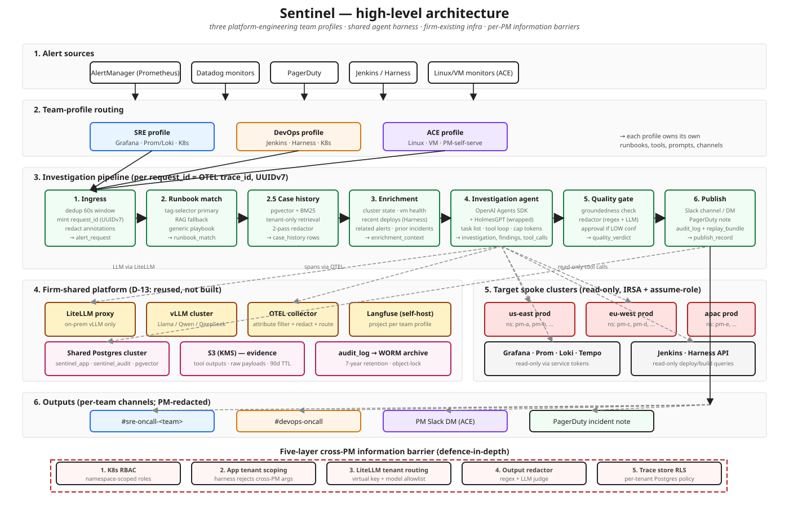

*To edit: open `diagrams/sentinel-architecture.svg` in [Excalidraw](https://excalidraw.com/) (File → Open → SVG import). Re-export and commit when done.*

The picture above is the single-glance overview. The Mermaid component map below is the same shape with more annotations and is the version reviewers should leave inline comments on.

### 2.1 Component map

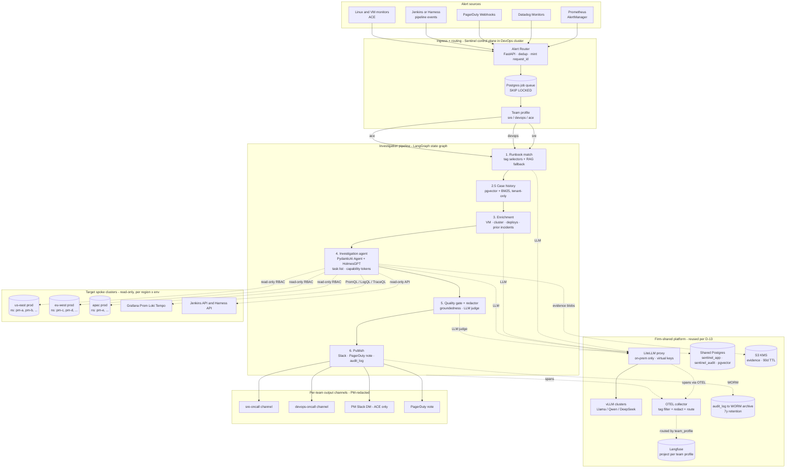

### 2.2 Why this shape

I'm reusing the Pydantic Graph DAG shape from the prior Sentinel (Octopus) project — that code path is well-tested and the compliance team there already accepted the audit-log model. The hedge fund changes that justify a fresh repo, not a fork:

- **LiteLLM proxy, not SDK in-process.** Every call must hit a network proxy that enforces per-tenant API keys, model allowlists, MNPI-classified-context routing (internal model only), prompt budgets, and a per-call audit trail independent of the application. The prior Octopus design used the SDK in-process, which is faster but doesn't give you a single chokepoint for compliance to inspect.
- **Hub-and-spoke topology.** The agent control plane runs in the DevOps cluster; investigation tools reach into spoke clusters via cross-account read-only roles. The prior project ran in the same cluster as its targets, which is fine for one team but breaks when you have 50+ PM namespaces across regions.
- **Five-layer information barriers.** The prior project had a single tenant. Here we lift identity-aware multi-tenancy into every layer (RBAC, app, LiteLLM, redactor, trace-store).

### 2.3 Agent framework: PydanticAI + LangGraph

> **D-01, v0.4:** Working choice is **PydanticAI for the LLM-loop agents** + **LangGraph for stateful sub-graph orchestration**. OpenAI Agents SDK is a viable alternative; the comparison and the contingent on-prem-model tool-use eval are in §15.14. Confirm before week 2 (see O-10).

**Use PydanticAI for the LLM-loop agents.** Specifically:
- The **investigation agent** (multi-iteration tool loop, the heart of the system) — runs as a PydanticAI `Agent` with typed `tools=[...]` and `output_type=<frozen attrs/Pydantic model>`.
- The **redactor / quality-gate LLM judge** — single-shot Pydantic-typed output; cheaper smaller on-prem model.
- Sub-agents called via LangGraph nodes if eval data later justifies specialised composites (eg. `diagnose_crashlooping_pod`).

**Use LangGraph for the orchestration shape.** Our pipeline DAG (ingress → match → cases → enrich → investigate → gate → publish) is **deterministic, not LLM-decided**. LangGraph models that as a state graph with explicit edges; the agent's iteration loop lives inside a single node. Three benefits over the alternative ("plain async with handoffs"):
- LangGraph's checkpoint primitive is purpose-built for replay determinism — drops a lot of custom code from §3.8.
- The graph definition is the diagram. No drift between the doc and the code.
- Stateful interrupts (eg. "wait for human approval before publishing") are first-class, not bolted on.

**Why this split:**

| Layer | Tool of choice | Reason |
|---|---|---|
| Pipeline orchestration (deterministic, stateful) | **LangGraph** state graph, OTEL spans per node | Replay-friendly checkpoints; graph IS the diagram; first-class interrupts |
| LLM agent loop (stochastic, tool-using) | **PydanticAI** `Agent(model=..., tools=[...], output_type=...)` | Strong typed outputs; native OTEL via `instrument=True`; battle-tested with on-prem models served through LiteLLM |
| Pipeline state passed between LangGraph nodes | Frozen `attrs` dataclasses (see §3) | Immutability, audit hashes, type safety |
| Cross-node sub-agent specialisation (when justified) | LangGraph sub-graphs OR PydanticAI `Agent.handoff()` if framework-level handoffs land | Both work; choose per-case |

**Routing PydanticAI through the LiteLLM proxy.** PydanticAI supports `litellm:` as a model prefix that delegates to `litellm.acompletion`. We point `litellm` at the firm's proxy via `LITELLM_BASE_URL` (or the explicit `Model` constructor) and use the per-request virtual key from the envelope. The model-name strings (eg. `litellm:llama-3.3-70b-instruct`) match what the team configs declare in `model_id_primary`/`model_id_judge` (§15.7, §15.8).

**OTEL.** PydanticAI emits OTEL spans natively (`Agent(..., instrument=True)`). LangGraph emits OTEL spans for each node transition when the OTel instrumentor is registered. We do **not** need a custom trace processor — much smaller §13.3 (was a custom `OTELTraceProcessor` for OpenAI Agents SDK; with PydanticAI + LangGraph, just bootstrap OTel and turn instrumentation on).

**What we gain over OpenAI Agents SDK:**
- Strong structured-output guarantees (Pydantic models on every output, with retries on validation failure).
- Better tool-use reliability with on-prem open models served through LiteLLM (the prior Octopus project shipped this on PydanticAI with Llama-class models).
- Replay determinism via LangGraph checkpoints.
- Consistency with the prior Octopus codebase, which compresses author velocity.

**What we accept:**
- LangChain ecosystem touchpoint via LangGraph. Mitigated by not depending on broader LangChain abstractions — we use LangGraph as a state-graph runtime, nothing else.
- One firm-internal team prefers OpenAI Agents SDK. Resolved by the §15.14 conversation (O-10).
- Less of a "guardrails" abstraction. We get the equivalent via LangGraph `interrupt()` plus our custom quality gate (§5.6).

### 2.4 LiteLLM proxy as the LLM chokepoint — on-prem only (D-11)

The firm's standard is: **all LLM calls go through the firm's LiteLLM proxy, which routes only to on-prem models.** External providers (Anthropic Cloud, OpenAI, etc.) are out of scope. The case-history retrieval, the investigator agent, the redactor LLM judge — all of them call LiteLLM, which routes to vLLM clusters running inside the firm's perimeter.

**Concrete shape:**

```
PydanticAI Agent (inside a LangGraph node)
   ↓  Model("litellm:llama-3.3-70b-instruct",
   ↓        base_url="https://litellm.platform.internal/v1",
   ↓        api_key="<sentinel-virtual-key>")
LiteLLM proxy (firm-shared, already deployed)
   ↓  routing rules per virtual key →
       ─ "llama-3.3-70b-instruct"  → vllm-llama.platform.internal
       ─ "qwen-2.5-72b-instruct"   → vllm-qwen.platform.internal
       ─ "deepseek-v3-instruct"    → vllm-deepseek.platform.internal
on-prem vLLM endpoints (firm-shared GPU cluster)
```

What we *don't* operate (because the firm already does, per D-13): the LiteLLM proxy, the vLLM clusters, the GPU infrastructure. We request virtual keys from the platform-platform team and consume.

**Implications for the design:**

- **Cost shape changes** from per-token to GPU-time billing. The Langfuse cost field for our calls reflects whatever cost-model the LiteLLM proxy reports (typically a per-token-equivalent based on the firm's GPU amortisation). Cost dashboards still work; the absolute numbers will be lower-but-also-less-predictable than cloud per-token pricing.
- **Model quality is whatever the on-prem fleet supports.** Llama 3.3 70B Instruct, Qwen 2.5 72B Instruct, DeepSeek-V3 are reasonable starting points; we validate tool-use quality during week 1–2 (see §14.3). For the redactor / judge, a smaller/cheaper on-prem model (Llama 3.1 8B class) is sufficient; for the investigator, we want at least a 70B-class model.
- **No data egress to external LLM providers.** Removes a whole class of compliance concerns. The redactor's role narrows: it protects against cross-PM leakage and accidental MNPI-in-output, not "this prompt left the building".
- **Failover is between on-prem models, not providers.** If the primary vLLM cluster is degraded, LiteLLM falls back to a secondary on-prem cluster (potentially serving a smaller model with lower quality). Code-level: we tag preferred + fallback models per agent role and let LiteLLM route.
- **Per-tenant routing still applies.** Even in an all-on-prem world, LiteLLM virtual keys still carry `tenant_id`, `team_profile`, `pii_class` headers — the proxy enriches OTEL spans with them, and per-tenant rate limits / spend caps still kick in.

**What LiteLLM proxy is responsible for:**

- Auth via virtual keys (one per agent role × team).
- Per-tenant routing tags forwarded as OTEL span attributes.
- Per-tenant rate limiting and budget enforcement.
- Request/response logging into Langfuse.
- Model allowlist enforcement: an MNPI-class request is allowed only on the on-prem fleet (which it is by definition under D-11; the allowlist is then about which *on-prem* models are tool-use-validated for MNPI).
- Failover between on-prem clusters.

We **don't** put LiteLLM proxy in the request path for tool calls — only LLM calls. Tool calls go directly from the agent to Kubernetes/Grafana/Harness with the agent's read-only credentials.

**Validation work in week 1–2:** before the investigator agent goes anywhere near a real cluster, run a tool-use eval suite (eg. `BFCL` Berkeley Function-Calling Leaderboard, plus a custom set tied to our tool catalogue) against each candidate on-prem model. Pick the smallest model that hits ≥85% tool-call accuracy on our eval. The result drives `model_id_primary` in `investigation` rows.

---

## 3. Data model — pipeline I/O at every stage

You asked specifically for input/output shapes. I'm using `attrs` with `frozen=True` because (a) immutability by default is your stated preference, (b) we want every payload to be hashable for audit, (c) the trace store needs deterministic JSON serialisation. Pydantic on the API edge for validation, attrs internally.

The guiding principle for these schemas: **every payload carries a triplet of (`tenant_id`, `trace_id`, `pii_class`).** That triplet is what the harness, the proxy, and the redactor key off. If a payload doesn't have it, it doesn't move.

### 3.0 Lifecycle of one alert — sequence diagram

End-to-end view of a single SRE alert from AlertManager fire to redacted Slack publish, with the request_id threading through. The shadow-mode v0 loop replaces the bottom `Slack` lane with `#sentinel-shadow` and skips the on-call interaction.

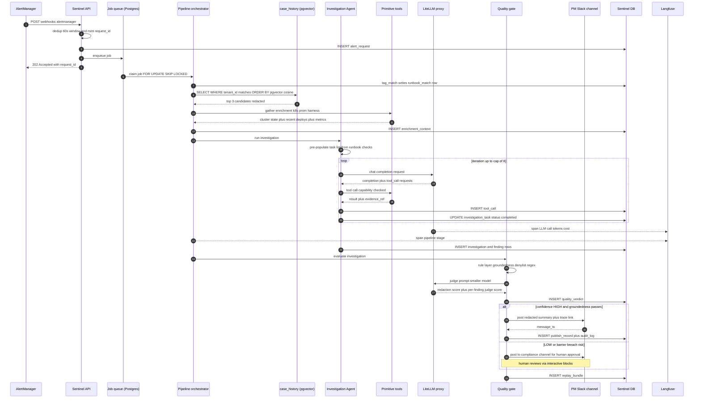

### 3.1 Common envelope (every pipeline message has these fields)

Every API ingress mints a single UUIDv7 (or v4 — see §12 for why v7) and uses it as both the API-level `request_id` and the OTEL `trace_id`. **Same value, two names.** This gives us one ID that joins Sentinel's DB, Langfuse, OTEL traces, Slack messages, PagerDuty notes, and the replay bundle.

```python
from datetime import datetime
from enum import Enum
from typing import Literal
from uuid import UUID
from attrs import frozen, field

class PIIClass(str, Enum):
    PUBLIC = "public"          # no firm-internal info
    INTERNAL = "internal"      # firm-internal but not MNPI
    CONFIDENTIAL = "confidential"  # cross-PM aggregates, no positions
    MNPI = "mnpi"              # holdings, PnL, position sizes — strict barrier

@frozen(kw_only=True, slots=True)
class Envelope:
    request_id: UUID                   # = OTEL trace_id; minted at API ingress; THE id everything else joins on
    parent_span_id: UUID | None
    tenant_id: str                     # PM identifier — ALWAYS present
    cluster_id: str                    # eg. "us-east-prod"
    region: Literal["us-east", "eu-west", "apac"]
    environment: Literal["prod", "dev"]
    pii_class: PIIClass
    ingested_at: datetime              # UTC
    source: Literal["alertmanager", "datadog", "pagerduty", "manual"]
    schema_version: str = "v1"

    @property
    def trace_id(self) -> UUID:
        """Same value as request_id; aliased for OTEL conventions."""
        return self.request_id
```

**Why one ID, two names:** at the API/HTTP layer "request_id" is the convention (logged in nginx, returned in HTTP response headers, looked up in the DB). At the OTEL/observability layer "trace_id" is the convention (used by SDKs, dashboards, span attribute names). Forcing both to the same UUID means an engineer pulling a thread from any layer lands at the same trace. The only translation: OTEL trace_id is conventionally a 128-bit hex string, but UUIDv4/v7 *is* a 128-bit value — we serialise it as the OTEL hex format when emitting spans.

Every subsequent payload `extends` the envelope (composition not inheritance — attrs `frozen` doesn't play with multiple inheritance cleanly; we copy the envelope into each payload as `envelope: Envelope`).

### 3.2 Stage 1 — alert ingress

**Input** (from AlertManager webhook v4 / PagerDuty common event format, normalised):

```python
@frozen(kw_only=True, slots=True)
class IngestedAlert:
    envelope: Envelope
    alert_id: str                      # provider's stable id (fingerprint or PD incident_id)
    fired_at: datetime
    resolved_at: datetime | None
    status: Literal["firing", "resolved", "ack'd"]
    severity: Literal["P1", "P2", "P3", "P4", "P5"]   # firm-normalised
    summary: str                       # max 256 chars
    description: str                   # max 4096 chars; truncated
    labels: tuple[tuple[str, str], ...]  # (immutable; sorted; from Prom labels)
    annotations: tuple[tuple[str, str], ...]
    generator_url: str | None          # link back to source system
    runbook_url_hint: str | None       # the `runbook_url` annotation if present
    raw_payload_hash: str              # SHA-256 of original payload, stored in evidence bucket
```

**Output** = same `IngestedAlert`, persisted into the job queue with `status='enqueued'`.

**Why not just pass the raw webhook through?** Two reasons. First, dedup — multiple sources fire on the same incident; we key on `(provider, alert_id)` and reject duplicates within a 60s window before doing any LLM work. Second, redaction — annotations sometimes contain PII or MNPI by accident (a debug log copy-pasted into an annotation). The redactor agent inspects annotations against a denylist before they hit the LLM.

### 3.3 Stage 2 — runbook match

**Input:** `IngestedAlert`.

**Output:**

```python
@frozen(kw_only=True, slots=True)
class RunbookMatch:
    envelope: Envelope
    alert_id: str
    method: Literal["tag", "rag", "fallback_generic"]
    matched_runbook: RunbookHandle | None     # None means generic playbook
    candidates: tuple[RunbookCandidate, ...]   # top-k with scores, for explainability
    match_confidence: float                    # 0..1
    selection_reason: str                       # human-readable reason for the selection

@frozen(kw_only=True, slots=True)
class RunbookHandle:
    runbook_id: str                  # eg. "k8s-crashloop"
    version_sha: str                 # git SHA where the runbook was edited
    content_sha: str                 # SHA-256 of the runbook body — distinct from version_sha
    applies_to: tuple[str, ...]      # tag selectors that matched (for trace)
    source: Literal["git", "rag", "external_curated"]

@frozen(kw_only=True, slots=True)
class RunbookCandidate:
    handle: RunbookHandle
    score: float
    matched_via: Literal["exact_tag", "regex_tag", "embedding"]
```

**Why include candidates, not just the winner?** Compliance asked the obvious question: when the agent's investigation goes wrong, can you tell the regulator *why this runbook and not another?* Storing top-k with scores answers that without us having to re-execute the matcher.

### 3.3.1 Stage 2.5 — case-history retrieval (similar past investigations)

A new stage between runbook match and context enrichment. Retrieves past investigations *for the same tenant* that resemble the current alert, and surfaces their resolutions to the investigation agent. As the agent sees more real production traffic, this becomes a learned memory — without retraining the model.

**Why this earns a stage of its own**, not just a tool call:
- It runs *unconditionally* (every investigation benefits from "have we seen this before?"), not at the agent's discretion. Stage = always-on; tool = optional.
- Its output is a fixed-shape context, not free-form. Agent sees a curated summary, not a sea of past prompts.
- The information-leakage controls live at this stage. Compliance audits this one entry-point, not every tool call.

**Input:** `IngestedAlert + RunbookMatch`.

**Output:**

```python
@frozen(kw_only=True, slots=True)
class CaseHistory:
    envelope: Envelope
    alert_id: str
    candidates: tuple[CaseCandidate, ...]    # top-k, ranked
    retrieval_method: Literal["tenant_only", "team_anonymised", "none"]
    leakage_check_passed: bool                # MUST be True; set by the redactor verifier
    duration_ms: int

@frozen(kw_only=True, slots=True)
class CaseCandidate:
    case_id: UUID                  # = original investigation's request_id
    similarity: float              # 0..1
    summary: str                   # already-redacted text, safe to inject into prompt
    runbook_id_used: str | None
    confirmed_root_cause: str | None    # only present if marked correct via /sentinel mark-cause
    occurred_at: datetime
    helpful_actions: tuple[str, ...]    # remediation steps that worked
    is_anonymised: bool                 # True if from cross-PM team-anonymised pool
```

The agent sees `candidates` as part of its context. Each candidate has only fields safe for prompt injection — full investigations are NOT embedded, only redacted summaries.

**Two retrieval modes:**

1. **`tenant_only`** (default): `WHERE tenant_id = current_tenant_id AND status = 'completed' AND confirmed_root_cause IS NOT NULL`. Same PM, full fidelity. The summary text was redacted at *index* time, but is now safe to show to anyone with that PM's access.

2. **`team_anonymised`** (opt-in, compliance-approved): a separate "patterns pool" containing only the *category-level* signal from past investigations across PMs. PM identifiers, folder paths, ticker symbols, position values are scrubbed by an aggressive redactor at index time; what survives is "alertname X with labels Y commonly has root cause Z". Useful for SRE/DevOps profiles where the patterns are fungible across PMs. **Not used for ACE** because the patterns there are too tied to per-PM environments.

**Redaction-at-index, not redaction-at-retrieval**, is the rule. We never store sensitive content in the case-history index. If the redactor at index time fails to scrub something, we must not retrieve it later — but if we made the mistake of indexing it, we are exposed. So:

- The redactor runs at index time and writes both `summary_redacted` and `summary_redaction_score` (LLM-judged 0..1, must exceed 0.9 to be indexed at all).
- A second-pass redactor runs at retrieval time *as a defence in depth*. If it finds anything sensitive, the candidate is dropped *and* the indexed row is flagged for re-redaction.
- Anonymised pool indexing requires a quarterly compliance audit of a sample of indexed rows.

**Information-leakage controls (the part you asked about specifically):**

| Control | Where | What it protects |
|---|---|---|
| Index-time redactor | Runs as part of post-investigation persistence | Stops MNPI from ever entering the case-history store |
| Index-time leakage score | Same | Refuses to index rows with low redaction score |
| Tenant filter at retrieval | SQL `WHERE tenant_id = ...` enforced by the harness, *and* by row-level security | Belt-and-braces: if app-layer leaks tenant_id boundary, RLS still enforces |
| Anonymised-pool separation | Two separate vector indexes; team-anonymised pool is a strict subset of fields with stricter redaction | Cross-PM patterns visible only after a second redaction pass and only for case-fungible categories |
| Retrieval-time second-pass redactor | Runs on every candidate before injection into agent prompt | Defence in depth |
| `is_anonymised` flag in candidate | Set on CaseCandidate | Agent's prompt knows which candidates are anonymised; quality gate scrutinises ungrounded use |
| Case-history disabled for `pii_class=mnpi` until compliance signs off | Hard gate at the harness | Conservative default for the strictest data class |

**RAG retrieval mechanics:**

- pgvector extension on the same Postgres as the trace store. (Avoids introducing a new vector DB; volumes are well within pgvector's comfort zone for the next 18 months.) **TODO: /research** confirm the firm's shared Postgres cluster supports `pgvector` (gates D-16); fallback is a dedicated RDS instance just for case-history.
- Embedding model: a small open model self-hosted via vLLM (eg. `BAAI/bge-m3` or `intfloat/e5-mistral-7b-instruct`) — running embeddings through external providers has the same MNPI risk as running the LLM there, so we keep it on-prem. **TODO: /research** benchmark BGE-m3 vs e5-mistral-7b vs Linq-Embed-Mistral on a held-out set of Sentinel alert fingerprints before committing.
- Embedded text: alert labels (sorted, stable) + alert summary + runbook_id_used + redacted root_cause text. Concatenated with separators that the embedding model handles cleanly.
- Hybrid retrieval: pgvector cosine similarity + BM25 (tsvector) on the same fields. Reciprocal rank fusion at the top — pure embedding misses exact-string matches that engineers care about.
- Top-k = 5 by default; agent sees at most 3 in the prompt (top-3 + a "1 more available" hint).

**Storage layout** (foreshadowing §12.3.15):

A `case_history` table with `tenant_id`, `team_profile`, vector column, and the redacted text. A separate `case_pattern` table for the anonymised pool (no `tenant_id`, has `team_profile`).

**Pipeline integration:**

```
(stage 2) RunbookMatch
   ↓
(stage 2.5) CaseHistory                 ← NEW
   ↓
(stage 3) EnrichmentContext             ← input now includes CaseHistory
   ↓
(stage 4) Investigation                 ← agent prompt includes case candidates
   ↓
(stage 5) QualityGate
   ↓
(stage 6) Publish
                                          ↓ (post-publish, async)
                                        IndexCase                  ← writes to case_history
                                        (only if confirmed-correct
                                         via /sentinel mark-cause)
```

The post-publish indexing is *gated on confirmation*. We don't index every published investigation — only those where the on-call engineer or PM confirms the diagnosis was correct. Otherwise we'd be teaching the agent its own mistakes. The `feedback` table's `mark_cause` events drive the index job.

### 3.4 Stage 3 — context enrichment

**Input:** `IngestedAlert + RunbookMatch`.

**Output:**

```python
@frozen(kw_only=True, slots=True)
class EnrichmentContext:
    envelope: Envelope
    alert_id: str
    cluster_state: ClusterStateSnapshot         # pods, deployments, recent events
    vm_health: VMHealthSnapshot                 # cpu, mem, disk, load1/5/15, top processes
    recent_deploys: tuple[HarnessDeploy, ...]   # last 10 deploys to this ns from Harness
    related_alerts_window: tuple[RelatedAlert, ...]  # other alerts in same ns/last 30m
    prior_incidents: tuple[PriorIncidentRef, ...]    # historical investigations same labels
    enrichment_duration_ms: int
    enrichment_warnings: tuple[str, ...]        # eg. "Harness API timeout, 5/10 deploys retrieved"

@frozen(kw_only=True, slots=True)
class VMHealthSnapshot:
    node_name: str                   # k8s node hosting the pod, NOT the underlying host name
    cpu_pct_p95_15m: float
    mem_used_pct: float
    disk_root_used_pct: float
    load_1m: float
    top_processes: tuple[ProcessInfo, ...]   # name + cpu_pct + rss_bytes; **process args redacted**

@frozen(kw_only=True, slots=True)
class HarnessDeploy:
    pipeline_id: str
    execution_id: str
    deployed_at: datetime
    deployed_by: str                # service account, not human (humans redacted unless explicitly opted in)
    status: Literal["success", "failed", "rolled_back"]
    artifact_version: str
    diff_summary: str | None        # one-line summary of what changed (from Harness)
```

**Critical detail:** `top_processes` redacts process args. A common compliance miss is that `ps aux` output contains command-line arguments which can include the literal name of an MNPI directory (eg. `/data/pm-acme/positions-2026Q1.parquet`). We strip `argv[1:]` and only keep `argv[0]`. If we need the args for an investigation, the human escalates and the redactor releases them by hand.

### 3.5 Stage 4 — investigation agent

The agent is the only stage that runs a tool-using LLM loop.

**Input:** `IngestedAlert + RunbookMatch + EnrichmentContext`.

**Output:**

```python
@frozen(kw_only=True, slots=True)
class Investigation:
    envelope: Envelope
    alert_id: str
    findings: tuple[Finding, ...]
    root_cause_hypothesis: str
    confidence: ConfidenceScore                  # multi-factor, see below
    remediation_steps: tuple[RemediationStep, ...]
    tool_calls: tuple[ToolCallRecord, ...]       # full audit trail of every tool call
    evidence_refs: tuple[EvidenceRef, ...]       # pointers to raw outputs in evidence bucket
    agent_decisions: tuple[AgentDecisionRecord, ...]   # internal decisions for replay
    duration_ms: int
    token_usage: TokenUsage
    cost_usd: float

@frozen(kw_only=True, slots=True)
class Finding:
    text: str                        # human-readable claim
    evidence_refs: tuple[str, ...]   # MANDATORY — at least one. Quality gate rejects ungrounded findings.
    severity: Literal["info", "warn", "critical"]

@frozen(kw_only=True, slots=True)
class ToolCallRecord:
    span_id: UUID
    tool_name: str
    args_redacted: dict[str, object]    # MNPI/PII scrubbed before persistence
    args_hash: str                       # of pre-redaction args, for replay
    started_at: datetime
    duration_ms: int
    exit_code: int | None
    output_truncated: str                # first 1KB
    output_full_ref: str                 # S3 path with KMS encryption + retention
    output_full_hash: str
    policy_decision: Literal["allowed", "blocked"]
    policy_rule_id: str | None

@frozen(kw_only=True, slots=True)
class ConfidenceScore:
    label: Literal["LOW", "MEDIUM", "HIGH"]
    overall: float                  # 0..1
    source_count: float             # how many independent evidence refs
    relevance: float                # how relevant the evidence is to the finding
    recency: float                  # how fresh the evidence is
    weights: tuple[tuple[str, float], ...]   # for explainability; sums to 1
```

**Three things that are non-obvious here:**

- **`evidence_refs` is mandatory on every `Finding`.** The quality gate at stage 5 rejects any investigation where a finding has no evidence ref. This is the single biggest lever you have on hallucination — no link to a tool call, no claim. Same pattern Anthropic Claude uses with citations and the same one I built into the Octopus Sentinel quality gate.
- **`policy_decision` on every tool call.** Even allowed ones. A "blocked" outcome carries `policy_rule_id` so we can audit which rule fired, and the agent gets a structured error back so it can adapt (without retry-bombing).
- **`agent_decisions` is for replay, not display.** The agent makes implicit choices — which tool to call next, when to stop iterating. Capturing these as structured records means the replay job can verify the agent makes the same decisions on the same inputs (or detect drift if it doesn't).

### 3.6 Stage 5 — quality gate + redaction

**Input:** `Investigation`.

**Output:**

```python
@frozen(kw_only=True, slots=True)
class QualityVerdict:
    envelope: Envelope
    alert_id: str
    decision: Literal["publish", "human_review", "reject"]
    redacted_summary: str            # safe to post to the PM's Slack channel
    redacted_findings: tuple[Finding, ...]
    issues: tuple[QualityIssue, ...]
    requires_approval: bool
    approver_role: Literal["oncall", "team_lead", "compliance"] | None

@frozen(kw_only=True, slots=True)
class QualityIssue:
    rule_id: str
    severity: Literal["info", "warn", "block"]
    message: str
```

The gate is **rule-based + LLM-judged**:

- Rule layer (deterministic, fast, runs first): groundedness check (every claim has evidence_refs), confidence-vs-publication-tier check (LOW must go to human), output-length cap, denylist regex (folder names, ticker symbols if not the PM's own).
- LLM layer (only if rule layer passes): a small "judge" model run via LiteLLM that scores the summary against a redaction rubric and asserts no MNPI leakage.

If `decision == "human_review"` we post the redacted summary to the compliance channel and persist `QualityVerdict` + `ApprovalRecord` to the DB. **In v0 (D-14, shadow mode) every output goes to the compliance channel anyway, so we ship the data structures only — no Slack interactive blocks, no approve/reject buttons.** Interactive approval becomes v1 work, gated on real human-channel publishing. The replay bundle still records the verdict and the (auto-recorded) decision so the v1 promotion is just adding the Slack interactive UI on top of stable persistence.

### 3.7 Stage 6 — publish

**Output:**

```python
@frozen(kw_only=True, slots=True)
class PublishResult:
    envelope: Envelope
    alert_id: str
    slack_message_ts: str | None
    slack_channel: str
    pagerduty_note_id: str | None
    published_at: datetime
    db_record_id: UUID
```

The Slack payload carries:
- The redacted summary
- The runbook handle (with link to git, not Confluence — the canonical version)
- The `trace_id` (so engineers can pull up the full Langfuse trace if they want)
- Reaction-based feedback buttons (👍 / 👎 / 🚨 — the third escalates to compliance)

### 3.7.1 Investigation state machine

The `investigation` row's `status` column transitions through a small state machine. Replays must produce the same final state for the same input.

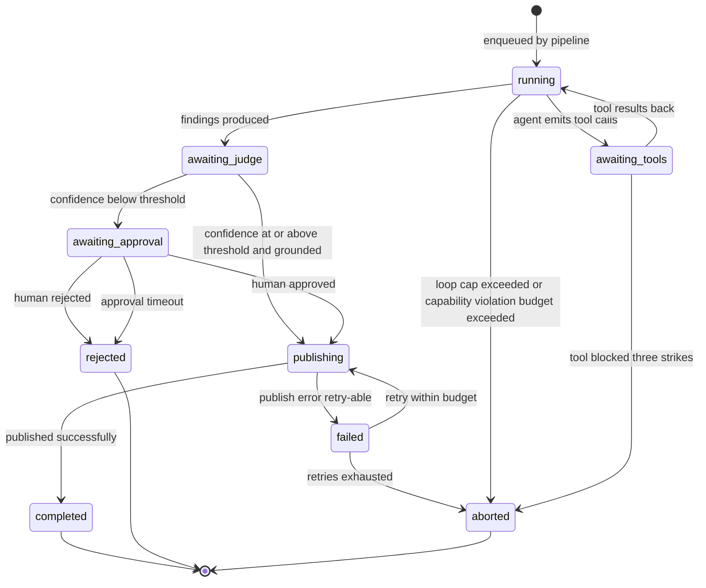

### 3.8 The trace bundle (the one record you replay from)

Every run produces a single `ReplayBundle` written to the trace store:

```python
@frozen(kw_only=True, slots=True)
class ReplayBundle:
    trace_id: UUID
    tenant_id: str
    pipeline_version_sha: str        # git SHA of the Sentinel repo at run time
    model_ids: tuple[str, ...]       # every model used
    prompt_versions: tuple[PromptHandle, ...]
    skill_handles: tuple[RunbookHandle, ...]
    mcp_servers: tuple[MCPServerHandle, ...]
    tool_call_records: tuple[ToolCallRecord, ...]
    agent_decisions: tuple[AgentDecisionRecord, ...]
    inputs_hash: str                 # SHA-256 of IngestedAlert
    outputs_hash: str                # SHA-256 of PublishResult
    started_at: datetime
    completed_at: datetime
    final_decision: Literal["published", "approved_then_published", "rejected", "errored"]
```

`replay <trace_id>` rebuilds the agent with the exact prompts, skills, MCP servers, model versions and inputs, and asserts the outputs match. This is the regulator's deliverable: "here is exactly what the agent saw and decided, and we can prove it again at any point."

---

## 4. Runbook management strategy

You named four candidate strategies — file-system-with-tags, RAG, live-Confluence-MCP, web-search/upstream — and asked specifically about unprecedented alerts. Here's the trade-off matrix and the hybrid I'd recommend.

### 4.1 The trade-off matrix

| Strategy | Match quality | Latency | Editor friction (for non-engineers) | Auditability | Failure modes | Verdict |
|---|---|---|---|---|---|---|
| **A. File system + tag selectors** (git-tracked) | High when tags are good; brittle when alert labels drift | Lowest (in-memory after startup) | High — non-engineers need to PR | Excellent — git SHA + content hash | Tag drift; runbook rot if not maintained | **Primary** |
| **B. RAG** (pgvector or similar) | Good for paraphrased / fuzzy intent; uneven for terse alert summaries | Medium (~50–200ms per query) | Same as primary source | Medium — indexed content can drift from source if pipeline broken | Embedding drift across model versions; can return spurious matches | **Secondary fallback** |
| **C. Live Confluence MCP** | Whatever the latest page says (good or bad) | Highest — Confluence search is slow, network-dependent | Lowest — editors keep their existing workflow | Poor — page versions hard to pin; Confluence retention may delete history | API outage = no runbooks; Confluence noise dominates; impossible to lock a version for replay | **Editor-side only — sync nightly into git** |
| **D. Web search / upstream repos** (`prometheus-operator/runbooks`, `holmesgpt/.../runbooks`, ArgoCD docs) | High for canonical issues; nothing for firm-specific issues | High and unreliable; rate-limited | None — public docs | None at retrieval time | Hostile content / poisoning; vendor SEO; outage of GitHub | **Curated allowlist only, ingested into git at index time** |

### 4.2 Recommended hybrid

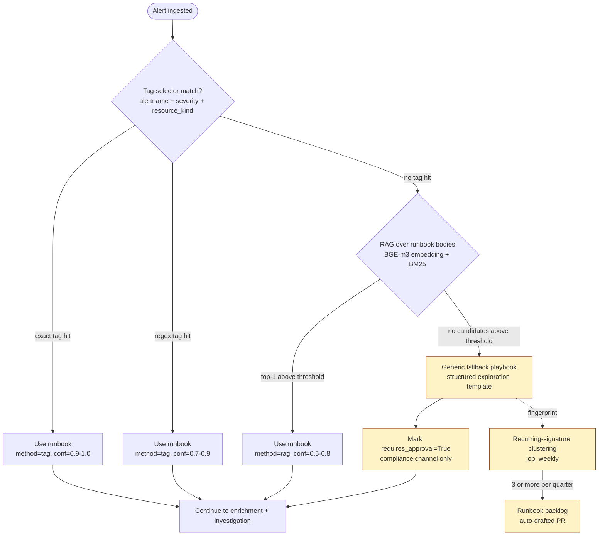

**Source of truth: a git-tracked runbook catalogue inside the Sentinel repo.** Same shape as the prior project's Skills (`SKILL.md` + frontmatter) but extended with hedge-fund metadata. Pulled into the agent harness deterministically at startup.

```
src/sentinel/runbooks/
├── k8s-crashloop/
│   ├── RUNBOOK.md            # frontmatter + body
│   ├── tools.yaml            # which tools this runbook authorises (capability scoping)
│   ├── checks.yaml           # validation queries: "after applying this, run X, expect Y"
│   └── tests.yaml            # eval fixtures: alert payload → expected runbook match
├── pod-pending-resources/
├── pvc-stuck/
├── harness-deploy-rollback/
└── _generic-investigation/   # the unprecedented-alert fallback playbook
```

**`RUNBOOK.md` frontmatter:**

```yaml
---
id: k8s-crashloop
version: 1.4.0
content_sha: <auto-computed at build time>
applies_to:
  alertname: ["KubePodCrashLooping", "PodRestartingTooOften"]
  severity_min: P3
  resource_kinds: ["Pod", "Deployment"]
  exclude_labels:
    pm_namespace: ["pm-acme-restricted"]   # opt-out per PM if needed
canonical_sources:                          # for human reference, not auto-fetched
  - https://github.com/prometheus-operator/runbooks/blob/main/content/runbooks/kubernetes/KubePodCrashLooping.md
  - https://github.com/HolmesGPT/holmesgpt/blob/master/holmes/plugins/runbooks/kubernetes.md
authors: [devops]
last_reviewed: 2026-04-12
mnpi_safe: true                            # safe to consult on MNPI-classified investigations
---
```

The body is free-form markdown for the agent — same as HolmesGPT's `runbooks/*.md`. It can include:
- The investigation hypothesis tree (what to check first, second, third)
- The tool-call sequences to gather evidence
- Common root causes with example evidence to confirm each
- Remediation suggestions (read-only — not commands the agent runs)

**Match logic, in priority order:**

1. **Exact tag match** on `alertname + severity + resource_kind`. Deterministic, near-zero latency, fully explainable. Covers the 70% of common alerts. If a runbook has `applies_to.alertname: ["KubePodCrashLooping"]` and the alert label is exactly that, the match is unambiguous.
2. **Regex tag match** on labels. For alerts where the alertname is parameterised (eg. `LatencyHigh_<service>`). Same explainability as exact, slightly looser matching.
3. **RAG over runbook bodies** (pgvector, BGE-m3 embeddings or similar). Only invoked when 1 and 2 yield no match above threshold. Returns top-k candidates with scores; the matcher LLM (small, cheap, via LiteLLM) picks the best of the candidates with a justification. The candidates are still drawn from git — not from Confluence, not from web.
4. **Generic investigation playbook** if RAG also yields nothing above threshold. This becomes the "unprecedented alert" path (see §4.4).

### 4.3 Confluence and upstream — write-side only, never read-side

This is the controversial recommendation but it's the right one.

**Confluence is an editor for non-engineers**, not a runtime data source. We accept the workflow cost: editors edit in Confluence, a nightly job pulls Confluence pages tagged `sentinel-runbook` into the Sentinel repo, normalises them against the schema, opens a PR with the diff. A platform engineer reviews and merges. Worst case the runbook lags by 24 hours — which is fine because runbooks aren't time-sensitive in the way the alert itself is.

**Why not live Confluence retrieval, even via MCP?**
- **Replay impossible.** A regulator asks "show me what the agent saw on 2026-03-14"; Confluence's revision history is best-effort and non-cryptographic. With git, you have the SHA.
- **Outage = no runbooks.** Sentinel is ops infrastructure; it cannot have a SaaS dependency on its hot path.
- **Noise floor.** Confluence has 50× more pages than runbooks; the search will return drafts, meeting notes, half-finished refactors. We are not using a curated source.
- **Latency.** Adding 1–3s per investigation for Confluence search is 1–3% of our 90s budget — but worse, it's variance we can't control.

**Why upstream (Prometheus operator / HolmesGPT) ingest, not live fetch?**
- The two repos you linked are gold for canonical patterns. We **do** want them. But we want them ingested at build time, normalised to our schema, and merged with "this is firm-internal-context" overlays. Our runbook for `KubePodCrashLooping` should *reference* the upstream guidance and then add the firm-specific bits (Harness deploy correlation, our PM namespace conventions, our Datadog dashboards).
- A daily sync job pulls these repos at known SHAs; CI pins the SHA into our lockfile. Same supply-chain hygiene as a third-party Python dependency.

### 4.4 Unprecedented alerts

Two failure modes:

**(a) Alert never seen before.** The matcher hits the generic fallback playbook. The playbook is a structured exploration template:

```markdown
1. Scope: which namespaces / pods / services are affected?
   → tool: list_pods_in_namespace, list_recent_events
2. Timeline: when did this start, and what happened around then?
   → tool: query_prometheus_range, get_harness_deploys (last 24h)
3. Resource saturation: is the cluster healthy?
   → tool: query_node_metrics, check_pvc_status
4. Error volume: what errors are appearing in logs?
   → tool: query_loki_top_errors
5. Dependencies: are upstream services healthy?
   → tool: check_service_health_for_namespace
6. Hypothesis: state the most likely root cause; cite the evidence.
```

Every investigation that runs the generic playbook is **automatically marked `confidence=LOW` and `requires_approval=True`** at the quality gate. We do not publish unsupervised.

Each generic-playbook run also raises a "runbook gap" event into a separate dashboard. Once we see the same generic-playbook signature three times in a quarter, an engineer drafts a proper runbook and PRs it. Over time the long tail shrinks.

**(b) Alert matches a runbook but the runbook is wrong.** Detected via the feedback loop: 👎 reactions on Slack, manual `/sentinel correct-runbook` slash command. These feed into a curation queue that the platform team triages weekly.

### 4.5 Should runbooks be free-form prompts or structured skills? Both — at different layers.

You asked whether runbooks should be free-form text the LLM reads, or structured "skills" with frontmatter, tool capabilities, prescribed checks, etc. The right answer is **both, with a clean separation between the structured envelope (consumed by code) and the free-form body (consumed by the LLM)**. Doing only one of them is a mistake in different directions.

**Pure free-form text prompts (the "stuff a markdown file into the system prompt" approach):**

| | |
|---|---|
| Pros | Easy to author; full LLM context; nuance preserved; easy for non-engineers to review |
| Cons | Can't capability-scope (every runbook gets every tool); can't measure procedural compliance; can't auto-test; can't enforce safety rules per-runbook; no way to know "did the agent follow this runbook" without LLM-judging the trace; effectively HolmesGPT's current model |
| Verdict | Necessary for the LLM half but insufficient as the whole story |

**Pure structured skills (everything is YAML, the agent runs a state machine):**

| | |
|---|---|
| Pros | Deterministic; fully testable; capability-scoped; procedural compliance is a structural property |
| Cons | Brittle for messy real-world incidents; expensive to author; loses the agent's ability to deviate when the runbook is incomplete; effectively re-implementing Stackstorm or Rundeck |
| Verdict | Throws away the reason you brought an LLM in the first place |

**The right shape: structured envelope + free-form body.**

```
src/sentinel/runbooks/k8s-crashloop/
├── RUNBOOK.md            # frontmatter (structured) + body (free-form prompt for the LLM)
├── tools.yaml            # capability scope — which tools this runbook authorises
├── checks.yaml           # prescribed checks — what we expect the agent to do
├── tests.yaml            # eval fixtures — alert payloads with expected outcomes
└── examples/             # optional: redacted historical traces showing good investigations
```

The split:
- **What humans/code consume (structured)**: frontmatter (`id`, `version`, `applies_to`, `mnpi_safe`), `tools.yaml`, `checks.yaml`, `tests.yaml`. These are the artefacts the harness reads to set up the agent run, the eval framework reads to validate, and the quality gate reads to score procedural compliance.
- **What the LLM consumes (free-form)**: the markdown body. Investigation hypotheses, common root causes, examples of what good evidence looks like for each cause. Written like an experienced engineer would explain the alert to a junior — narrative, not state machine.

**`checks.yaml` is the structural anchor.** This is what makes procedural compliance measurable and what makes pre-populated investigation tasks (§5.9) work. Each entry maps a check ID to a tool-call signature:

```yaml
# src/sentinel/runbooks/k8s-crashloop/checks.yaml
prescribed_checks:
  - id: confirm_pod_state
    description: Confirm pod is actually CrashLooping (not stale alert)
    suggested_tools: [k8s_describe_pod]
    required: true
  - id: check_oom_events
    description: Look for OOM events in the namespace
    suggested_tools: [k8s_get_events]
    required: true
  - id: correlate_recent_deploys
    description: Look for Harness deploys in the last 30 minutes
    suggested_tools: [harness_recent_deploys]
    required: true
  - id: check_resource_limits
    description: Confirm CPU/memory limits and requests
    suggested_tools: [k8s_describe_deployment]
    required: false       # only relevant for resource-related crashloops
  - id: tail_recent_logs
    description: Last 100 log lines before crash
    suggested_tools: [k8s_get_pod_logs]
    required: true
```

The agent gets `checks.yaml` lifted into its task list (§5.9) and `tools.yaml` as its capability scope; it gets the markdown body as part of its prompt. It can do extra things if it wants (the harness allows extra tasks), but it has to do at least the `required: true` ones.

**`tests.yaml` is what makes runbook PRs reviewable.** Every runbook ships with golden alert payloads + expected outcomes. CI runs the runbook against the fixtures on every PR. A runbook with no tests doesn't merge.

```yaml
# src/sentinel/runbooks/k8s-crashloop/tests.yaml
fixtures:
  - id: oom-classic
    alert_path: fixtures/alerts/oom-classic.json
    expected_runbook_match_min: 0.9
    expected_hypothesis_keywords: ["memory", "OOMKilled", "limit"]
    expected_confidence_min: HIGH
    expected_required_checks_executed: [confirm_pod_state, check_oom_events, tail_recent_logs]
    forbidden_substrings_in_summary: ["pm-other-fund", "/data/restricted"]
```

**Why this is better than either extreme:**

- The LLM still has the rich, prose-y guidance it works best with (the RUNBOOK.md body).
- The harness has structured signals it needs for capability scoping, procedural compliance scoring, evals, and the task-list integration.
- Non-engineers (eg. SREs reviewing a runbook) read the markdown body, which is the part they care about. The yaml files are reviewed by engineers as part of the PR.
- A runbook can evolve: you might start with frontmatter + body + minimal checks, and add `tests.yaml` cases as real incidents reveal failure modes.

**Compared to HolmesGPT's runbooks**, which are pure free-form markdown: we keep their excellent prose where it's strong (and ingest theirs verbatim into our body section when relevant), but we add the capability-scoping and procedural-compliance machinery they don't have because they didn't need it for their threat model.

**Compared to a pure state-machine runbook system** (Rundeck-style): we keep the agent's flexibility to handle the long tail; the prescribed checks are *minimum bars*, not *complete plans*.

The lesson from the Octopus Sentinel project: the prior `domain/skills/` system was already this shape (frontmatter + markdown body), but lacked `checks.yaml` and `tools.yaml` — which is why procedural compliance scoring and per-runbook capability scoping were hard to retrofit. We're paying the structural cost up front this time.

### 4.6 Concrete reuse from the linked repos

| Source | What we take | How we take it |
|---|---|---|
| `prometheus-operator/runbooks` | Canonical alert→cause→check structure for Kubernetes / Prometheus alerts (`KubePodCrashLooping`, `KubeContainerWaiting`, `KubePersistentVolumeFillingUp`, etc.) | Daily sync job at pinned SHA → normalised into our schema → opens a PR; firm-specific overlays added by us |
| `HolmesGPT/holmes/plugins/runbooks` | Holmes's prompt-engineered investigation guidance per-category — proven to work with their `ToolCallingLLM` loop | Same daily sync; we keep their prose verbatim where it's strong, replace tool-call references with our tool names |
| Harness official docs | "Recent deploys → likely culprits" patterns | Manual ingest, low volume — these change rarely |
| Internal Confluence | Firm-specific runbooks | Nightly PR-bot |

The point: **runbooks are a curated, versioned, owned artifact** — the same way you'd treat a database schema or an API contract. Treating them like wiki pages is what makes them rot.

---

## 5. Agent harness, guardrails, evals

### 5.1 Tool design — primitive tools, never free-form code

You asked the right question: one-command-per-tool, agent-as-tools, or free-form code generation? Here's the trade-off and the recommendation.

| Approach | Pros | Cons | Verdict |
|---|---|---|---|
| **A. Primitive tools** — one tool per command, eg. `kubectl_get_pods(ns, label_selector)`, `prom_query_range(query, start, end)`, `harness_get_recent_deploys(ns, hours)` | Precise RBAC per tool; deterministic args; easy denylist (no `exec`, no `delete`); easy to evaluate (golden inputs → expected output); every tool is a unit of audit; same pattern HolmesGPT uses | Agent needs many round-trips to compose; prompt gets bigger as tool count grows | **Primary — this is the foundation** |
| **B. Agent-as-tool** — composite subagents like `pod_diagnostician(pod_name, ns)` that internally orchestrate a sequence of primitive ops | Fewer top-level tools shown to the planner; deep specialisation; subagent can be evaluated as a unit; reduces prompt size for the planner | Harder to scope RBAC at the subagent boundary; harder to replay (sub-loop ordering can be non-deterministic); easy to over-specialise and end up with a forest of subagents | **Selective — only when eval data shows the primitive sequence is suboptimal** |
| **C. Free-form code generation** — agent emits arbitrary `kubectl` / `bash` / Python and the harness executes | Maximally expressive; small prompt | Catastrophic blast radius (`kubectl exec` is one token away); near-impossible to safely allowlist; massive prompt-injection surface; auditing becomes shell-history forensics; replay determinism gone | **Hard reject for the hedge fund context.** |

**Recommendation: A as the foundation, B selectively, C never.**

- Start with ~30 primitive tools — five groups: `k8s_*` (read-only kube API), `prom_*` (PromQL/LogQL/TraceQL), `harness_*` (read-only Harness API), `slack_*` (write to PM channel only — guarded), and `evidence_*` (store/retrieve evidence refs). Each tool is a small, typed Python function with a Pydantic input schema and a typed output, registered into the agent via PydanticAI's `Tool` class or MCP.
- Each tool is **idempotent and side-effect-free** by construction. There is no `kubectl_delete_pod`, no `harness_trigger_pipeline`. Mutating actions are not in the tool catalogue at all in v1 — not "in the catalogue but denied", not in the catalogue.
- Add agent-as-tool patterns for **proven composite workflows** once a primitive sequence is empirically suboptimal. Eg. if eval data shows the agent always runs `get_pod → describe_pod → get_events → get_logs` in that order for `KubePodCrashLooping`, wrap that into `diagnose_crashlooping_pod(pod, ns)` as a subagent. The subagent's tools are the same primitives — it does not get a new privilege envelope.
- Free-form code generation is rejected. If a future investigation genuinely needs a kubectl pattern we don't ship, the engineer writes a new tool and PRs it. That cost is the right one to pay; the "agent emits a shell command" cost is not.

### 5.2 Tool catalogue (initial, illustrative)

```python
# k8s_*  — every tool scoped to a single (cluster, namespace) by the harness
k8s_list_pods(cluster: str, namespace: str, label_selector: str | None = None) -> list[PodSummary]
k8s_describe_pod(cluster: str, namespace: str, pod_name: str) -> PodDescription
k8s_get_events(cluster: str, namespace: str, since_minutes: int = 60) -> list[K8sEvent]
k8s_get_pod_logs(cluster: str, namespace: str, pod_name: str, container: str | None, since_seconds: int = 600, max_lines: int = 1000) -> str
k8s_get_deployment(cluster: str, namespace: str, deployment_name: str) -> DeploymentDescription
k8s_top_nodes(cluster: str) -> list[NodeMetrics]                # no namespace — cluster-level read

# prom_*
prom_query_instant(query: str, at: datetime | None = None) -> PromQueryResult
prom_query_range(query: str, start: datetime, end: datetime, step: str = "1m") -> PromRangeResult
loki_query_range(logql: str, start: datetime, end: datetime, limit: int = 200) -> LokiResult
tempo_search_traces(service: str, span_name: str | None, since_minutes: int = 30) -> TempoResult

# harness_*
harness_recent_deploys(namespace: str, hours: int = 24) -> list[HarnessDeploy]
harness_pipeline_executions(pipeline_id: str, count: int = 10) -> list[HarnessExecution]
harness_artifact_diff(execution_id: str) -> HarnessArtifactDiff

# evidence_*
evidence_store(content: str, content_type: str, ttl_days: int = 90) -> EvidenceRef
evidence_retrieve(ref: str) -> bytes

# meta
runbook_get(runbook_id: str) -> RunbookHandle
get_current_alert() -> IngestedAlert         # what fired this investigation
```

Notes on the schema:
- Every tool takes `cluster: str` explicitly. The harness checks against the alert's `envelope.cluster_id` and rejects calls that try to escape to a different cluster. This is the single most important piece of code in the harness.
- `namespace: str` is similarly checked against `envelope.tenant_id`. PM-A's investigation cannot list pods in PM-B's namespace, full stop. The check happens at the harness, not just at K8s — defence in depth.
- `k8s_top_nodes` is the only tool that reads cluster-level state. We allow it because node pressure is genuinely shared. The output redacts node labels that contain PM identifiers.

### 5.3 Capability tokens (the harness's kill-switch)

Each tool is gated by a **capability token** assigned at runbook load time. The runbook's `tools.yaml` declares which tools it can call:

```yaml
# src/sentinel/runbooks/k8s-crashloop/tools.yaml
allowed_tools:
  - k8s_list_pods
  - k8s_describe_pod
  - k8s_get_events
  - k8s_get_pod_logs
  - prom_query_range
  - harness_recent_deploys
  - evidence_store
denied_tools: []                        # explicit; empty means "everything not in allowed"
max_tool_calls_per_run: 30
max_loop_iterations: 8
```

The harness intercepts every tool call and checks against the active runbook's capability set. A call to a tool not in `allowed_tools` returns a structured error to the agent (`{"error": "tool_not_authorised_for_runbook", "rule_id": "cap-token-001"}`) and increments a counter. Three rejections in a single run abort the run.

The generic fallback playbook gets a strict-but-broader set; the quality gate compensates by always sending its outputs to human review.

### 5.4 Evidence groundedness

The single biggest lever on hallucination: **every claim must cite a tool call**. Implementation:

1. The `Finding` schema requires `evidence_refs: tuple[str, ...]` (non-empty).
2. The system prompt for the investigation agent says "every claim in your findings must be supported by at least one evidence_ref returned by a tool call this run". Cited at runtime not training time.
3. The quality gate runs a deterministic checker:
   ```python
   for finding in investigation.findings:
       if not finding.evidence_refs:
           verdict.issues.append(QualityIssue(rule_id="qg-grounded-001", severity="block", ...))
       for ref in finding.evidence_refs:
           if ref not in {tc.span_id for tc in investigation.tool_calls}:
               verdict.issues.append(QualityIssue(rule_id="qg-grounded-002", severity="block", ...))
   ```
4. Beyond format, a lightweight LLM judge (a smaller model via LiteLLM, eg. Haiku-class) is asked: "for each finding, does the cited evidence actually support the claim?" — returns a per-finding score. Findings below a threshold get downgraded or dropped.

This is the same pattern used in production by Anthropic Claude (citation-grounded responses) and by the Octopus Sentinel quality gate. The deterministic check catches format failures; the judge catches semantic failures.

### 5.5 Evals — three layers

**Layer 1: Unit-level tool tests.** Each tool has property tests. Inputs → output shape, no live cluster. Run on every PR.

**Layer 2: Pipeline golden cases.** Pairs of `(IngestedAlert, expected_outcome)` covering ~100 alert categories at v1. Each case asserts:
- Correct runbook matched
- Correct tools called (via tool-call recall/precision against a labelled gold sequence)
- Confidence within expected band
- No PM data leak in summary
- Investigation completed under latency budget

Run on every PR via `pydantic-evals` or DeepEval. **TODO: /research** the eval-framework choice — `pydantic-evals` is the obvious fit for a PydanticAI codebase but lacks dashboards/regression tracking; Braintrust and DeepEval add those at vendor cost. Pilot `pydantic-evals` in v0 (zero infra); re-evaluate before v1 with concrete pain points and budget.

**Layer 3: Shadow / live evaluation.** v0.5 runs in shadow mode for 4 weeks: agent investigates every alert but does **not** publish to Slack. Outputs are written to the trace store with a `shadow=true` flag. Engineers' actual investigations are scraped from PagerDuty + git log + Slack threads (via the existing on-call runbook). We compare:

- **Tool-call recall** vs human (did the agent gather the same evidence?)
- **Tool-call precision** (did the agent gather *only* the same evidence, or junk extras?)
- **Hypothesis agreement** (did the agent's root cause hypothesis match what the human concluded?)
- **Time-to-first-useful-evidence** (would the human have benefited from the agent's first 30 seconds of work?)

Only after shadow mode shows ≥85% hypothesis-agreement and ≥0 PM data leaks across 200 cases do we promote to v1 (publish to Slack with the on-call engineer's PM channel, behind the quality gate).

### 5.6 Validating that the agent is actually working

You asked three concrete questions. Each gets its own evaluation track because they measure different things and can fail independently.

#### 5.6.1 Track A — Did the agent diagnose the issue correctly?

This is the **outcome** question, and it's the only one stakeholders ultimately care about. Everything else is leading indicators.

**Definition of "correct diagnosis":** the agent's top-1 hypothesis matches the eventually-confirmed root cause of the incident. Confirmed root cause comes from:
- The on-call engineer's resolution comment in PagerDuty (free-text — needs LLM extraction into a structured `actual_root_cause` field).
- The postmortem document if one was written.
- A `/sentinel mark-cause <category>` slash command that the closing engineer types in the Slack thread (cheap to instrument, gives us labelled data).

**Metrics:**

| Metric | What it measures | Alarm threshold |
|---|---|---|
| `hypothesis_recall@1` | Of incidents with a confirmed cause, % where the agent's top-1 hypothesis category matches | < 70% v1, < 85% v2 → triage |
| `hypothesis_recall@3` | Same but top-3 (some incidents are genuinely ambiguous) | < 90% any time → triage |
| `time_to_correct_hypothesis` | If the agent got it right, how soon in the run did it converge? | p95 > 60s → tune prompts |
| `false_confidence_rate` | % of high-confidence diagnoses that were later corrected | > 5% → recalibrate confidence weights |
| `diagnosis_specificity` | LLM judge: was the hypothesis specific enough to act on, or vague ("something is wrong")? | < 0.7 mean score → prompt tune |

**How to populate the labels at scale:** the `/sentinel mark-cause` command + an LLM-extraction pass over PagerDuty resolution notes. Anything not labelled by either route falls into a weekly review queue that the platform team triages — at 2 incidents/PM/day across 20 PMs, that's ~280/week, of which probably 70% get auto-labelled, leaving ~80 for human review. Manageable.

**A/B baseline.** During v0.5 shadow mode (4 weeks), agent runs on every alert but doesn't publish. We compare its top-1 hypothesis to the human's actual diagnosis. Single number to gate v1: ≥85% agreement on a stratified sample of 200 incidents.

#### 5.6.2 Track B — Did the agent follow the runbook? Coverage, quality, and the runbook improvement loop

This is the **procedural** question, and it's the lever you pull to make the diagnosis question's number go up.

**Three states the agent can be in for any given incident:**

| State | What happened | What it tells you | Action |
|---|---|---|---|
| 1. **Runbook hit + followed** | A runbook matched on tags, agent executed the prescribed checks, hypothesis grounded in evidence | Best case. Build confidence here. | Promote runbook to "stable" tier; consider lifting to higher autonomy tier in future |
| 2. **Runbook hit + agent diverged** | Runbook matched, but agent took a different investigation path | Either the agent got smarter, or the runbook is wrong, or the runbook is too rigid | Curation queue: human reviews the run, decides whether to update the runbook or correct the agent's behaviour |
| 3. **No runbook hit (generic fallback)** | Agent ran the unprecedented-alert playbook | Coverage gap | Backlog item: write a real runbook if this signature recurs ≥3× per quarter |

**Detecting which state:** straightforward instrumentation in the harness.

```python
@frozen(kw_only=True, slots=True)
class AdherenceMetrics:
    runbook_id: str | None                          # None → state 3
    prescribed_checks: tuple[str, ...]              # from the runbook's `checks.yaml`
    executed_checks: tuple[str, ...]                # tool calls actually made, mapped back to the runbook's check IDs
    procedural_compliance: float                    # |executed ∩ prescribed| / |prescribed|
    extra_checks: tuple[str, ...]                   # tool calls beyond the runbook's prescription
    state: Literal["hit_followed", "hit_diverged", "no_runbook"]
```

`procedural_compliance` is the single number that says "did the agent do what the runbook told it to do?". Track per-runbook over time.

**Runbook quality scoring.** Each runbook gets a rolling-30-day scorecard:

| Field | Computed from |
|---|---|
| `match_rate` | runs where this runbook matched / alerts in the runbook's `applies_to` scope |
| `procedural_compliance_p50/p95` | from `AdherenceMetrics` |
| `hypothesis_recall@1` | when this runbook fired, did the agent get the diagnosis right? |
| `mean_confidence` | average `ConfidenceScore.overall` |
| `human_thumbs_up_rate` | from Slack reactions on investigations using this runbook |
| `compliance_audit_pass_rate` | from compliance's quarterly sample |

Runbooks below thresholds (eg. hypothesis_recall@1 < 70%) go to a curation queue. The platform engineer who owns the runbook gets the score, the failing traces, and a one-week SLA to either (a) revise the runbook or (b) demote the runbook to "needs-rewrite" and route its alerts to the generic playbook in the meantime.

**Closing the runbook improvement loop (the part most teams skip):**

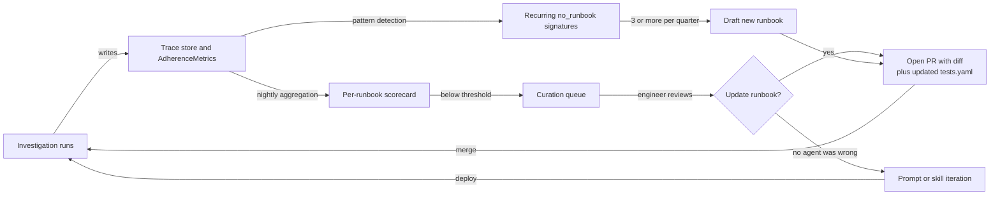

Two specific automations worth building early:

- **Diff-runbook job.** When a curation engineer reviews a "hit + diverged" trace, they can `/sentinel propose-runbook-edit <trace_id>` — a small LLM job summarises the divergence into a suggested runbook diff, saves it as a draft PR. Engineer reviews and merges. This is how the runbook keeps up with reality without becoming a full-time editing job.
- **Recurring-signature clustering.** Weekly job clusters generic-playbook traces by alert label fingerprint + agent hypothesis. Any cluster with ≥3 incidents flags as a runbook candidate. The platform engineer who picks it up gets a starter draft auto-generated from the cluster's traces (LLM job).

**Building confidence from groundedness — the procedural-confidence loop.** When the agent follows the runbook AND every claim is grounded in evidence cited by tool calls AND the procedural compliance is high, we *can* trust that branch. Concretely:

```
confidence_publish_tier =
    base_confidence (from ConfidenceScore)
    × runbook_track_record_multiplier (runbook's hypothesis_recall@1 over last 90d)
    × procedural_compliance_factor (how closely this run followed the runbook)
    × groundedness_factor (% of findings with passing judge score)
```

Above the high tier → publish without approval. Middle tier → publish to PM channel with a "AI-generated, please verify" disclaimer. Low tier → human review before publish. The thresholds shift quarterly based on observed accuracy.

#### 5.6.3 Track C — When the agent is using "self-intelligence" (autonomous tool use), how do we know it's working?

This is the genuinely-hard question — how do you validate an agent that's making its own decisions about which tools to call?

You cannot validate by prescribing the answer; the agent's value is choosing intelligently. So you validate **process** and **outcome** independently, and triangulate.

**1. Reference traces from senior engineers (golden runs).** For each alert category, capture how a senior engineer actually investigates — what tools they query, in what order, what they conclude. We instrument the on-call's terminal (opt-in, audited) and Slack thread to capture this. Build a labelled dataset of `(alert, expert_tool_sequence, expert_hypothesis)`. Then for each run, score:

   - **Tool-call recall vs expert** — `|agent_tools ∩ expert_tools| / |expert_tools|`. Did the agent gather the evidence the expert would have?
   - **Tool-call precision vs expert** — `|agent_tools ∩ expert_tools| / |agent_tools|`. Did the agent gather only useful evidence, or also junk?
   - **Sequence Levenshtein** — how close is the agent's tool order to the expert's? Order matters because some tools answer cheaply and the expert short-circuits.

   Recall is more important than precision in v1; we'd rather the agent over-investigate (cheap LLM calls) than miss key evidence.

**2. Outcome-blind LLM judge.** Independent LLM (different model from the investigation, via LiteLLM) gets the alert + the trace + the hypothesis but not the resolution. Asked to score:
   - Is the trace coherent (did the agent's reasoning chain follow logically)?
   - Did the agent investigate the obvious things first before going deep on a tangent?
   - Is the hypothesis adequately supported by the cited evidence?
   - Are there obvious things the agent should have checked but didn't?

   The judge's scores correlate with eventual diagnostic accuracy — useful as a real-time leading indicator before you have ground-truth labels.

**3. Self-consistency (cheap, surprisingly effective).** Run the agent twice on the same alert (different seed). If the two runs produce the same hypothesis, confidence is high. If they diverge, the run is ambiguous and gets routed to human review even if individual confidence scores are high. ~doubles cost on alerts you choose to consistency-check, so apply selectively (eg. runs that would otherwise auto-publish). **TODO: /research** specifically how on-prem Llama-class models behave under temperature/seed variation — some open models have weaker stochasticity than closed ones, in which case self-consistency loses signal.

**4. Statistical anomalies on the trace.** Track per-investigation distributions:
   - Tool calls per run (median, p99). A run with 50 tool calls is suspect (loop trap or confused agent) — auto-flag for review.
   - Token usage. Outliers either indicate the agent is stuck in a loop or that the alert is genuinely complex; the harness already caps `max_loop_iterations`.
   - Time to first tool call. If high, the agent spent too long thinking — prompt issue.
   - Re-tool ratio (same tool with similar args, called multiple times). High → confused agent.

**5. Adversarial / negative tests.** Synthesised alert payloads with:
   - Misleading annotations ("this is definitely a database issue" when it isn't)
   - Cross-PM data injected into descriptions (must not appear in summary)
   - Prompt injection attempts in log lines and pod names
   - Empty/missing labels
   
   Run nightly. Pass rate is a hard gate.

**6. Replay-diff CI job.** Pick the last 100 production traces, replay each, assert the published output matches. Surfaces non-determinism (an MCP server returning different tool schemas, model drift on a non-pinned version) before a regulator notices.

**7. Online compliance audit.** Quarterly: compliance picks 30 random traces, manually walks each, checks (a) no MNPI leak, (b) all findings grounded, (c) replay matches. Pass rate becomes a regulator-facing metric.

**Putting it together — the dashboard.** Single Grafana page (one per PM + global) with:

- Top: outcome metrics (hypothesis_recall@1, MTTA delta, time_to_first_AI_summary p95, human-rated usefulness)
- Middle: procedural metrics (runbook coverage, procedural_compliance, evidence groundedness pass-rate, judge score)
- Bottom: agent-health metrics (latency p95, cost per investigation, tool-call-count distribution, replay reproducibility)

Each metric has an alert threshold; any breach pages the platform engineer (not the on-call SRE — Sentinel's reliability is the platform team's responsibility, not the team it serves).

### 5.6.4 Three validation tracks at a glance

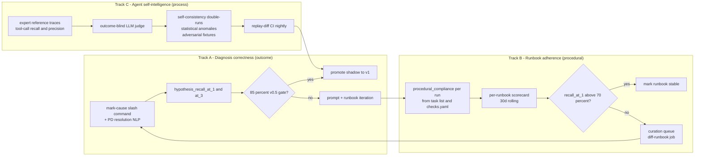

### 5.7 Per-PM information barriers — five enforcement layers

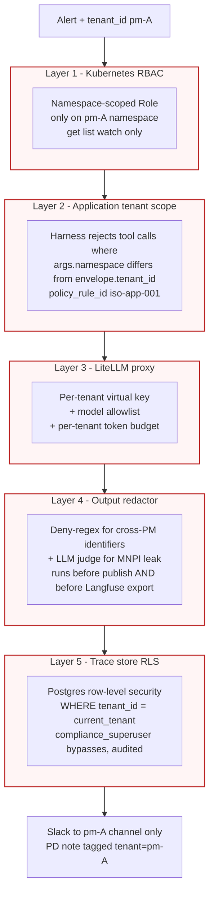

Each layer is independent — failure of any single layer does not breach the barrier. That's the property compliance signs off on.

You asked specifically about "private information like folder names in a portfolio manager's VM won't be seen by another PM". The barrier is enforced in five places:

1. **Kubernetes RBAC.** The agent's ServiceAccount in cluster `us-east-prod` has a namespace-scoped `Role` for *every* PM namespace (granted via separate RoleBindings). When the harness invokes a tool, it presents a token derived from the PM-specific RoleBinding only. So even if the application layer were buggy, the K8s API would reject a list-pods call to `pm-other`.
2. **Harness application layer.** The tool router rejects any tool call where `args.namespace != envelope.tenant_id`. Logged with `policy_decision="blocked"` and `policy_rule_id="iso-app-001"`. Three blocks → run aborts → compliance alert.
3. **LiteLLM proxy.** Each tenant has its own virtual key. The application sets `tenant_id` as a header on every LLM call; the proxy enforces the model allowlist for that tenant. MNPI-classified tenants can only route to internal-VPC models. The proxy logs the `(virtual_key, model, tenant_id, prompt_hash)` for compliance — so even if app code lies about the tenant, the proxy's independent log catches it.
4. **Output redactor.** Before publishing, the redactor runs a deny-list regex *and* a small LLM judge against the summary, scrubbing:
   - PM identifiers other than the originating PM
   - Folder paths from other PMs (the redactor has a static map of `pm_id → forbidden_paths`)
   - Ticker symbols / position values (heuristic + LLM judge)
   - Any token that matches `pm-(?!{originating_pm})\w+`
5. **Trace store row-level security.** The Postgres schema has `tenant_id` on every relevant table; PostgreSQL RLS policies enforce that queries only see rows for the connected tenant. Langfuse uses one project per PM (or RLS within a single project — depends on Langfuse's RLS support; needs validation). Compliance queries with a "compliance-superuser" role that can see across tenants but is heavily audited.

The principle: any single layer can fail without breaching the barrier. That's defence-in-depth and that's what compliance will accept.

### 5.8 HolmesGPT integration — fully traced, not "out of band"

> **TODO: /research** — the integration shape below was sketched against HolmesGPT's state in early 2026. Before committing in week 6, verify (a) the upstream `robusta-dev/holmesgpt` repo's `Toolset` interface is unchanged; (b) the Logfire/OTel hooks haven't been replaced by something incompatible; (c) the LLM client abstraction allows the LiteLLM-proxy redirection we describe; (d) whether the firm's preferred fork (was `offtian/holmesgpt@httpx-compat` at Octopus) is still maintained. If any of these have shifted, pin to the last-known-good commit and document the gap.


HolmesGPT is great at the "ask LLM, run a tool, ask again" loop. But its default integration calls tools directly with its own credentials and traces with its own logger. We can't have that.

**Integration shape:**
- HolmesGPT runs **inside** our agent harness, not alongside it.
- HolmesGPT's `Toolset` interface gets a custom adapter that dispatches every tool call through our harness's policy gate (capability tokens, tenant scoping, evidence-store callbacks).
- HolmesGPT's LLM calls go through LiteLLM proxy via the `litellm:` provider prefix (HolmesGPT supports this).
- Every HolmesGPT iteration is wrapped in a Langfuse span as a child of the investigation's parent span.
- HolmesGPT's "investigate" output is treated as a `Finding` candidate; it goes through our quality gate just like a finding from our custom investigation agent.

This is the same pattern the prior project used (`HolmesAdapter` wrapping the SDK). The hedge fund version adds the policy gate and the per-tenant LiteLLM routing.

The custom Harness-skilled agent runs *in addition* to HolmesGPT, not instead of it. Where HolmesGPT covers Kubernetes/Prometheus/Loki investigations well, our custom agent specialises in:
- **Harness deploy correlation.** "Was there a deploy in the affected namespace in the last 30 minutes?" "What changed in the artifact?" "Has this pipeline been failing recently?"
- **Per-PM context awareness.** Knowing which Slack channel, which on-call rotation, which runbook overrides apply.
- **Skill composition.** Loading the matched runbook's `tools.yaml` capability scope and enforcing it.

In v1 we run both in parallel and let the quality gate merge findings (with deduplication). In v2, after eval data shows which agent wins on which alert categories, we route deterministically.

### 5.9 Internal task list — the Claude Code TodoWrite pattern, applied to investigations

Yes — the TaskCreate/TaskUpdate pattern Claude Code uses internally is directly applicable, and it's a good lever on three problems we already have:

- Procedural compliance scoring (track B in §5.6.2) becomes much easier when the agent declares its intended steps explicitly.
- Stuck-loop detection becomes trivial: if the agent doesn't mark a task `completed` for N iterations, abort.
- The Langfuse trace becomes legible — instead of a flat list of 30 tool calls, you see a structured plan with the tool calls grouped under their parent task.

#### 5.9.1 What the agent gets

Two harness-provided tools, registered alongside the primitive tools:

```python
investigation_task_create(subject: str, runbook_check_id: str | None = None) -> TaskId
investigation_task_update(task_id: TaskId, status: Literal["in_progress", "completed", "blocked"], evidence_refs: tuple[str, ...] = (), notes: str | None = None) -> None
```

Differences from Claude Code's flavour:

- **`runbook_check_id` is optional**. When the agent is following a runbook, the harness *pre-populates* the task list from the runbook's `checks.yaml` (each `prescribed_check` becomes a task). The agent then updates statuses. When there's no runbook (generic playbook), the agent creates tasks itself.
- **`evidence_refs` is required to mark a task `completed`.** Same groundedness lever as findings — "I checked X" without a tool-call reference is rejected.
- **Tasks are immutable once `completed`.** No re-opening; if the agent needs to revisit, it creates a new task. Keeps the trace append-only and replay-deterministic.

#### 5.9.2 Schema (extends §3.5)

```python
@frozen(kw_only=True, slots=True)
class InvestigationTask:
    task_id: UUID
    subject: str                                 # "Check pod restart count"
    runbook_check_id: str | None                 # links task to runbook prescribed check
    created_at: datetime
    status: Literal["pending", "in_progress", "completed", "blocked"]
    status_changes: tuple[TaskStatusChange, ...]   # full timeline, append-only
    evidence_refs: tuple[str, ...]               # populated on completion
    parent_task_id: UUID | None                  # for hierarchical decomposition

@frozen(kw_only=True, slots=True)
class Investigation:
    # ... existing fields ...
    tasks: tuple[InvestigationTask, ...]         # NEW — full task timeline
```

The replay bundle includes the task timeline; the trace store renders it as a Gantt-style visualisation per investigation in the Sentinel UI.

#### 5.9.3 How the quality gate uses it

```python
# Procedural compliance, derived directly from the task list:
prescribed_check_ids = {c.id for c in runbook.prescribed_checks}
covered_check_ids = {t.runbook_check_id for t in investigation.tasks
                     if t.status == "completed" and t.runbook_check_id is not None}
procedural_compliance = len(covered_check_ids & prescribed_check_ids) / max(1, len(prescribed_check_ids))

# Groundedness, lifted to the task level (stronger than per-finding):
for task in investigation.tasks:
    if task.status == "completed" and not task.evidence_refs:
        verdict.issues.append(QualityIssue(rule_id="qg-task-grounded-001", severity="block", ...))
```

The gate also checks for **abandoned tasks** — `pending` or `in_progress` at the end of the run. Abandoned tasks indicate the agent gave up, which is a signal the quality gate can use to lower confidence or escalate.

#### 5.9.4 When NOT to use it

The task list is overhead — it costs LLM tokens to create and update. So:

- **Use it for runbook-driven investigations**: pre-populated, near-zero marginal cost (the agent is just updating statuses), big procedural-compliance win.
- **Use it for generic-playbook investigations** (unprecedented alerts): the planning-then-execution pattern is exactly when an agent benefits from explicit decomposition. Cost is justified by the fact these runs are flagged for human review anyway.
- **Skip it for one-shot triage classifiers** (the alert classifier in stage 1, the redactor in stage 5): single LLM call, no decomposition needed, the overhead would be 100% of the work.

Concretely, the alert classifier and the matcher don't get task-list tools; the investigation agent and the redactor's LLM judge do.

#### 5.9.5 What this gives us that ad-hoc decomposition doesn't

A flat list of 30 tool calls in Langfuse is unreadable; engineers debugging an investigation skip it. A structured task tree with tool calls hung under their parent task is legible — you can answer "what was the agent trying to do at minute 1:30?" in one glance. That alone earns the cost.

It's also the cheapest way to make `procedural_compliance` a real metric instead of a heuristic. Without an explicit task list you'd have to map tool calls back to runbook checks via fuzzy matching; with one, the link is structural.

---

## 6. Deployment topology, RBAC, network

### 6.1 Where the agent lives

You asked specifically: "should I get a dedicated service account with read-only access?". Yes — and more than one. Here's the topology.

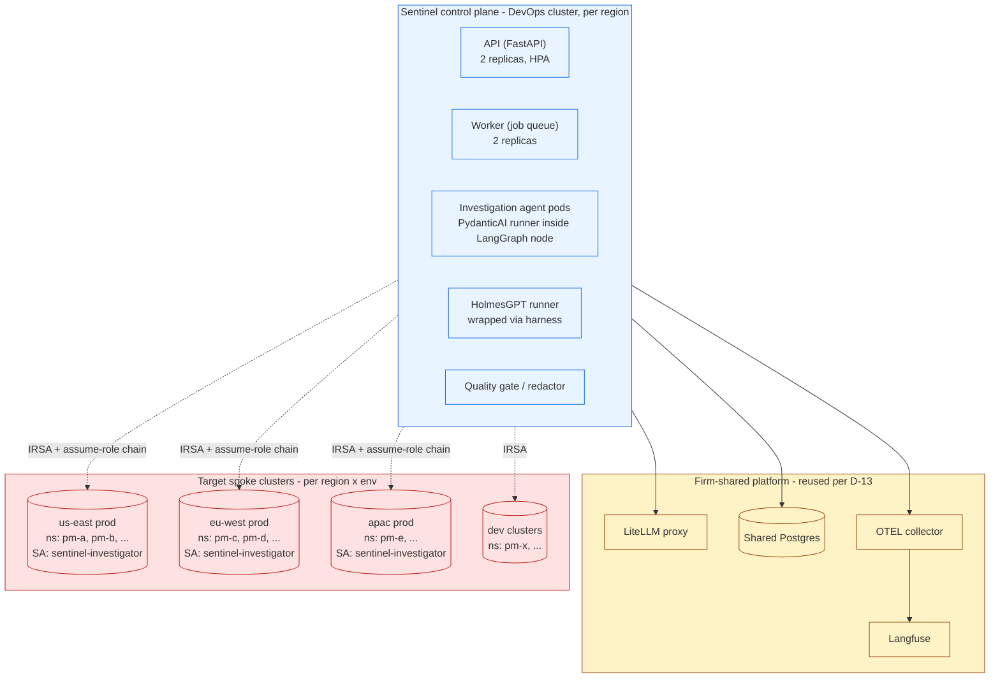

Why hub-and-spoke and not "agent in every cluster":

- **Single control plane to upgrade.** Rolling out a new prompt version, a new runbook, or a new model means one Helm upgrade, not N.
- **Centralised observability.** Every span lands in one Langfuse and one trace DB. You don't have to federate.
- **Compliance-friendly.** One audit log, one set of credentials to review. Spoke clusters expose only read APIs to the hub.
- **Failure isolation in the right direction.** A spoke cluster blowing up doesn't take Sentinel down. Sentinel blowing up doesn't affect spoke workloads — and the on-call engineer falls back to manual investigation.

### 6.2 ServiceAccount design — one per (cluster, env), namespace-scoped Roles per PM

Concrete answer to your question:

- **Yes, dedicated ServiceAccount with read-only access.** Not one global SA — that would be the worst possible RBAC choice in a multi-PM hedge fund.
- **One SA per spoke cluster + environment.** Eg. `sentinel-investigator@us-east-prod`, `sentinel-investigator@eu-west-prod`, etc. Each lives in a control namespace inside the spoke cluster (eg. `sentinel-system`).
- **Per-PM namespace permissions are namespace-scoped Roles bound at the PM namespace level.** Not ClusterRoles.

Concretely, in each spoke cluster:

```yaml
# Cluster-level: only what genuinely needs cluster scope (nodes, events at cluster level)
# Notably: NO list-pods at cluster level. Pods are listed per namespace.
apiVersion: rbac.authorization.k8s.io/v1
kind: ClusterRole
metadata:
  name: sentinel-cluster-readonly
rules:
  - apiGroups: [""]
    resources: ["nodes", "namespaces"]
    verbs: ["get", "list", "watch"]
  - apiGroups: ["metrics.k8s.io"]
    resources: ["nodes"]
    verbs: ["get", "list"]
---
# Per-namespace: granted via separate RoleBindings, one per PM namespace that opts in
apiVersion: rbac.authorization.k8s.io/v1
kind: Role
metadata:
  name: sentinel-namespace-readonly
  namespace: pm-acme   # one of these per PM namespace
rules:
  - apiGroups: [""]
    resources: ["pods", "services", "configmaps", "events", "persistentvolumeclaims"]
    verbs: ["get", "list", "watch"]
  - apiGroups: ["apps"]
    resources: ["deployments", "replicasets", "statefulsets", "daemonsets"]
    verbs: ["get", "list", "watch"]
  - apiGroups: [""]
    resources: ["pods/log"]
    verbs: ["get"]
  # NO secrets. NO pods/exec. NO pods/attach. NO pods/portforward.
  # NO deletes, patches, updates, creates anywhere.
```

Bind via PR — adding Sentinel to a new PM namespace is an explicit Git change, reviewed by the PM's tech lead and the platform team. No one can self-add.

The agent never gets `pods/exec`. If we ever decide to allow `kubectl exec` (we shouldn't in v1), it goes through a *separate* SA with explicit per-call human approval — not the routine investigation SA.

**Cross-cluster auth.** Sentinel runs in the DevOps cluster on AWS. Spoke clusters are separate AWS accounts. We use:
- IRSA on the Sentinel pod to assume `sentinel-hub-role` in the hub account.
- `sentinel-hub-role` has trust policies on each spoke account allowing it to assume `sentinel-spoke-role-{cluster}` in that account.
- Each spoke account's role is mapped (via `aws-auth` configmap or EKS access entries) to the spoke's `sentinel-investigator` SA.

This is a standard EKS hub-spoke pattern. `aws-cli sts assume-role` chain wrapped in a kubeconfig generator inside the agent. Token refresh handled by `aws-iam-authenticator` or a sidecar.

### 6.3 Pod security & network policy

Agent pods run with:

- `runAsNonRoot: true`, `runAsUser: 65534`, `readOnlyRootFilesystem: true`
- `securityContext.capabilities.drop: [ALL]`
- `seccompProfile.type: RuntimeDefault`
- `automountServiceAccountToken: true` (we need it) but the SA is the namespace-scoped one
- Resource limits set (CPU 1 core, Memory 2Gi for investigation pods; tune from observation)

Network policy on the Sentinel namespace allows egress to:

- LiteLLM proxy (private DNS in cluster or VPC peer)
- Langfuse (private link)
- Postgres (in-cluster)
- Slack API (via egress allowlist)
- PagerDuty API (via egress allowlist)
- Each spoke cluster's K8s API endpoint (via VPC peering / private endpoints)
- Grafana (in-cluster or VPC peer to shared monitoring cluster)
- Harness API (via egress allowlist)

Denies all other egress including DNS to external resolvers (use cluster CoreDNS).

Service mesh (Istio or Linkerd) for mTLS between Sentinel components. Required for the trace DB and for LiteLLM↔Langfuse traffic carrying prompts.

### 6.4 Secrets

No raw API keys in env vars. SPIRE/SPIFFE workload identity for service-to-service auth where possible. For external API keys (Slack bot token, PagerDuty, Harness) use sealed-secrets via SOPS+KMS or AWS Secrets Manager with IRSA-fronted reads.

LiteLLM virtual keys per tenant are stored in LiteLLM's own backing DB, not in Sentinel. Sentinel asks LiteLLM "give me a key for tenant X" and gets a short-lived token. Rotation handled by LiteLLM, audited.

### 6.5 Helm chart layout (proposed)

```
helm/sentinel/
├── Chart.yaml
├── values.yaml
├── values-prod-us-east.yaml
├── values-prod-eu-west.yaml
├── values-prod-apac.yaml
├── values-dev.yaml
└── templates/
    ├── api/
    │   ├── deployment.yaml
    │   ├── hpa.yaml
    │   ├── pdb.yaml
    │   └── service.yaml
    ├── worker/
    │   └── ... (same)
    ├── agent/                    # investigation agent pods
    │   └── ...
    ├── mcp-server/
    ├── networkpolicy.yaml
    ├── serviceaccount.yaml       # one in DevOps cluster; spoke SAs lives in spoke charts
    ├── postgres-migration-job.yaml
    ├── ingress.yaml              # AWS ALB
    └── monitoring/
        ├── servicemonitor.yaml
        └── prometheusrule.yaml

helm/sentinel-spoke/              # tiny chart deployed to each spoke
├── Chart.yaml
└── templates/
    ├── serviceaccount.yaml       # sentinel-investigator
    ├── clusterrole.yaml
    ├── clusterrolebinding.yaml
    └── role-per-namespace.yaml   # generated per-PM via values
```

Two-chart split because the spoke RBAC needs to be deployed per spoke cluster on its own GitOps cadence, while the hub control plane is one deploy per region.

---

## 7. LLM observability with Langfuse

### 7.1 What we trace

Every span has these attributes:

```python
{
  "trace_id": "...",
  "tenant_id": "pm-acme",       # MANDATORY
  "pii_class": "internal|mnpi|...",
  "agent_role": "alert_classifier|enrichment|investigator|judge|redactor",
  "model_id": "litellm:anthropic/claude-sonnet-4-6",
  "prompt_version_sha": "<git-sha:filename>",
  "prompt_content_sha": "<sha-256 of resolved template>",
  "skill_handles": ["k8s-crashloop@1.4.0:<sha>"],
  "mcp_server_handles": ["k8s-mcp@<sha>", "harness-mcp@<sha>"],
  "tool_call_count": 12,
  "loop_iterations": 3,
  "cost_usd": 0.04,
  "input_token_count": 4321,
  "output_token_count": 567,
}
```

The non-obvious ones:

- **`prompt_version_sha` + `prompt_content_sha`** — the version is `git-sha:filename` (where the template lives), the content sha is of the *resolved* prompt after variables are substituted. Same model, same content sha → same input. Used for caching and replay.
- **`skill_handles` and `mcp_server_handles`** — captured per call so we can answer "which version of the runbook influenced this prompt?" months later.
- **`tenant_id` is mandatory.** No untenanted spans. The Langfuse exporter rejects spans missing it.

### 7.2 Langfuse projects: one per platform team, not per PM

Reframed from v0.1 of this RFC. The right segmentation in Langfuse is **per Platform Engineering team** (SRE / DevOps / ACE), not per PM.

Reasons:
- The Langfuse project is the *operator* boundary: each Platform Engineering team owns its agents, runbooks, eval datasets, prompt versions, and operational dashboards. The team operating the agent is the audience for the project.
- Per-PM Langfuse projects would mean ~50 projects, each with 1/50th of the traces. Hard to do meaningful eval, hard to spot patterns, expensive to administer.
- Per-team gives each Platform Engineering team a clean view: SRE engineers see SRE traces, not DevOps noise.
- Cost reporting per team (not per PM) matches how the firm bills internal LLM usage.

**Project structure:**

```
Langfuse organisation: hedgefund-platform-eng
├── project: sentinel-sre          # SRE-team-operated agents
├── project: sentinel-devops       # DevOps-team-operated agents
├── project: sentinel-ace          # ACE-team-operated agents
└── project: sentinel-platform     # cross-team metadata: replay reproducibility, redactor evals,
                                   #  shared eval datasets, harness self-tests
```

**PM information barrier within a per-team project:** enforced at three places, none of which is the project boundary:

1. **Trace tags.** Every trace carries `tenant_id` (the PM) as a Langfuse trace tag. Default views in the Langfuse UI filter to "your tenant" via tag filters per user.
2. **Native Langfuse access controls (where they exist).** Langfuse v3+ supports project-level RBAC and can scope users to specific tags via API filters. We enforce that platform engineers only have read access to traces tagged with their assigned PM scope, OR they have an "operator" role that bypasses the tag filter for the duration of an investigation (audited).
3. **PM data redaction at write time.** The redactor runs *before* the trace is exported to Langfuse, not after. So MNPI never reaches Langfuse storage in the first place — only redacted summaries and tool-call hashes do. The full unredacted evidence stays in our Postgres trace store with row-level security (see §12).

**Why this is safer than per-PM projects:** because the redactor runs before Langfuse export, what's *in* Langfuse is already safe to read across PMs by anyone with team access. The per-PM cross-cut is reconstructable via tag filters when an engineer is investigating a specific PM's incident.

**Trade-off accepted:** if Langfuse's tag-filtering RBAC is weaker than we'd like (this is worth validating empirically — see open question O-09), we tighten by either (a) running a Langfuse instance per region as a smaller blast radius, or (b) using Langfuse self-hosting + a thin proxy that enforces tag-based access at API level.

**Self-host vs Cloud:** self-host. Sending hedge fund prompts to Langfuse Cloud, even with redaction, is more risk than the firm should accept for marginal operational convenience. Self-host on-prem in a private cluster, ideally co-located with LiteLLM proxy.

**Cross-team visibility:** each team's project is private to its members. Compliance and the platform-platform team (the people maintaining Sentinel itself) get a "platform-superuser" role across all projects, audited. Nobody else cross-cuts.

### 7.3 The Postgres trace store (in addition to Langfuse)

Langfuse handles the LLM-call observability beautifully but it doesn't handle:
- Tool call records with full I/O hashes
- Replay bundles
- Append-only audit trail with WORM semantics for regulatory inspection

We keep the Postgres tables from the prior project (`pipeline_runs`, `node_executions`, `agent_calls`, `audit_log`) extended with `tenant_id` and RLS:

```sql
CREATE POLICY pm_isolation ON pipeline_runs
  FOR SELECT
  USING (tenant_id = current_setting('app.current_tenant_id', true)
         OR pg_has_role(current_user, 'compliance_superuser', 'MEMBER'));
```

The application sets `app.current_tenant_id` at the start of each request. Compliance has a separate role that bypasses RLS but their queries are audited via `pgaudit`.

### 7.4 Tracing HolmesGPT specifically

You asked for "integration with HolmesGPT in full" with every step traced. HolmesGPT internally instruments via Logfire / OTel, but we override:

- The model client → custom client that wraps LiteLLM proxy calls in our spans
- The toolset adapter → custom adapter that routes through our policy gate and emits a span per tool call as a child of the iteration span
- The "investigate" entry point → wrapped in a parent span at the investigation level

Net result: a Holmes investigation of 5 LLM iterations × 8 tool calls each appears in Langfuse as a tree of 1 (investigation) → 5 (iterations) → 8 (tool calls) spans, all under the investigation `trace_id`, all with `tenant_id` and PII class.

### 7.5 Cost dashboards

Per-PM monthly LLM cost dashboard built from Langfuse cost fields. Hard alert if a PM exceeds a daily budget (rare — the LiteLLM proxy will block before that). Soft alert if cost-per-investigation drifts upward 25% week-on-week.

### 7.6 Common LLM observability anti-patterns to avoid

- **Don't log full prompts and outputs to your application logs.** They contain MNPI. Logs leave the cluster too easily. Langfuse + the Postgres trace store are the only places they live.
- **Don't sample.** This is regulated infra. 100% trace coverage. If volume is too high, optimise the trace store, don't drop spans.
- **Don't conflate `trace_id` with `request_id`.** A single request to the `/sentinel/investigate` API can spawn many LLM calls; `trace_id` is the investigation, `span_id` is the LLM call. Langfuse handles this if you nest correctly.
- **Don't put LiteLLM in a hot loop without retries.** A failing LiteLLM proxy with no retry policy turns a transient blip into a missed alert. Retries with jitter at the SDK layer; circuit-break at the proxy.

---

## 8. Risks, compliance, regulatory replay

### 8.1 Risk register

| Risk | Likelihood | Impact | Mitigation |
|---|---|---|---|
| Cross-PM data leakage in agent output | Medium without controls | Catastrophic (regulatory, reputational) | Five-layer barrier (§5.7); redactor LLM judge; quarterly audit; zero-tolerance metric |
| Agent hallucinated diagnosis published unsupervised | Medium | High (wasted on-call time, eroded trust) | Mandatory groundedness; quality gate; confidence-tiered publishing; shadow mode before v1 |
| Prompt injection via alert annotations / pod names / log lines | High (attackers will try) | High if successful | Annotations redacted before LLM; capability tokens prevent escalation even if injected; outputs sanitised before publish |
| LLM provider outage | Medium | Medium (Sentinel offline, on-call falls back to manual) | Provider failover at LiteLLM; degraded mode that still routes alerts to Slack with no AI summary |
| Runbook rot (runbooks become stale, accuracy drops) | High over time | Medium | Per-runbook scorecard; curation queue; weekly review SLA |
| Trace store loss / compromise | Low | Catastrophic (regulatory) | WORM bucket + Postgres replication; quarterly disaster-recovery test; encrypted at rest with KMS |
| Agent incurs runaway LLM cost | Medium | Medium | Per-tenant daily budgets at LiteLLM; per-run loop cap; cost alerts |
| Spoke cluster RBAC misconfiguration | Medium | High | RBAC defined in Helm chart, reviewed via PR; periodic `kubectl auth can-i` validation; staging-first rollout |
| Replay non-determinism (model drift, MCP schema changes) | Medium | Medium-High (regulatory) | Pinned model versions; pinned MCP server SHAs; replay-diff CI job; immediate alert on drift |
| Agent leaks credentials in trace output | Low | High | Redactor includes credential pattern detection; trace store has automated scanner for `(?i)(api|secret|token|key|password|bearer)` |

### 8.2 Compliance asks (anticipated)

- **Audit trail.** Append-only `audit_log` table with input hash, prompt SHA, model ID, output hash, decision. WORM-style retention 7 years (or whatever the firm's policy says).
- **MNPI handling sign-off.** Compliance review of the redactor regexes + LLM judge prompt before v1. Quarterly review of redactor false-negative rate against a labelled fixture set.
- **Replay capability.** `python -m sentinel.replay <trace_id> --diff` reproduces any historical run. Demonstrated to compliance during onboarding. Available on demand for any regulator request.
- **Data residency.** EU PMs' data must not transit US infrastructure. Practically: per-region LiteLLM proxy with region-pinned model providers (Anthropic / OpenAI EU endpoints), per-region Langfuse instance, per-region trace DB. The hub-and-spoke is per region, not global.
- **Right to disconnect.** Any individual PM can opt out of Sentinel; the namespace-scoped RoleBinding is the on/off switch.
- **Independent control evidence.** LiteLLM proxy logs, Langfuse logs, Postgres trace store, and Kubernetes audit logs are four independent records. A regulator can cross-reference any two and detect tampering.

### 8.3 Open compliance questions (need decisions before v1)

These need input from Compliance and Risk before we commit:
- Are external LLM providers (Anthropic, OpenAI) acceptable for INTERNAL-class data? For MNPI-class? If MNPI is restricted to on-prem only, what models are available — and is performance acceptable?
- What's the firm's data retention policy for prompts/outputs? Currently assuming 7y for audit, 90d for evidence — needs confirmation.
- Who approves the redactor's denylist? Is there a legal-review SLA?
- Can on-call engineers see Langfuse traces for PMs they're not assigned to (during incidents)? Or only their PM's traces?

---

## 9. Phased rollout & milestones

### 9.1 v0 — internal alpha (4–6 weeks)

Goal: end-to-end pipeline working in dev cluster against synthetic alerts.

- Pipeline DAG with all 6 stages
- 5 runbooks, hand-authored (k8s-crashloop, pod-pending-resources, pvc-stuck, harness-deploy-rollback, latency-spike)
- LiteLLM proxy deployed, single-tenant (one virtual key)
- Langfuse self-hosted, single project
- 30 primitive tools, no agent-as-tools
- Quality gate enforces groundedness rules
- Replay CLI works
- Eval framework with 30 golden cases, runs on every PR
- Synthetic load test: 100 alerts/hour for 1 hour, no failures, latency under budget

Exit criteria: `replay --diff` is 100% deterministic over 30 runs; quality gate rejects ungrounded fixtures; eval suite passes.

### 9.2 v0.5 — shadow mode (4 weeks)

Goal: agent runs against real alerts but does not publish.

- Onboard 2 PM namespaces in 1 region (us-east-dev first, then us-east-prod after 2 weeks)
- Five-layer information barrier deployed and tested with adversarial fixtures
- Per-PM Langfuse projects, per-PM virtual keys at LiteLLM
- 5 more runbooks added based on first-week alert distribution
- HolmesGPT integration live, traced end-to-end
- Engineer-facing dashboard in Grafana
- `/sentinel mark-cause` slash command live for label collection

Exit criteria: ≥85% hypothesis_recall@1 over 200 incidents; 0 PM data leak in adversarial fixtures and live shadow runs; latency p95 < 90s; no replay-diff failures.

### 9.3 v1 — supervised production (Q3 2026)

Goal: publish to PM Slack channels, behind quality gate.

- Two PMs go live (both in us-east-prod)
- Quality gate enforces auto-publish only for HIGH confidence + groundedness pass; MEDIUM goes to PM channel with disclaimer; LOW requires human approval
- Compliance audit done quarterly
- Runbook coverage ≥70% across the alerts seen in shadow mode
- Cost per investigation ≤$0.20

Exit criteria for next phase: 4 weeks of production traffic with no compliance incidents; engineer-rated usefulness ≥65%; MTTA delta -30% on golden categories; `time_to_first_AI_summary` p95 ≤ 90s.

### 9.4 v2 — multi-region, multi-PM (Q4 2026 → Q1 2027)

- Roll out to all PMs across us-east, eu-west, apac
- Per-region Langfuse and trace stores
- Runbook curation team + weekly scorecard review
- Self-consistency double-runs on selected high-stakes alerts
- Improved redactor with LLM judge
- Cost per investigation ≤$0.10

### 9.5 v3 — selective autonomy (TBD, ≥Q2 2027)

Based on v2 data, identify the top 3–5 alert categories where:
- Hypothesis recall@1 ≥ 95% over 90 days
- Procedural compliance ≥ 95% over 90 days
- Zero compliance incidents

For those categories only, allow specific suggested actions (eg. "scale up replicas by 1") to be presented as Slack one-click buttons that, when approved by a human, trigger a Harness pipeline. Still no direct cluster mutation by the agent — the human-approved Slack button is the boundary.

---

## 10. Requirements register

Numbered for traceability. Each requirement has an acceptance criterion. Grouped by area.

### 10.1 Ingest (R-IN-*)

- **R-IN-1.** AlertManager webhook receiver dedupes on `(provider, alert_id)` within 60s window. *Accept:* duplicate fixtures within window result in one investigation.
- **R-IN-2.** PagerDuty webhook receiver normalises to `IngestedAlert`. *Accept:* unit tests cover 5 PD event types; trip-wire test on schema drift.
- **R-IN-3.** Alert envelope is populated with `tenant_id`, `cluster_id`, `region`, `pii_class` before any downstream stage. *Accept:* schema-validation gate fails any payload missing the triplet.
- **R-IN-4.** Annotations are redacted before reaching any LLM. *Accept:* fixture with PII in annotation does not appear in LLM call.

### 10.2 Runbook (R-RB-*)

- **R-RB-1.** Runbooks are git-tracked under `src/sentinel/runbooks/`. *Accept:* pre-commit hook computes content_sha and writes to frontmatter.
- **R-RB-2.** Tag-based matcher selects deterministically on `(alertname, severity, resource_kind)`. *Accept:* unit tests cover 50 alert label permutations.
- **R-RB-3.** RAG fallback uses pgvector with BGE-m3 (or equivalent); only invoked if tag-matcher returns no candidate above threshold. *Accept:* integration test demonstrates fallback path.
- **R-RB-4.** Generic playbook is the terminal fallback; matched runs are flagged `requires_approval=True`. *Accept:* end-to-end test publishes to compliance channel only, never to PM channel directly.
- **R-RB-5.** Confluence sync runs nightly, opens PRs with diffs. *Accept:* one full sync cycle succeeds in dev; review SLA documented.
- **R-RB-6.** Each runbook carries a scorecard (match_rate, hypothesis_recall@1, mean_confidence, etc.) updated nightly. *Accept:* dashboard renders scorecards; below-threshold runbooks appear in curation queue.

### 10.3 Tools (R-TL-*)

- **R-TL-1.** No mutating tools in v1 catalogue. *Accept:* RBAC denies any verb other than get/list/watch; tool registry rejects mutating tool registration.
- **R-TL-2.** Every tool has a Pydantic input schema and typed output. *Accept:* schema generation test passes for all tools.
- **R-TL-3.** Every tool call is gated by capability tokens from the active runbook. *Accept:* unit test confirms unauthorised tool calls return structured error.
- **R-TL-4.** Cross-PM access attempts are rejected at the harness AND at K8s. *Accept:* adversarial test attempting `k8s_list_pods(namespace=other_pm)` is rejected at both layers; both rejections logged.
- **R-TL-5.** Tool outputs are redacted (process args, secret-shaped strings) before persistence. *Accept:* fixture test with secret in pod log → secret not present in trace.

### 10.4 Agent harness (R-AG-*)

- **R-AG-1.** Investigation agent uses task-list tools for runbook-driven and generic-playbook runs. *Accept:* every completed task has evidence_refs; quality gate enforces.
- **R-AG-2.** Loop cap of 8 iterations per investigation; configurable. *Accept:* runaway test terminates at cap with structured error.
- **R-AG-3.** HolmesGPT integration emits spans through our Langfuse, not its own. *Accept:* HolmesGPT trace appears nested under investigation trace_id; its tool calls appear as child spans.
- **R-AG-4.** Replay bundle written to trace store on every run. *Accept:* `replay --diff` reproduces output bit-for-bit on 100/100 sample runs.

### 10.5 LLM observability (R-OB-*)

- **R-OB-1.** All LLM calls go through LiteLLM proxy. *Accept:* network policy denies direct egress to model endpoints from agent pods; all LLM traffic appears in proxy logs.
- **R-OB-2.** Every span carries the mandatory attribute set (tenant_id, pii_class, prompt_version_sha, etc.). *Accept:* exporter rejects spans missing attributes.
- **R-OB-3.** Per-PM Langfuse projects, with explicit access controls. *Accept:* user-A in PM-A cannot read PM-B's project (negative test in audit run).
- **R-OB-4.** Postgres trace store has RLS by tenant_id. *Accept:* connection as PM-A's app role cannot read PM-B rows.
- **R-OB-5.** Replay-diff CI job runs nightly on the last 100 production traces. *Accept:* one full nightly run passes; failure pages platform team.

### 10.6 Quality gate & redaction (R-QG-*)

- **R-QG-1.** Every Finding has at least one evidence_ref. *Accept:* gate rejects fixture with empty evidence_refs.
- **R-QG-2.** LOW confidence outputs are flagged `requires_approval=True` and the data is persisted to `approval_record` + `quality_verdict`. **v0:** posts to compliance channel with no interactive controls; the human-review path is documented but the click-through UI is v1. *Accept:* low-confidence fixture writes the right rows; v0 publish to compliance channel happens regardless.
- **R-QG-3.** Redactor enforces deny-regex + LLM-judge before publish. *Accept:* fixture containing other-PM identifier is redacted; LLM judge is run independently.
- **R-QG-4.** Adversarial / negative test suite runs nightly. *Accept:* 100% pass rate on the suite; failure pages platform team.

### 10.7 Deployment & RBAC (R-DP-*)

- **R-DP-1.** Sentinel control plane deployed in DevOps cluster only. *Accept:* Helm chart only deploys application pods to DevOps cluster.
- **R-DP-2.** Each spoke cluster has a dedicated read-only ServiceAccount. *Accept:* SA exists in spoke; roles restrict to read verbs only.
- **R-DP-3.** Per-PM RoleBindings deployed via spoke chart, one per PM namespace. *Accept:* `kubectl auth can-i list pods --as=system:serviceaccount:sentinel-system:sentinel-investigator -n pm-a` returns yes; `-n pm-b` returns yes only if pm-b opted in.
- **R-DP-4.** Pod security contexts enforce non-root, read-only-rootfs, drop-all-caps. *Accept:* OPA/Kyverno policy in cluster blocks non-compliant pods.
- **R-DP-5.** Network policy denies egress to anything outside the allowlist. *Accept:* curl test from inside pod to external endpoint times out; allowed endpoints succeed.
- **R-DP-6.** Per-region deployment isolation. *Accept:* EU-region Sentinel cannot reach US Langfuse or US Postgres.

### 10.8 Compliance (R-CO-*)

- **R-CO-1.** Append-only audit log with WORM semantics. *Accept:* attempts to update/delete rows fail at the database role level.
- **R-CO-2.** Quarterly compliance audit of 30 random investigations. *Accept:* audit report template exists; first audit completed before v1 promotion.
- **R-CO-3.** Replay reproducibility = 100% on the nightly diff CI job. *Accept:* diff job has been green for 14 consecutive days before v1.
- **R-CO-4.** Data retention policy: 7y for audit log, 90d for raw evidence. *Accept:* TTL/lifecycle policies configured on storage.
- **R-CO-5.** MNPI-classified contexts route to internal-VPC models only. *Accept:* attempting to call public model with MNPI-classed tenant returns 403 from LiteLLM.

---

## 11. Open questions & decision log

### 11.1 Decisions made (with reasoning)

| # | Decision | Reason |
|---|---|---|
| D-01 *(tentative — internal push to reconsider)* | OpenAI Agents SDK for the LLM-loop agents; plain async Python for pipeline orchestration | Working assumption based on early week-2 reading. Internal advocacy for **PydanticAI + LangGraph** is now on the table; see O-10 below for the explicit re-evaluation. Either choice is workable; the criteria for the call are tool-use reliability against on-prem open models, OTEL/Langfuse depth, replay determinism, and team familiarity (prior Octopus project shipped on PydanticAI + Pydantic Graph) |
| D-02 | LiteLLM proxy (network), not SDK in-process | Compliance needs a single chokepoint with independent logs; firm operates the proxy already (D-13) |
| D-03 | Langfuse projects per Platform Engineering team (SRE, DevOps, ACE), not per PM | Operator boundary > tenant boundary; PM separation enforced at trace tags + RLS in app DB |
| D-04 | Runbooks in git as RUNBOOK.md (frontmatter + body) + tools.yaml + checks.yaml + tests.yaml; Confluence sync nightly | Free-form body for the LLM, structured envelope for the harness — both, at different layers |
| D-05 | Primitive tools as foundation, no free-form code | RBAC, replay determinism, eval testability — non-negotiable for hedge fund |
| D-06 | Read-only RBAC in v1 | Earn the trust before lifting; compliance comfort |
| D-07 | Hub-and-spoke topology, agent in DevOps cluster | Single control plane; clean cross-account RBAC story |
| D-08 | TaskCreate-style internal task list for the investigation agent | Enables procedural-compliance metric; legible traces; minor token cost |
| D-09 | HolmesGPT runs inside the harness, not alongside | Single trace ID, single policy gate, single observability story |
| D-10 | One ServiceAccount per (cluster, env), namespace-scoped RoleBindings per PM | Per-PM isolation enforced at K8s, not just app-layer |
| D-11 *(tentative — validate week 1)* | All LLM calls via LiteLLM proxy → on-prem vLLM endpoints only. No external providers | Working assumption from author's week-2 reading of firm policy. Compliance: zero LLM data egress. Trade: lower model quality than frontier closed models; absorb via more rigorous prompt eng + evals + tool-use validation in week 1–2 |
| D-12 *(tentative — validate week 1)* | Codebase as a sub-package inside the firm's platform monorepo | Working assumption pending monorepo onboarding. Conformance with firm CI/CD/lint/test conventions; shared libraries; trade is slower per-PR cycle for monorepo-wide review |
| D-13 *(tentative — validate week 1)* | Reuse firm-existing infra: LiteLLM proxy, OTEL collector, Langfuse, shared Postgres cluster | Working assumption pending platform-team intros. ~3 weeks of infra build collapses to integration work; the §14 plan is rebuilt around this assumption |
| D-14 | v0 pilot publishes only to a compliance/platform shadow Slack channel | Lowest-risk launch; gives a clean read on accuracy and false-positive rate before any PM-facing output |
| D-15 *(tentative — validate week 1)* | Per-team Langfuse projects accessed via the firm's existing Langfuse instance, with project-level RBAC + trace-tag filtering on `tenant_id` | Working assumption — depends on which Langfuse version the firm runs and what RBAC features it has |
| D-16 *(tentative — validate week 1)* | Use firm's shared Postgres cluster — request `sentinel_app` and `sentinel_audit` databases (split for the WORM role separation in §12.3.10) | Working assumption pending DBA conversation; if the cluster doesn't support `pgvector` or per-database role separation, may need a dedicated RDS instance |

> **Note on D-11..D-13, D-15, D-16:** these were ratified in the RFC author's week 2 with limited firm-internal context. They are *working assumptions* sufficient to start week-1 implementation, not commitments. §11.4 below lays out the validation plan — each tentative decision has a named owner to confirm with and a default fallback if the assumption turns out wrong.

### 11.2 Open questions (need owners)

| # | Question | Owner | Decision needed by |
|---|---|---|---|
| O-01 | Are external LLM providers acceptable for INTERNAL-class data? Anthropic via dedicated VPC endpoint for MNPI? | Compliance + Risk | Before v0.5 |
| O-02 | Is Braintrust / DeepEval worth the budget over self-hosted pydantic-evals? | Platform Eng | Before v1 (eval dashboard becomes urgent) |
| O-03 | One repo or two? (re-use prior Octopus repo vs. greenfield clone) | You | Within 2 weeks — affects all downstream work |
| O-04 | Approval flow for the unprecedented-alert path: compliance channel or PM tech-lead approval? | Compliance + PMs | Before v0.5 |
| O-05 | Per-region or global Langfuse? Affects how data residency is enforced. | Compliance + Platform | Before v2 |
| O-06 | How long do we keep raw tool outputs (`evidence_*` bucket)? Prior project default was 90d; hedge fund context may want 1y. | Compliance | Before v1 |
| O-07 | What's the agent's identity in PagerDuty notes? "Sentinel Bot" is fine but compliance may want a per-tenant identity. | Platform | Before v1 |
| O-08 | When (if ever) do we lift to selective autonomy (v3)? Need pre-defined criteria so we don't argue about it ad hoc. | You + Risk | During v1 review |
| O-09 | Does the firm's existing Langfuse RBAC support tag-based filtering on `tenant_id` strongly enough to use one project per team profile, or do we need one Langfuse project per (team × PM)? | Langfuse operator at the firm | Before week 5 |
| **O-10** | **Agent framework: OpenAI Agents SDK vs PydanticAI + LangGraph.** Internal advocacy at the firm for PydanticAI + LangGraph (Pydantic Graph for the orchestration shape, LangGraph for stateful sub-graphs). Re-evaluate against OpenAI Agents SDK using on-prem-model tool-use eval, OTEL integration depth, replay determinism, and team familiarity. | You + senior engineer on the platform team | **Before week 2 (gates the agent harness build)** |

### 11.4 First-month validation plan for tentative decisions

Each tentative decision (D-11..D-16) is something the author committed to in week 2 with imperfect information. Each has: a concrete validation step in week 1; the named role to confirm with; and a fallback design if the assumption turns out wrong. Crucially, **work doesn't block on these** — week 1 builds against the working assumption, and any decision that flips triggers a documented amendment, not a restart.

| Decision | Validate by | Named owner to confirm with | Concrete artefact to ask for | Fallback if wrong |
|---|---|---|---|---|
| **D-11** on-prem only | Day 2: meeting with Compliance lead + Risk-officer responsible for LLM policy | Head of Compliance (or whoever signed the firm's LLM policy) | The signed LLM-use policy document; the list of approved on-prem models | If external+VPC OK: relax model allowlist, swap on-prem vLLM for Anthropic-via-Bedrock for the investigator only. ~3 days of work |
| **D-12** monorepo sub-package | Day 1: pair with a senior engineer on the platform-engineering team to onboard | Tech lead of the platform-engineering team you joined | Existing CI/CD config; an example service that lives in the monorepo; the lint/typecheck rules | If a separate repo is normal for new platforms (some firms do this for risky/new code): switch to a standalone repo. ~half day of cost, mostly CI scaffolding |
| **D-13** reuse existing LiteLLM/OTEL/Langfuse/Postgres | Day 3–5: separate intros with operators of each service | Platform team operating each service. For LiteLLM ask: "Can I get a virtual key with these tags?" For Langfuse: "Can I create a project called sentinel-sre and what RBAC features does it have?" For OTEL: "What's the collector endpoint and what attributes are required?" For Postgres: "Can I request a database, with `pgvector` extension, on the shared cluster?" | Connection details + onboarding doc for each | If any are not available: stand up our own minimal version (single Helm chart can spin up Langfuse + Postgres). Cost: ~3–5 days per missing service. Worst case all four are unavailable → this is the original §14 plan, but we know in week 1 not week 4 |
| **D-15** firm Langfuse per-team projects | Day 4 with Langfuse operator | Langfuse operator | Test creating a `sentinel-sre` project; trying to set up trace-tag-based RBAC | If Langfuse's RBAC isn't strong enough: run a Langfuse instance per team-profile (3 instances) — costs more ops but recovers the boundary |
| **D-16** Postgres on shared cluster | Day 4 with DBA | Database team / DBA | Confirm `pgvector` extension; confirm separate database roles; confirm logical replication for the audit log WORM archive | If shared cluster can't host `pgvector` (some managed Postgres versions can't): provision a small RDS-equivalent for case-history only, keep the rest on shared. ~2 days |
| **D-01 (re-opened)** agent framework | Day 2–3: meeting with the senior engineer advocating for PydanticAI + LangGraph; review their POC/draft if any | Senior engineer pushing PydanticAI + LangGraph; CTO or Head of Platform Eng for tie-break | Their POC code (if any); their tool-use eval results; the firm's appetite for dependency-pinning on Anthropic-led OSS vs OpenAI-led OSS | Either is workable: switch costs of choosing the other later are ~5 days for the harness layer (no domain rewrite needed because OpenAI Agents SDK and PydanticAI both speak structured outputs + tool loops). See §15.15 for the comparison matrix |

**Process for every tentative decision:**

1. The agreed action item lives as a Linear/Jira ticket with the named owner and a 5-business-day SLA.
2. If a decision flips, the author files a one-page **decision amendment** (similar shape to an ADR) updating this table, with a reason and a delta in §14 if the timeline changes.
3. The amendment goes to the same reviewers as the original RFC.

**Things to bring to each conversation** so you don't waste the named person's time:

- For Compliance (D-11): the §8 risk register and §3 PII classes; ask "is the redactor design sufficient?" alongside "are external providers acceptable?" — they may say yes-with-conditions
- For platform tech lead (D-12): the §6 deployment topology + §14 plan; ask about firm conventions for cross-cutting platform services (do they like one-service-per-repo or sub-package style?)
- For the LiteLLM operator (D-13): the §2.4 + §13 contract for tenant tagging; ask which models pass their tool-use eval
- For the Langfuse operator (D-15): the §7.2 + §13.6 spec; ask version, current RBAC features, OTLP endpoint config
- For the DBA (D-16): the §12 schema (especially `case_history` with `pgvector`, `audit_log` with WORM); ask about backup/restore SLAs and pgaudit availability

**Why this is the right posture for someone two weeks in:** working assumptions backed by named-owner validation steps move faster than perfect-information decision-making in any organisation, especially at a hedge fund where the cost of asking is low and the cost of waiting is high. The decision log + validation plan is also exactly the artefact a sceptical reviewer asks for ("you've made 16 decisions; how confident are you in each?"). Pre-empting that question is leverage.

### 11.5 Things explicitly deferred to later (so we don't argue about them now)

- AI Support Agent (Jira) — out of scope until v2+ stable
- Cross-PM analytics or postmortem aggregation — until information-barrier audit pass-rate proves
- Agent-driven feature flag changes (Harness write API) — until selective autonomy criteria met
- Fine-tuned models — until we have ≥1000 labelled cases per category
- AgentGateway for cross-runtime tool routing — only when we add a second agent runtime

---

## 15. Code organisation — settings, common config, team plugins

### 15.1 Layering

**Four layers**, each with one job. Lower layers never import higher ones; that's enforced by import-linter contracts.

| # | Layer | What it owns | What it knows |
|---|---|---|---|
| 1 | `Settings` (Pydantic) | Env-var ingestion, validation, secret typing | Only what env vars the deployment provides |
| 2 | `BaseConfig` (abstract, attrs.frozen) | The **shape** every config must have — fields with placeholder/sentinel defaults; abstract properties subclasses must override | Nothing concrete — pure structure |
| 3 | `CommonConfig` extends `BaseConfig` | The **shared concrete values** every team uses (loop cap, redaction policy, judge thresholds, infra-client factories) | The cross-team defaults; no team-specific knowledge |
| 4 | `SRETeamConfig` / `DevOpsTeamConfig` / `ACETeamConfig` extends `CommonConfig` | The **team-specific overrides** (runbook path, tool subset, output channels, prompts, model IDs) | Only what differs per team |

**This is inheritance, not composition** — the team config *is a* CommonConfig (which *is a* BaseConfig). Three benefits:
- A team config object alone contains every field the application needs — no `team.common.x` indirection.
- Each layer fills in fields the layer above declared as placeholders. Mypy/the type checker knows nothing is missing because every layer must satisfy `BaseConfig`'s declared fields.
- The "is a" relationship matches the mental model: "an SRETeamConfig is a Sentinel config with the SRE specifics filled in".

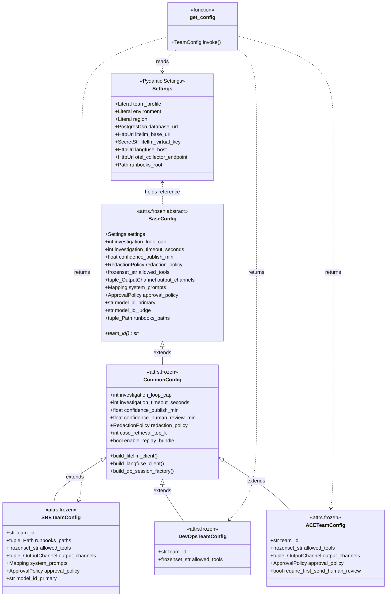

### 15.2 Package layout

`plugins/common/` is the shared substrate — not just config, but **shared runbooks, skills, and tools** that any team can compose with. Each team is a *package* (not a single file) so it can carry its own assets next to its config.

```
src/sentinel/
├── settings.py                  # Pydantic Settings — env-var boundary
├── config.py                    # BaseConfig (placeholders/shape) + get_config()
│
├── plugins/
│   ├── __init__.py
│   │
│   ├── common/                  # ── shared substrate ──
│   │   ├── __init__.py          # exports paths/handles to the assets below
│   │   ├── common.py            # CommonConfig extends BaseConfig
│   │   ├── approval.py          # ApprovalPolicy primitive
│   │   ├── redaction.py         # RedactionPolicy primitive
│   │   ├── output.py            # OutputChannel primitive
│   │   │
│   │   ├── runbooks/            # cross-team runbooks (eg. container-crashlooping)
│   │   │   ├── container-crashlooping/
│   │   │   │   ├── RUNBOOK.md
│   │   │   │   ├── tools.yaml
│   │   │   │   ├── checks.yaml
│   │   │   │   └── tests.yaml
│   │   │   ├── pvc-stuck/
│   │   │   └── _generic-investigation/   # the unprecedented-alert fallback
│   │   │
│   │   ├── skills/              # agent behavioural skills (prompt fragments)
│   │   │   ├── evidence-grounding/
│   │   │   │   └── SKILL.md
│   │   │   ├── task-list-discipline/
│   │   │   └── confidence-calibration/
│   │   │
│   │   └── tools/               # primitive tools every team can call
│   │       ├── __init__.py
│   │       ├── evidence.py      # evidence_store, evidence_retrieve
│   │       ├── runbook.py       # runbook_get
│   │       ├── investigation_task.py   # task_create, task_update
│   │       └── k8s_readonly.py  # k8s_list_pods, k8s_describe_pod, ... (used by SRE + DevOps)
│   │
│   └── teams/                   # ── team-specific specialisations ──
│       ├── __init__.py          # exports TeamConfig TypeAlias
│       │
│       ├── sre/
│       │   ├── __init__.py      # SRETeamConfig (the class)
│       │   ├── runbooks/        # SRE-only runbooks (eg. latency-spike)
│       │   │   ├── latency-spike/
│       │   │   └── error-budget-burn/
│       │   ├── skills/          # SRE-specific behavioural overlays
│       │   └── tools/           # SRE-only tools
│       │       ├── __init__.py
│       │       ├── prom.py      # prom_query_*
│       │       ├── loki.py      # loki_query_range
│       │       └── tempo.py     # tempo_search_traces
│       │
│       ├── devops/
│       │   ├── __init__.py      # DevOpsTeamConfig
│       │   ├── runbooks/        # jenkins-pipeline-failed, deploy-stuck, ...
│       │   ├── skills/
│       │   └── tools/           # jenkins.py, harness.py
│       │
│       └── ace/
│           ├── __init__.py      # ACETeamConfig
│           ├── runbooks/        # disk-full-var, memory-pressure, ...
│           ├── skills/          # PM-friendly tone, no-jargon, etc.
│           └── tools/           # linux_*.py, vm_*.py
│
├── runbooks/
│   ├── sre/
│   ├── devops/
│   └── ace/
│
├── domain/                      # business entities (alert, investigation, ...)
├── application/                 # pipeline orchestration, supervisor
├── interfaces/                  # FastAPI routers, agents, MCP
├── data/                        # SQLModel + Alembic
├── vendors/                     # Slack, PagerDuty, Jenkins, Harness adapters
└── observability/               # OTEL setup, Langfuse client wrappers
```

Import-linter contract enforces the boundaries:

```toml
# pyproject.toml
[tool.importlinter]
root_packages = ["sentinel"]

[[tool.importlinter.contracts]]
name = "settings is the only env-var consumer"
type = "forbidden"
source_modules = ["sentinel.plugins", "sentinel.domain", "sentinel.application", "sentinel.interfaces"]
forbidden_modules = ["os.environ", "dotenv"]

[[tool.importlinter.contracts]]
name = "plugins.common does not depend on plugins.teams"
type = "forbidden"
source_modules = ["sentinel.plugins.common"]
forbidden_modules = ["sentinel.plugins.teams"]

[[tool.importlinter.contracts]]
name = "team configs do not depend on each other"
type = "independence"
modules = ["sentinel.plugins.teams.sre", "sentinel.plugins.teams.devops", "sentinel.plugins.teams.ace"]
```

### 15.3 `settings.py` — the env-var boundary

`Settings` is the **only** module that reads env vars. Everything else takes a `Settings` (or `CommonConfig`, or `TeamConfig`) and treats it as immutable input. This is what makes the system testable and replay-deterministic.

```python
# src/sentinel/settings.py
from __future__ import annotations

from functools import lru_cache
from pathlib import Path
from typing import Literal

from pydantic import HttpUrl, PostgresDsn, SecretStr
from pydantic_settings import BaseSettings, SettingsConfigDict


class Settings(BaseSettings):
    """Environment-driven settings. The only place we read env vars.

    Frozen so downstream code cannot mutate runtime configuration.
    """

    model_config = SettingsConfigDict(
        env_prefix="SENTINEL_",
        env_file=".env",
        env_file_encoding="utf-8",
        frozen=True,
        extra="forbid",   # fail fast on typos
    )

    # ─── deployment context ───
    team_profile: Literal["sre", "devops", "ace"]
    environment: Literal["localdev", "dev", "prod"] = "dev"
    region: Literal["us-east", "eu-west", "apac"] = "us-east"
    cluster_id: str
    service_version_sha: str = "dev"

    # ─── databases (D-16: shared cluster, two logical databases) ───
    database_url: PostgresDsn
    audit_database_url: PostgresDsn

    # ─── LiteLLM proxy (D-11: on-prem only) ───
    litellm_base_url: HttpUrl
    litellm_virtual_key: SecretStr
    litellm_request_timeout_seconds: float = 60.0

    # ─── Langfuse (D-13/D-15: firm-shared, per-team project) ───
    langfuse_host: HttpUrl
    langfuse_public_key: SecretStr
    langfuse_secret_key: SecretStr

    # ─── OTEL collector (D-13: firm-shared) ───
    otel_collector_endpoint: HttpUrl
    otel_service_namespace: str = "sentinel"

    # ─── Slack ───
    slack_bot_token: SecretStr
    slack_app_token: SecretStr
    slack_signing_secret: SecretStr

    # ─── PagerDuty ───
    pagerduty_api_token: SecretStr

    # ─── Jenkins / Harness (per-team availability; optional) ───
    jenkins_base_url: HttpUrl | None = None
    jenkins_api_token: SecretStr | None = None
    harness_base_url: HttpUrl | None = None
    harness_api_token: SecretStr | None = None

    # ─── observability ───
    structlog_level: Literal["DEBUG", "INFO", "WARN", "ERROR"] = "INFO"
    sentry_dsn: SecretStr | None = None

    # ─── runbook + eval paths (relative to repo root) ───
    runbooks_root: Path = Path("src/sentinel/runbooks")
    eval_dataset_path: Path = Path("tests/evals/datasets")

    # ─── feature flags ───
    enable_holmesgpt: bool = False
    enable_case_history_retrieval: bool = False  # off in v0; enable post-100-confirmed
    enable_self_consistency: bool = False         # expensive; enable selectively


settings = Settings()
```

Notes:
- `extra="forbid"` is critical — typos in `SENTINEL_*` env vars fail at boot, not at first use.
- `frozen=True` means downstream code that tries to mutate will get a clean `ValidationError`.
- `SecretStr` ensures secrets aren't accidentally logged or repr'd.
- Every secret is explicitly typed; no string-keyed dicts.
- Optional services (Jenkins/Harness) are `None` when not configured for the active team.

### 15.4 `config.py` — `BaseConfig` (the shape) + `get_config()` (the entry point)

`config.py` lives at the root of the package next to `settings.py`, because between them they are the **public contract** every other module imports. Two things live here:

1. `BaseConfig` — the abstract shape every Sentinel config carries, with placeholder/sentinel defaults that subclasses override.
2. `get_config()` — the single function the application uses to discover its concrete (team-specific) config at runtime.

```python
# src/sentinel/config.py
from __future__ import annotations

from abc import abstractmethod
from collections.abc import Mapping
from functools import lru_cache
from pathlib import Path
from types import MappingProxyType
from typing import TYPE_CHECKING, Literal

from attrs import field, frozen

from sentinel.plugins.common.approval import ApprovalPolicy
from sentinel.plugins.common.output import OutputChannel
from sentinel.plugins.common.redaction import RedactionPolicy
from sentinel.settings import Settings, settings

if TYPE_CHECKING:
    from sentinel.plugins.teams import TeamConfig


TeamId = Literal["sre", "devops", "ace"]


@frozen(kw_only=True, slots=True)
class BaseConfig:
    """Abstract shape of every Sentinel config.

    Every field has a placeholder/empty default. Subclasses (CommonConfig,
    *TeamConfig) override with concrete values. The `team_id` property is the
    only thing every concrete config MUST implement — every other field has
    a sane default at one of the layers below.

    Frozen + slots: immutable, memory-efficient, hashable.

    Lives in config.py (not plugins/) because BaseConfig is the public
    contract every other module imports. Settings + BaseConfig are the
    two stable surfaces; everything else is an implementation detail.
    """

    settings: Settings

    # ── pipeline behaviour (concrete defaults filled by CommonConfig) ──
    investigation_loop_cap: int = 0
    investigation_timeout_seconds: int = 0
    enrichment_timeout_seconds: int = 0
    job_poll_interval_seconds: float = 0.0
    job_max_retries: int = 0
    job_max_concurrent_per_worker: int = 0

    # ── confidence thresholds (filled by CommonConfig) ──
    confidence_publish_min: float = 0.0
    confidence_human_review_min: float = 0.0

    # ── redaction (filled by CommonConfig with the firm-wide default policy) ──
    redaction_policy: RedactionPolicy = field(factory=RedactionPolicy.empty)

    # ── case-history retrieval ──
    case_retrieval_top_k: int = 0
    case_retrieval_show_top_n_to_agent: int = 0
    case_retrieval_min_redaction_score: float = 0.0

    # ── eval ──
    eval_groundedness_min: float = 0.0

    # ── replay ──
    enable_replay_bundle: bool = False

    # ── substrate composition (placeholders here; filled by CommonConfig + *TeamConfig per §15.10) ──
    runbooks_paths: tuple[Path, ...] = ()        # ordered, first-wins; team path first, common path second
    skills_paths: tuple[Path, ...] = ()
    tool_modules: tuple[str, ...] = ()           # dotted module paths for the tool registry to import
    allowed_tools: frozenset[str] = field(factory=frozenset)
    allowed_skills: frozenset[str] = field(factory=frozenset)

    # ── team-specific (placeholders here; filled by *TeamConfig) ──
    output_channels: tuple[OutputChannel, ...] = ()
    system_prompts: Mapping[str, str] = field(factory=lambda: MappingProxyType({}))
    approval_policy: ApprovalPolicy = field(factory=ApprovalPolicy.empty)
    model_id_primary: str = ""
    model_id_judge: str = ""

    # ── the only abstract surface — concrete configs declare their team_id ──
    @property
    @abstractmethod
    def team_id(self) -> TeamId: ...


# ──────────────────────────────────────────────────────────────────────
# Entry point — the single function every entry-point module calls
# ──────────────────────────────────────────────────────────────────────

def build_team_config(settings: Settings) -> "TeamConfig":
    """Dispatch to the concrete team config based on Settings.team_profile.

    Each *TeamConfig is a subclass of CommonConfig (which is a subclass of
    BaseConfig). Constructing the team config gives you every field —
    BaseConfig placeholders, CommonConfig shared values, and the team-specific
    overrides — in a single immutable frozen instance.

    Imports the concrete *TeamConfig classes lazily to avoid circular import
    (those modules import BaseConfig from this file).
    """
    team = settings.team_profile
    if team == "sre":
        from sentinel.plugins.teams.sre import SRETeamConfig
        return SRETeamConfig(settings=settings)
    if team == "devops":
        from sentinel.plugins.teams.devops import DevOpsTeamConfig
        return DevOpsTeamConfig(settings=settings)
    if team == "ace":
        from sentinel.plugins.teams.ace import ACETeamConfig
        return ACETeamConfig(settings=settings)
    # Defensive: Pydantic Literal already prevents this, but Mypy can't always tell
    raise ValueError(f"Unknown team profile: {team!r}")


@lru_cache(maxsize=1)
def get_config() -> "TeamConfig":
    """Singleton config for the running process.

    Test code calls `get_config.cache_clear()` between tests when overriding
    env vars, or constructs a *TeamConfig directly to inject test-specific
    values without touching the env layer at all.
    """
    return build_team_config(settings)
```

**Why `team_id` is the only `@abstractmethod`**: it's the discriminator. Every other field has a sensible-or-explicitly-empty default, so a partial subclass would still construct. `team_id` is what tells the rest of the system which profile this is, and there's no sane default — so we force every concrete config to declare it.

**Why placeholders, not `attrs.NOTHING`/required**: a required attrs field forces every subclass to redeclare it positionally, which gets ugly with multi-level inheritance. Placeholders + concrete overrides at the right layer is cleaner. The "is this a real value or a placeholder" question is answered by `team_id`: a `BaseConfig` that's never been through `CommonConfig` has `team_id` raising `NotImplementedError`, which surfaces immediately in any code path that depends on it.

**Why `BaseConfig` and `get_config()` share a file**: they're the public surface of the config system. Importers say `from sentinel.config import BaseConfig, get_config` and don't have to know about the plugin layout underneath. Any future refactor of `plugins/` is internal — the public contract is stable.

**Why deferred imports inside `build_team_config`**: the team modules import `BaseConfig` from `sentinel.config`, and `config.py` needs to dispatch to them — a circular import if both happen at module load. Doing the imports lazily inside `build_team_config` breaks the cycle. Each branch is hit exactly once after the lru_cache primes, so the cost is one-time and irrelevant.

### 15.5 `plugins/common/common.py` — `CommonConfig`, the shared substrate

Inherits from `BaseConfig` and **fills in every field that's the same across all teams**. Doesn't fill in team-specific fields (those stay as placeholders for `*TeamConfig` to override). Adds the infra-client factory methods because client construction is shared regardless of team.

```python
# src/sentinel/plugins/common/common.py
from __future__ import annotations

from collections.abc import Callable

from attrs import field, frozen

from sentinel.config import BaseConfig
from sentinel.plugins.common.redaction import RedactionPolicy


@frozen(kw_only=True, slots=True)
class CommonConfig(BaseConfig):
    """Concrete shared values across every team profile.

    Subclassed by *TeamConfig with team-specific overrides.
    Not instantiated directly in production — always via a *TeamConfig.
    `team_id` remains abstract here; *TeamConfig provides it.
    """

    # ── pipeline behaviour: concrete cross-team defaults ──
    investigation_loop_cap: int = 8
    investigation_timeout_seconds: int = 300
    enrichment_timeout_seconds: int = 30
    job_poll_interval_seconds: float = 1.0
    job_max_retries: int = 3
    job_max_concurrent_per_worker: int = 4

    # ── confidence thresholds ──
    confidence_publish_min: float = 0.7
    confidence_human_review_min: float = 0.4

    # ── redaction: the default policy from the firm-wide redactor ──
    redaction_policy: RedactionPolicy = field(factory=RedactionPolicy.default)

    # ── case-history retrieval ──
    case_retrieval_top_k: int = 5
    case_retrieval_show_top_n_to_agent: int = 3
    case_retrieval_min_redaction_score: float = 0.9

    # ── eval ──
    eval_groundedness_min: float = 0.7

    # ── replay ──
    enable_replay_bundle: bool = True

    # team-specific fields (output_channels, system_prompts, approval_policy,
    # model_id_*) remain at BaseConfig's empty placeholders — overridden by
    # *TeamConfig. The substrate fields (runbooks_paths, skills_paths,
    # tool_modules, allowed_tools, allowed_skills) get the COMMON_*
    # defaults filled in via §15.10.2.

    # ── infra-client factories (shared regardless of team) ──
    @property
    def db_session_factory(self) -> Callable[[], object]:
        from sentinel.data.database import build_session_factory
        return lambda: build_session_factory(str(self.settings.database_url))

    @property
    def litellm_client_factory(self) -> Callable[[], object]:
        from openai import AsyncOpenAI
        return lambda: AsyncOpenAI(
            base_url=str(self.settings.litellm_base_url),
            api_key=self.settings.litellm_virtual_key.get_secret_value(),
            timeout=self.settings.litellm_request_timeout_seconds,
        )

    @property
    def langfuse_client_factory(self) -> Callable[[], object]:
        from langfuse import Langfuse
        return lambda: Langfuse(
            host=str(self.settings.langfuse_host),
            public_key=self.settings.langfuse_public_key.get_secret_value(),
            secret_key=self.settings.langfuse_secret_key.get_secret_value(),
        )
```

The `*_factory` properties return zero-arg callables, not eagerly-built clients. Lets us inject mocks in tests without instantiating real network clients.

### 15.6 `TeamConfig` is just a TypeAlias

There is no separate `TeamConfig` Protocol or class in this design — `BaseConfig` (in `config.py`) is the contract, `CommonConfig` is the abstract-via-`team_id` intermediate, and a `TeamConfig` is "any concrete subclass of `CommonConfig`". For type hints we expose a simple union from `plugins/teams/__init__.py`:

```python
# src/sentinel/plugins/teams/__init__.py
from typing import TypeAlias

from sentinel.plugins.teams.sre import SRETeamConfig
from sentinel.plugins.teams.devops import DevOpsTeamConfig
from sentinel.plugins.teams.ace import ACETeamConfig

TeamConfig: TypeAlias = SRETeamConfig | DevOpsTeamConfig | ACETeamConfig
```

This gives Mypy exhaustive matching when you do `match team:` — narrowing on `team.team_id` works exhaustively because the union is closed.

Helper for tools registry — the team config narrows which tools the harness exposes:

```python
# src/sentinel/plugins/teams/__init__.py (continued)
def build_team_tool_registry(team: TeamConfig, registry: "ToolRegistry") -> "ToolRegistry":
    """Return a sub-registry containing only tools authorised for this team."""
    return registry.subset(team.allowed_tools)
```

### 15.7 `plugins/teams/sre/__init__.py` — concrete SRE profile

```python
# src/sentinel/plugins/teams/sre/__init__.py
from __future__ import annotations

from collections.abc import Mapping
from pathlib import Path
from types import MappingProxyType
from typing import Literal

from attrs import field, frozen

from sentinel.plugins.common import (
    COMMON_RUNBOOKS_PATH,
    COMMON_SKILLS_PATH,
    COMMON_TOOL_MODULES,
    COMMON_TOOL_NAMES,
)
from sentinel.plugins.common.approval import ApprovalPolicy
from sentinel.plugins.common.common import CommonConfig
from sentinel.plugins.common.output import OutputChannel


# SRE-specific tool names (composed with COMMON_TOOL_NAMES via §15.10.3 pattern)
_SRE_TOOL_NAMES: frozenset[str] = frozenset({
    # Prometheus / Loki / Tempo (SRE-specific; not in common substrate)
    "prom_query_instant", "prom_query_range",
    "loki_query_range", "tempo_search_traces",
    # Harness (read-only)
    "harness_recent_deploys",
})

_SRE_PROMPTS: dict[str, str] = {
    "alert_classifier": """\
You are an alert classifier for an SRE platform at a hedge fund. Given a Kubernetes
or service-level alert, classify severity (P1-P5), category, and the affected
service. Return structured output only.""",
    "investigator": """\
You are the SRE investigation agent. Given an alert and a matched runbook, work
through the runbook's prescribed checks first. Every claim in your findings must
cite an evidence_ref returned by a tool call. Use the investigation_task_*
tools to mark tasks complete. Stop when the runbook's required checks are
done or the loop cap is reached.""",
    "judge": """\
You are a quality judge. Evaluate whether each finding is supported by the
cited evidence. Return per-finding scores 0-1.""",
    "redactor": """\
You are the redactor. Given an investigation summary and the originating PM's
tenant_id, return a version safe to publish to that PM's channel. Strip any
identifiers of other PMs.""",
}


_SRE_DIR: Path = Path(__file__).parent


def _sre_output_channels() -> tuple[OutputChannel, ...]:
    return (
        OutputChannel(kind="slack_channel", target="#sre-oncall", min_confidence_label="MEDIUM"),
        OutputChannel(kind="pagerduty_note", target="incident", min_confidence_label="MEDIUM"),
    )


def _sre_approval_policy() -> ApprovalPolicy:
    return ApprovalPolicy(
        require_human_below_label="MEDIUM",
        approver_role="oncall",
        approval_timeout_seconds=900,
        auto_approve_after_n_clean_runs=None,
        require_human_first_send_of_template=False,
    )


@frozen(kw_only=True, slots=True)
class SRETeamConfig(CommonConfig):
    """SRE team profile — Grafana / observability / general SRE.

    Inherits all shared values from CommonConfig; overrides the team-specific
    fields BaseConfig declared as placeholders.
    """

    # team_id satisfies BaseConfig's abstract property
    @property
    def team_id(self) -> Literal["sre"]:
        return "sre"

    # ── substrate composition (see §15.10.3 for the pattern) ──
    runbooks_paths: tuple[Path, ...] = field(
        factory=lambda: (_SRE_DIR / "runbooks", COMMON_RUNBOOKS_PATH)
    )
    skills_paths: tuple[Path, ...] = field(
        factory=lambda: (_SRE_DIR / "skills", COMMON_SKILLS_PATH)
    )
    tool_modules: tuple[str, ...] = field(
        factory=lambda: COMMON_TOOL_MODULES + (
            "sentinel.plugins.teams.sre.tools.prom",
            "sentinel.plugins.teams.sre.tools.loki",
            "sentinel.plugins.teams.sre.tools.tempo",
            "sentinel.plugins.teams.sre.tools.harness_readonly",
        )
    )
    allowed_tools: frozenset[str] = field(
        factory=lambda: COMMON_TOOL_NAMES | _SRE_TOOL_NAMES
    )

    # ── team-specific fields (no shared equivalent) ──
    output_channels: tuple[OutputChannel, ...] = field(factory=_sre_output_channels)
    system_prompts: Mapping[str, str] = field(
        factory=lambda: MappingProxyType(_SRE_PROMPTS)
    )
    approval_policy: ApprovalPolicy = field(factory=_sre_approval_policy)

    # On-prem via LiteLLM; validated for tool-use in week 1-2 (see §2.4)
    # TODO: /research model selection — run BFCL + Sentinel-tools eval against
    # llama-3.3-70b-instruct, qwen-2.5-72b-instruct, deepseek-v3-instruct on
    # the firm's vLLM cluster; pick the smallest model with ≥85% tool-call
    # accuracy. Override here when result is in.
    model_id_primary: str = "litellm:llama-3.3-70b-instruct"
    model_id_judge: str = "litellm:llama-3.1-8b-instruct"
```

Notes:
- `team_id` is a property (computed, no field) — satisfies the abstract one in `BaseConfig` and stays out of the `__init__` signature.
- The substrate composition fields (`runbooks_paths`, `skills_paths`, `tool_modules`, `allowed_tools`, `allowed_skills`) are real attrs fields here, **overriding** the empty/placeholder defaults from `BaseConfig`. This is `attrs`-correct: a child class redeclaring a field replaces the parent's default, leaving the field still in the constructor.
- Defaults for mutable values (`MappingProxyType`, `tuple` factories) use `field(factory=...)` to avoid the classic "mutable default" footgun.

### 15.8 `plugins/teams/ace/__init__.py` — the PM-facing profile

ACE differs from SRE in four places: tool catalogue (Linux/VM, no Kubernetes), output channel (PM Slack DM, not on-call), approval policy (much stricter — first-send human review per template), and the primary model (we want a stronger investigator because outputs go to non-engineers).

```python
# src/sentinel/plugins/teams/ace/__init__.py
from __future__ import annotations

from collections.abc import Mapping
from pathlib import Path
from types import MappingProxyType
from typing import Literal

from attrs import field, frozen

from sentinel.plugins.common import (
    COMMON_RUNBOOKS_PATH,
    COMMON_SKILLS_PATH,
    COMMON_TOOL_MODULES,
)
from sentinel.plugins.common.approval import ApprovalPolicy
from sentinel.plugins.common.common import CommonConfig
from sentinel.plugins.common.output import OutputChannel


# ACE composes a NARROWER common substrate — no k8s tools (see §15.10.4).
_COMMON_TOOLS_FOR_ACE: frozenset[str] = frozenset({
    "evidence_store", "evidence_retrieve",
    "runbook_get",
    "investigation_task_create", "investigation_task_update",
})

_ACE_TOOL_NAMES: frozenset[str] = frozenset({
    "linux_df", "linux_du", "linux_top", "linux_vmstat",
    "linux_free", "linux_journalctl_tail",
    "vm_describe", "vm_recent_events",
})

_ACE_DIR: Path = Path(__file__).parent

_ACE_PROMPTS: dict[str, str] = {
    "investigator": """\
You are an Advanced Computing Engineering (ACE) assistant for portfolio managers
at a hedge fund. Your output is read directly by the PM, not by an engineer.
Be instructional and accessible. Walk the PM through self-serve steps to
resolve common Linux/VM issues. Never recommend destructive commands without
explicit context. Every step must be safe to run on the PM's own VM.""",
    "judge": """\
Evaluate the proposed self-serve guidance. Reject any step that could cause
data loss, alter another user's files, or escalate privileges. Per-step
risk score 0-1.""",
    "redactor": """\
This output goes directly to a portfolio manager. Strip any reference to
internal infrastructure (other VMs, other PMs, internal IPs, system paths
outside /home and /var/log/<their_user>). Use plain language.""",
}


def _ace_output_channels() -> tuple[OutputChannel, ...]:
    return (
        # Primary: DM to the PM. The 'target' is a template; the publish
        # stage resolves <pm_user_id> from envelope.tenant_id at runtime.
        OutputChannel(kind="slack_dm", target="<pm_user_id>", min_confidence_label="HIGH"),
        # Audit channel for ACE engineers to review every send
        OutputChannel(kind="slack_channel", target="#ace-self-serve-audit", min_confidence_label="LOW"),
    )


def _ace_approval_policy() -> ApprovalPolicy:
    # The strictest profile in the firm. First send of any guidance template
    # requires ACE-engineer approval. After 30 clean sends of the same
    # template, subsequent identical guidance auto-approves.
    return ApprovalPolicy(
        require_human_below_label="HIGH",
        approver_role="ace_engineer",
        approval_timeout_seconds=1800,
        auto_approve_after_n_clean_runs=30,
        require_human_first_send_of_template=True,
    )


@frozen(kw_only=True, slots=True)
class ACETeamConfig(CommonConfig):
    """ACE — direct-to-PM self-serve VM/Linux guidance."""

    @property
    def team_id(self) -> Literal["ace"]:
        return "ace"

    # ── substrate composition (narrow common subset; see §15.10.4) ──
    runbooks_paths: tuple[Path, ...] = field(
        factory=lambda: (_ACE_DIR / "runbooks", COMMON_RUNBOOKS_PATH)
    )
    skills_paths: tuple[Path, ...] = field(
        factory=lambda: (_ACE_DIR / "skills", COMMON_SKILLS_PATH)
    )
    tool_modules: tuple[str, ...] = field(
        factory=lambda: COMMON_TOOL_MODULES + (
            "sentinel.plugins.teams.ace.tools.linux",
            "sentinel.plugins.teams.ace.tools.vm",
        )
    )
    # Note: ACE composes _COMMON_TOOLS_FOR_ACE (a strict SUBSET of
    # COMMON_TOOL_NAMES) plus its own. Drops k8s_* deliberately.
    allowed_tools: frozenset[str] = field(
        factory=lambda: _COMMON_TOOLS_FOR_ACE | _ACE_TOOL_NAMES
    )

    # ── team-specific fields ──
    output_channels: tuple[OutputChannel, ...] = field(factory=_ace_output_channels)
    system_prompts: Mapping[str, str] = field(
        factory=lambda: MappingProxyType(_ACE_PROMPTS)
    )
    approval_policy: ApprovalPolicy = field(factory=_ace_approval_policy)

    # ACE benefits most from a stronger investigator because outputs go
    # directly to non-engineers. Validate in week 1-2.
    # TODO: /research same model-selection eval as SRE; ACE may want a
    # different primary because it values explanation quality over raw
    # tool-use accuracy (PMs read the output; engineers read SRE's).
    model_id_primary: str = "litellm:qwen-2.5-72b-instruct"
    model_id_judge: str = "litellm:llama-3.1-8b-instruct"
```

`DevOpsTeamConfig` follows the same shape with Jenkins/Harness tools and the `#devops-oncall` channel — omitted here for brevity.

### 15.9 Common primitives — `ApprovalPolicy`, `OutputChannel`, `RedactionPolicy`

Small, frozen, composable.

```python
# src/sentinel/plugins/common/approval.py
from typing import Literal
from attrs import frozen


ConfidenceLabel = Literal["LOW", "MEDIUM", "HIGH"]


@frozen(kw_only=True, slots=True)
class ApprovalPolicy:
    require_human_below_label: ConfidenceLabel = "HIGH"
    approver_role: Literal["oncall", "team_lead", "compliance", "ace_engineer"] = "oncall"
    approval_timeout_seconds: int = 900
    auto_approve_after_n_clean_runs: int | None = None
    require_human_first_send_of_template: bool = False

    @classmethod
    def empty(cls) -> "ApprovalPolicy":
        """Sentinel placeholder used by BaseConfig — never published from."""
        return cls(
            require_human_below_label="HIGH",
            approver_role="compliance",
            approval_timeout_seconds=0,   # 0 means 'no auto-approve, hold forever'
            auto_approve_after_n_clean_runs=None,
            require_human_first_send_of_template=True,
        )


# src/sentinel/plugins/common/output.py
@frozen(kw_only=True, slots=True)
class OutputChannel:
    kind: Literal["slack_channel", "slack_dm", "pagerduty_note", "jira_comment"]
    target: str
    min_confidence_label: ConfidenceLabel


# src/sentinel/plugins/common/redaction.py
@frozen(kw_only=True, slots=True)
class RedactionPolicy:
    deny_patterns: tuple[str, ...] = ()
    judge_score_min: float = 0.9

    @classmethod
    def default(cls) -> "RedactionPolicy":
        return cls(
            deny_patterns=(
                r"(?i)(api[_-]?key|secret|token|password|bearer)[\s:=]+[\w\-]+",
                # cross-PM identifier denylist; runtime-substitutes the originating tenant_id
                r"(?i)pm-(?!{tenant_id})\w+",
            ),
            judge_score_min=0.9,
        )

    @classmethod
    def empty(cls) -> "RedactionPolicy":
        """Sentinel placeholder for BaseConfig. Never used in production
        because CommonConfig overrides with .default()."""
        return cls(deny_patterns=(), judge_score_min=1.0)   # 1.0 means 'reject everything'
```

### 15.10 The common substrate — shared runbooks, skills, and tools

`plugins/common/` carries three asset trees that team profiles compose with their own:

- **`plugins/common/runbooks/`** — runbooks that apply across teams. A `container-crashlooping` runbook is identical for SRE and DevOps; we author it once. Same shape as team-specific runbooks (`RUNBOOK.md` + `tools.yaml` + `checks.yaml` + `tests.yaml`).
- **`plugins/common/skills/`** — agent behavioural skills (prompt fragments) that every agent benefits from regardless of team. The Octopus prior project's `domain/skills/` pattern: `SKILL.md` with frontmatter + a free-form prompt body. Examples: `evidence-grounding` (every claim must cite evidence), `task-list-discipline` (mark tasks complete before claiming you're done), `confidence-calibration` (when to label LOW vs HIGH).
- **`plugins/common/tools/`** — Python-defined primitive tools usable by any team's agent. Includes harness primitives (`evidence_store`, `runbook_get`, `investigation_task_*`) and read-only Kubernetes operations that both SRE and DevOps need.

**Two principles for the substrate:**

1. **A team config composes shared + own assets.** The team's `runbooks_paths` is a tuple `(team_path, common_path)`; the loader resolves with team-first-wins semantics so a team can override a shared runbook by shadowing its `runbook_id`.
2. **Asset overrides are explicit, never implicit.** If a team wants to override a shared runbook, they create a runbook with the same `id` in their own `runbooks/` directory. The loader reports overrides at startup so reviewers can see what's been customised.

#### 15.10.1 Substrate handles in `plugins/common/__init__.py`

Centralised path/module references so team configs don't reach into `__file__` arithmetic:

```python
# src/sentinel/plugins/common/__init__.py
from __future__ import annotations

from pathlib import Path

_COMMON_DIR: Path = Path(__file__).parent

COMMON_RUNBOOKS_PATH: Path = _COMMON_DIR / "runbooks"
COMMON_SKILLS_PATH: Path = _COMMON_DIR / "skills"

# Import paths to tool modules (loaded by the tool registry at startup).
# Each module exposes a `register(registry)` function.
COMMON_TOOL_MODULES: tuple[str, ...] = (
    "sentinel.plugins.common.tools.evidence",
    "sentinel.plugins.common.tools.runbook",
    "sentinel.plugins.common.tools.investigation_task",
    "sentinel.plugins.common.tools.k8s_readonly",
)

# The set of tool *names* the common substrate provides. Used by team configs
# to compose their `allowed_tools` frozenset.
COMMON_TOOL_NAMES: frozenset[str] = frozenset({
    "evidence_store", "evidence_retrieve",
    "runbook_get",
    "investigation_task_create", "investigation_task_update",
    # k8s read-only — shared between SRE and DevOps; ACE doesn't get these
    "k8s_list_pods", "k8s_describe_pod", "k8s_get_events",
    "k8s_get_pod_logs", "k8s_get_deployment", "k8s_top_nodes",
})

# Same for skills — names the agent harness loads from disk.
COMMON_SKILL_NAMES: frozenset[str] = frozenset({
    "evidence-grounding",
    "task-list-discipline",
    "confidence-calibration",
})
```

#### 15.10.2 `BaseConfig` and `CommonConfig` carry the substrate fields

Add three fields to `BaseConfig` (placeholders), populated at the `CommonConfig` and team layers:

```python
# in sentinel/config.py — extend BaseConfig
@frozen(kw_only=True, slots=True)
class BaseConfig:
    # ... (existing fields)

    # ── substrate composition (placeholders; layers below fill them in) ──
    runbooks_paths: tuple[Path, ...] = ()        # ordered, first-wins
    skills_paths: tuple[Path, ...] = ()
    tool_modules: tuple[str, ...] = ()           # dotted module paths to import
    allowed_tools: frozenset[str] = field(factory=frozenset)
    allowed_skills: frozenset[str] = field(factory=frozenset)
```

```python
# in plugins/common/common.py — CommonConfig fills with the common substrate
from sentinel.plugins.common import (
    COMMON_RUNBOOKS_PATH, COMMON_SKILLS_PATH,
    COMMON_TOOL_MODULES, COMMON_TOOL_NAMES, COMMON_SKILL_NAMES,
)

@frozen(kw_only=True, slots=True)
class CommonConfig(BaseConfig):
    # ... (existing fields)

    runbooks_paths: tuple[Path, ...] = field(
        factory=lambda: (COMMON_RUNBOOKS_PATH,)
    )
    skills_paths: tuple[Path, ...] = field(
        factory=lambda: (COMMON_SKILLS_PATH,)
    )
    tool_modules: tuple[str, ...] = field(default=COMMON_TOOL_MODULES)
    allowed_tools: frozenset[str] = field(default=COMMON_TOOL_NAMES)
    allowed_skills: frozenset[str] = field(default=COMMON_SKILL_NAMES)
```

#### 15.10.3 Team configs extend the substrate, they don't replace it

A team's `runbooks_paths` puts the team-specific path *first* (so it wins on `runbook_id` collisions), then includes the common path as fallback. `allowed_tools` is the union of common tools and team tools.

```python
# in plugins/teams/sre/__init__.py — SRETeamConfig
from pathlib import Path

from attrs import field, frozen

from sentinel.plugins.common.common import CommonConfig
from sentinel.plugins.common import (
    COMMON_RUNBOOKS_PATH, COMMON_SKILLS_PATH,
    COMMON_TOOL_MODULES, COMMON_TOOL_NAMES, COMMON_SKILL_NAMES,
)


_SRE_DIR: Path = Path(__file__).parent

# SRE-specific tool modules (in addition to common)
_SRE_TOOL_MODULES: tuple[str, ...] = (
    "sentinel.plugins.teams.sre.tools.prom",
    "sentinel.plugins.teams.sre.tools.loki",
    "sentinel.plugins.teams.sre.tools.tempo",
    "sentinel.plugins.teams.sre.tools.harness_readonly",
)

# Tool *names* the SRE-specific modules expose
_SRE_TOOL_NAMES: frozenset[str] = frozenset({
    "prom_query_instant", "prom_query_range",
    "loki_query_range",
    "tempo_search_traces",
    "harness_recent_deploys",
})

# SRE-specific skills
_SRE_SKILL_NAMES: frozenset[str] = frozenset({
    "prefer-grafana-over-datadog",
    "noisy-alertname-handling",
})


@frozen(kw_only=True, slots=True)
class SRETeamConfig(CommonConfig):

    @property
    def team_id(self) -> Literal["sre"]:
        return "sre"

    # ── substrate composition ──
    # team path FIRST, common path SECOND → team wins on runbook_id collisions
    runbooks_paths: tuple[Path, ...] = field(
        factory=lambda: (_SRE_DIR / "runbooks", COMMON_RUNBOOKS_PATH)
    )
    skills_paths: tuple[Path, ...] = field(
        factory=lambda: (_SRE_DIR / "skills", COMMON_SKILLS_PATH)
    )
    # Tool modules are the union; order doesn't matter (each module's register()
    # adds to the registry independently)
    tool_modules: tuple[str, ...] = field(
        factory=lambda: COMMON_TOOL_MODULES + _SRE_TOOL_MODULES
    )
    # Allowed tool names is the union
    allowed_tools: frozenset[str] = field(
        factory=lambda: COMMON_TOOL_NAMES | _SRE_TOOL_NAMES
    )
    # Skills are the union
    allowed_skills: frozenset[str] = field(
        factory=lambda: COMMON_SKILL_NAMES | _SRE_SKILL_NAMES
    )

    # ... (other team-specific fields: output_channels, system_prompts,
    #      approval_policy, model_id_*)
```

#### 15.10.4 ACE composes differently — common harness primitives, no shared k8s tools

ACE doesn't want the K8s tools — its agents work on user VMs, not Kubernetes. So it composes a **smaller** common substrate:

```python
# in plugins/teams/ace/__init__.py
_COMMON_TOOLS_FOR_ACE: frozenset[str] = frozenset({
    # only the harness primitives, not k8s
    "evidence_store", "evidence_retrieve",
    "runbook_get",
    "investigation_task_create", "investigation_task_update",
})

_ACE_TOOL_NAMES: frozenset[str] = frozenset({
    "linux_df", "linux_du", "linux_top", "linux_vmstat",
    "linux_free", "linux_journalctl_tail",
    "vm_describe", "vm_recent_events",
})


@frozen(kw_only=True, slots=True)
class ACETeamConfig(CommonConfig):
    @property
    def team_id(self) -> Literal["ace"]:
        return "ace"

    # ACE's runbooks_paths still includes COMMON_RUNBOOKS_PATH for fallback
    # (eg. _generic-investigation), but ACE has many more team-specific ones.
    runbooks_paths: tuple[Path, ...] = field(
        factory=lambda: (_ACE_DIR / "runbooks", COMMON_RUNBOOKS_PATH)
    )
    # ACE drops the k8s_* tools by composing a narrower allowed set
    allowed_tools: frozenset[str] = field(
        factory=lambda: _COMMON_TOOLS_FOR_ACE | _ACE_TOOL_NAMES
    )
    # ... etc
```

The principle: **`allowed_tools` is what the agent gets**, not the full union of common+team. Teams express which subset of the common substrate they want plus their own additions. This makes the security boundary explicit per-team.

#### 15.10.5 Loader semantics — first-wins, with override audit

The runbook/skill loaders walk `runbooks_paths`/`skills_paths` in order, registering each `id` only once:

```python
# src/sentinel/application/loaders/runbooks.py
from pathlib import Path
from sentinel.domain.runbooks import Runbook


def load_runbooks(paths: tuple[Path, ...]) -> dict[str, Runbook]:
    """Load runbooks from `paths` in order. First occurrence of an id wins;
    later occurrences are reported as `overridden_by` for audit visibility.
    """
    catalog: dict[str, Runbook] = {}
    overridden: dict[str, Path] = {}
    for path in paths:
        if not path.exists():
            continue
        for rb_dir in sorted(path.iterdir()):
            runbook_md = rb_dir / "RUNBOOK.md"
            if not runbook_md.exists():
                continue
            rb = Runbook.from_dir(rb_dir)
            if rb.id in catalog:
                overridden[rb.id] = rb_dir   # second occurrence — log/audit
            else:
                catalog[rb.id] = rb
    if overridden:
        # Structured log so the override map appears in the bootstrap span
        logger.info("runbook_overrides_active", overrides=overridden)
    return catalog
```

Two concrete consequences:
- A team CANNOT accidentally lose access to a common runbook — common is always in `runbooks_paths`. They can override, never delete.
- Override audit is structured: at startup the bootstrap span carries `runbook_overrides=<dict>`, and the audit log records which version of each runbook (with content_sha) is active.

#### 15.10.6 Tool registry composes from `tool_modules` at startup

The tool registry is built once per process; each module registered exposes its tools by name:

```python
# src/sentinel/application/tool_registry.py
from importlib import import_module
from sentinel.config import BaseConfig


class ToolRegistry:
    def __init__(self) -> None:
        self._tools: dict[str, ToolDef] = {}

    def register(self, tool: ToolDef) -> None:
        if tool.name in self._tools:
            raise ValueError(f"Tool name collision: {tool.name}")
        self._tools[tool.name] = tool

    def subset(self, allowed: frozenset[str]) -> "ToolRegistry":
        return ToolRegistry._from_subset(self, allowed)

    @classmethod
    def from_config(cls, config: BaseConfig) -> "ToolRegistry":
        registry = cls()
        for module_path in config.tool_modules:
            module = import_module(module_path)
            module.register(registry)
        # sanity check: every name in allowed_tools is now registered
        missing = config.allowed_tools - set(registry._tools)
        if missing:
            raise RuntimeError(f"Allowed tools not registered: {missing}")
        return registry.subset(config.allowed_tools)
```

Each tool module declares its `register(registry)` entry point:

```python
# src/sentinel/plugins/common/tools/evidence.py
from sentinel.application.tool_registry import ToolDef, ToolRegistry


def evidence_store(content: str, content_type: str, ttl_days: int = 90) -> str:
    """Store an evidence blob and return an opaque ref."""
    ...


def register(registry: ToolRegistry) -> None:
    registry.register(ToolDef(
        name="evidence_store",
        callable=evidence_store,
        capability_class="harness",
    ))
    registry.register(ToolDef(
        name="evidence_retrieve",
        callable=evidence_retrieve,
        capability_class="harness",
    ))
```

The agent harness instantiates the registry from the team's config:

```python
registry = ToolRegistry.from_config(team_config)
agent = build_investigation_agent(team=team_config, tools=registry)
```

#### 15.10.7 Why this layering matters

- **Authoring once.** Container-crashlooping is ~80% the same diagnostic work for SRE and DevOps. Authoring it twice is a maintenance nightmare. Authoring it once in `plugins/common/runbooks/` and letting both teams compose it is cheap and consistent.
- **Skills compose like middleware.** `evidence-grounding` is a behavioural overlay every agent benefits from. Loading it from common into every team's prompt means there's one place to update the discipline.
- **Tool security stays per-team.** ACE doesn't get k8s tools, even though they exist in common. The team config's `allowed_tools` is the authoritative list — the registry rejects calls to anything outside it.
- **No team-to-team coupling.** SRE doesn't import from DevOps, ACE doesn't import from SRE. They each only depend on `common` (which is what `common` is for).
- **Override is opt-in and audited.** A team that overrides a shared runbook leaves a structured trail at startup; nothing happens silently.

### 15.11 `get_config()` lives in `config.py` next to `BaseConfig`

Already shown in §15.4 — `get_config()` and `build_team_config()` share a file with `BaseConfig` because they're the public contract surface. Repeated here for emphasis: **`config.py` is the only place outside an entry-point file that any module needs to import to participate in the config system.**

Application code imports the contract — `from sentinel.config import BaseConfig` — never the concrete team classes. Dispatch is the runtime's job.

### 15.12 Consumption pattern — services take config by parameter

Application code never calls `get_config()` directly. It receives the parts it needs:

```python
# src/sentinel/application/pipeline/orchestrator.py
from sentinel.plugins.teams import TeamConfig


class PipelineOrchestrator:
    def __init__(self, config: TeamConfig) -> None:
        self._config = config
        # Note: no `.common.` indirection — the team config IS the config.
        # Inherited fields are accessed directly.
        self._loop_cap = config.investigation_loop_cap
        self._channels = config.output_channels
        self._approval = config.approval_policy

    async def run(self, *, envelope: Envelope, payload: AlertPayload) -> PublishResult:
        ...
```

The FastAPI entry point (the only place `get_config()` is called) wires it up:

```python
# src/sentinel/interfaces/api/dependencies.py
from fastapi import Depends
from sentinel.config import get_config
from sentinel.plugins.teams import TeamConfig


def team_config_dep() -> TeamConfig:
    return get_config()


# Used in handlers as: config: TeamConfig = Depends(team_config_dep)
```

This pattern means **every other class can be unit-tested by passing a `*TeamConfig` constructed directly** without touching env vars or the `get_config()` cache.

### 15.13 Testing pattern

```python
# tests/unit/test_pipeline_orchestrator.py
from sentinel.plugins.teams.sre import SRETeamConfig
from sentinel.application.pipeline.orchestrator import PipelineOrchestrator


def test_orchestrator_respects_loop_cap(test_settings):
    # Override only what differs — everything else inherits from CommonConfig
    config = SRETeamConfig(settings=test_settings, investigation_loop_cap=3)
    orchestrator = PipelineOrchestrator(config=config)
    assert orchestrator._loop_cap == 3   # private but stable


def test_orchestrator_uses_sre_channels(test_settings):
    config = SRETeamConfig(settings=test_settings)
    assert config.team_id == "sre"
    assert any(ch.target == "#sre-oncall" for ch in config.output_channels)
    # And inherited values from CommonConfig come through
    assert config.investigation_loop_cap == 8


# Override at the env layer for integration tests
def test_full_pipeline_with_dev_settings(monkeypatch):
    monkeypatch.setenv("SENTINEL_TEAM_PROFILE", "sre")
    monkeypatch.setenv("SENTINEL_DATABASE_URL", "postgresql://...")
    # ... other required vars
    from sentinel.config import get_config
    get_config.cache_clear()
    config = get_config()
    assert config.team_id == "sre"
    assert isinstance(config, SRETeamConfig)
```

Three test scaffolds, in increasing scope:
- **Pure unit**: construct a `*TeamConfig` directly with `settings=test_settings` and any per-test field overrides. No env, no `get_config`. Fast, deterministic.
- **Integration with env**: `monkeypatch.setenv` then `get_config.cache_clear()`. Fast (no real network services).
- **End-to-end**: a `pytest` fixture that brings up a Postgres + LiteLLM mock + Langfuse mock and exercises `get_config()` against a `.env.test` file.

**One subtle test pitfall to avoid:** `attrs.frozen` classes are hashable, which means an `lru_cache` on `get_config()` will cache the result *per-process*. If two tests in the same process both go through `get_config()` with different env, the second test sees the first's config. Always `get_config.cache_clear()` in the integration-test setup, or use the unit-test pattern (construct directly).

### 15.14 Agent framework re-evaluation: OpenAI Agents SDK vs PydanticAI + LangGraph

There's an active push at the firm to use **PydanticAI + LangGraph** instead of OpenAI Agents SDK. This is open question O-10 and a re-opened D-01. Here's the comparison framework — take this into the conversation, don't pre-commit.

**Three candidates** (the third is included for completeness because the prior Octopus Sentinel project used it):

| | **A. OpenAI Agents SDK** | **B. PydanticAI + LangGraph** | **C. PydanticAI + Pydantic Graph** (Octopus reference) |
|---|---|---|---|
| Maturity | Newer (released 2025); evolving rapidly | Both mature individually; combined is increasingly common | Mature; proven on Octopus prior project |
| Tool-use reliability with on-prem models (D-11) | Good with OpenAI-format tool calls; less tested with Llama/Qwen-served-via-LiteLLM | Strong; PydanticAI explicitly designed for structured tool-use across providers | Strong (same PydanticAI runtime as B) |
| Structured-output guarantees | OpenAI-style `response_format`; degrades on incomplete generations | Pydantic models on every output; first-class | First-class (same as B) |
| Pipeline DAG / orchestration | Plain async Python (decision in current draft); SDK has handoffs but they're LLM-driven | LangGraph for stateful, branching, DAG-style orchestration | Pydantic Graph (same conceptual shape as LangGraph, smaller blast radius) |
| Guardrails | Native `guardrails=[...]` (parallel-runnable validators) | LangGraph's interrupt/checkpoint pattern + custom nodes | Custom; we'd build the supervisor gate ourselves |
| Handoffs to sub-agents | First-class `handoffs` | LangGraph sub-graphs | Pydantic Graph sub-graphs |
| OTEL integration | Custom `TraceProcessor` (well-supported; what §13.3 sketches) | LangGraph emits OTEL natively if instrumented; PydanticAI emits OTEL spans natively (`instrument=True`) | PydanticAI native OTEL; we wired this on Octopus |
| Replay determinism | Workable — record SDK trace events + LLM responses; replay against recorded responses | Workable — LangGraph's checkpoint mechanism is purpose-built for replay | Octopus's `ReplayBundle` proves this works |
| Team familiarity (firm's existing teams) | Probably less; firm "standard" was a recent designation | Other teams' "push" suggests existing familiarity | Author has shipped this end-to-end already |
| Author's velocity in 2 months | Decent; some learning curve | High (uses what author already knows) | Highest (literally what the author shipped before) |
| Lock-in to a single LLM-vendor's framework | OpenAI-led OSS — same dependency story as `openai` lib | Anthropic-adjacent + LangChain — broader vendor mix | Anthropic-adjacent — narrowest mix |
| Compliance comfort with framework choice | Newer = less audited → mild concern | Mature, widely adopted | Mature, prior project survived an audit |

**Decision criteria, in priority order:**

1. **Tool-use reliability with on-prem open models.** Run the same tool-use eval (BFCL + custom Sentinel tools fixture set) against Llama 3.3 70B and Qwen 2.5 72B through both candidate frameworks. Whichever yields higher tool-call-correctness wins this criterion. **This is the gate** — if either framework can't reliably call our tools through LiteLLM-proxied vLLM, the call is made for us.
2. **Pipeline replay determinism.** Both can do it. The question is how much code we write. LangGraph's checkpoint mechanism is purpose-built; OpenAI Agents SDK requires us to record trace events and reconstruct. LangGraph wins on engineering effort.
3. **Team velocity.** PydanticAI + LangGraph is closer to what the author has already shipped on Octopus, and apparently to what other firm teams are using. Practical velocity wins.
4. **Compliance comfort.** PydanticAI is the better-audited choice as of 2026-04-25.

**Strongest recommendation (subject to the meeting):** **switch to PydanticAI + LangGraph** — contingent on the on-prem-model tool-use eval clearing the bar. The "internal push" is a signal worth heeding when:
- The team pushing it has more experience operating it day-to-day than the team they're pushing against.
- The author has prior production experience with the closely-related Pydantic Graph variant.
- The cost of switching later (after week 2 commits) is days, not weeks, but not zero.

**If we do switch, what changes in the rest of this RFC:**
- §2.3 framework section rewrites: PydanticAI for the LLM-loop, LangGraph for the orchestration layer (replaces "plain async Python orchestration").
- §13.3 OTEL trace processor: simplified — PydanticAI's `instrument=True` exports OTEL natively; LangGraph similarly. Less custom code.
- §15.7+15.8 team configs: minor — `model_id_*` strings become PydanticAI-style identifiers (eg. `litellm:llama-3.3-70b-instruct` works in both).
- Replay (§3.8) becomes simpler: LangGraph checkpoints are designed for it.
- §3 sequence diagram: the agent loop becomes a LangGraph state machine; the call signatures stay the same.
- Eval framework: `pydantic-evals` becomes the obvious choice (vs Braintrust/DeepEval), aligning with PydanticAI's ecosystem.

**Action:** schedule the conversation in week 0.5 with the senior engineer who's advocating for PydanticAI + LangGraph; bring the on-prem-model tool-use eval results with you. Make the call before week 2 starts. Document the outcome as an amendment to D-01.

### 15.15 Why this shape (and what alternatives we rejected)

| Choice | Why | Alternative we rejected |
|---|---|---|
| `attrs.frozen` + `slots=True` everywhere | Immutability is the firm's stated preference; slots cuts memory; `kw_only=True` fits config better than positional | Pydantic models for everything — overkill for internal-only config; slower instantiation; less ergonomic for inheritance |
| Four-layer chain: `Settings → BaseConfig → CommonConfig → *TeamConfig` | Each layer has one job. Settings = env-var ingestion. BaseConfig = the contract / shape. CommonConfig = cross-team defaults. *TeamConfig = team specifics. Subclasses inherit and override; no `team.common.x` indirection | Single flat `TeamConfig(common=...)` composition — works, but you end up writing `team.common.foo` everywhere and the contract is split across two classes |
| **`BaseConfig` lives in `config.py` at the package root, not under `plugins/common/`** | The contract is the public API of the config system. Putting it next to `Settings` makes the import surface obvious: `from sentinel.config import BaseConfig`. Anything under `plugins/` is implementation detail. | `plugins/common/base.py` — implies BaseConfig is "just another plugin", but it's the contract every plugin satisfies. Wrong direction of dependency. |
| `BaseConfig` and `get_config()` share `config.py` | Both are the public surface; importers shouldn't have to know "the contract is here, the entry point is over there". Co-locating reduces cognitive load and import-graph complexity. | Two files (`config.py` for shape, `bootstrap.py` for `get_config`) — adds a file with no domain content. |
| Inheritance over composition for `Common → Team` | A team config IS a common config plus team specifics. Inheritance carries the shared values for free; subclass redeclaration is the override mechanism | Composition with a `common` field — makes you walk the indirection in every consumer; harder for type checkers to refine on `team_id` |
| `BaseConfig` declares fields with placeholder defaults rather than `attrs.NOTHING` | Lets each layer override defaults cleanly; multi-level attrs inheritance with required fields gets messy fast | Required fields at base level — every subclass has to redeclare positionally |
| `team_id` as the only `@abstractmethod` | The single discriminator that has no sane default. Every other field can default-cascade through the layers | Multiple required abstract properties — adds boilerplate to every team without value |
| Lazy imports inside `build_team_config` | Breaks the circular `config.py ↔ plugins/teams/*.py` import without TYPE_CHECKING tricks at every call site | Putting team modules above config in the import graph — would force every consumer to import every team config to use BaseConfig |
| Single `get_config()` entry point with `lru_cache` | Concentrates all env-var reading in one place; downstream code takes config by parameter; trivially testable | Free-form `os.getenv` in modules — what every legacy service regrets by year 2 |
| One file per team config | Easy to find, easy to diff, easy to import-lint as independent modules | Single `teams.py` — couples team configs that should evolve separately |
| Tools as `frozenset[str]` of names, not class instances | The tool *implementations* live in a registry; the team config just declares which names are authorised | Embedding tool callables in the team config — circular imports, unstable shape, hard to mock |
| `model_id_*` as plain string defaults overridden per team | One place per team to change the on-prem model; type-checkable | YAML side-files — adds a parsing layer for no benefit |
| `*_factory` properties on `CommonConfig` | Lazy client construction; mock-injectable; no global mutable state | Module-level singletons (`db = Database(...)`) — what every legacy Python service ends up with |
| `TeamConfig: TypeAlias = SRETeamConfig \| DevOpsTeamConfig \| ACETeamConfig` in `plugins/teams/__init__.py` | Closed union → exhaustive `match` narrowing in Mypy/Pyright. Lives in `plugins/teams/__init__.py` so `config.py` doesn't have to import the concrete classes at module-load time. | Open `Protocol` — accepts arbitrary duck-typed objects; loses exhaustive matching. Or putting the alias in `config.py` — forces eager team-module loading. |


| Library | Position | Why |
|---|---|---|
| **PydanticAI** | **Adopt (D-01 v0.4)** | LLM-loop runtime: typed tool calls, structured outputs, `instrument=True` OTEL, validated against on-prem Llama/Qwen via LiteLLM at the prior project |
| **LangGraph** | **Adopt (D-01 v0.4)** | State-graph orchestrator for the deterministic pipeline (ingress→match→cases→enrich→investigate→gate→publish); checkpoints purpose-built for replay determinism; OTel instrumentor available |
| OpenAI Agents SDK | **Alternative kept on the bench** | Viable alternative; firm-internal advocacy in either direction; revisit at v3 if firm-wide standardisation pressure increases |
| LiteLLM (proxy mode) | Adopt | Firm-shared chokepoint (D-13). On-prem-only egress (D-11). |
| Langfuse | Adopt (firm-shared, per-team project; D-15) | LLM-trace UI; reuse the firm's existing self-host |
| HolmesGPT | Adopt (wrapped inside harness) | Solid investigation primitives. **TODO: /research** confirm latest fork pin works with PydanticAI ≥ 1.x and our LiteLLM-proxy contract |
| FastMCP | Adopt | Standard MCP server/client; proven at Octopus |
| pgvector | Adopt for case-history retrieval | No extra DB to operate; volumes are well within capacity for v1+v2. **TODO: /research** confirm shared Postgres cluster supports `pgvector` extension (gates D-16) |
| Embedding model — BGE-m3 / e5-mistral-7b / similar | **TODO: /research** | Need on-prem-served embedding for case-history (D-11). Compare BGE-m3 (open, well-supported) vs e5-mistral-7b (better English) vs Linq-Embed-Mistral. Eval on Sentinel alert-fingerprint dataset before committing |
| OPA / Kyverno | Adopt one | Policy gate for tool calls and pod security. **TODO: /research** the firm may already standardise on one |
| Eval framework — pydantic-evals / Braintrust / DeepEval | **TODO: /research** | `pydantic-evals` is the obvious fit for a PydanticAI codebase but lacks dashboards. Braintrust and DeepEval add dashboards + regression tracking but cost. Pilot pydantic-evals in v0; revisit before v1 |
| Logfire SDK (for PydanticAI OTel export) | Adopt | We use it as the OTLP exporter, not the cloud product (`send_to_logfire=False`) |
| Anthropic prompt caching | Defer for v0 | We're on-prem (D-11); prompt caching specifics depend on the vLLM serving stack, not the agent framework. Re-evaluate when on-prem fleet validates |
| WORM archive — S3 Object Lock / Azure Immutable Blob / GCS Bucket Lock | **TODO: /research** | Compliance requirement for `audit_log` 7-year retention. Pick whichever cloud the firm runs on; same shape from app perspective |
| kagent | Defer | Useful when you have many concurrent agent CRDs; we have one runtime |
| AgentGateway | Defer | Useful when multiple agent runtimes; not yet our case |

## Appendix B — illustrative scenario

**Alert:** `KubePodCrashLooping` fires on `pm-acme/risk-calculator-7d4b8` in `us-east-prod`.

**Stage 1 (ingress):** Webhook received, normalised to `IngestedAlert(envelope=Envelope(tenant_id="pm-acme", cluster_id="us-east-prod", region="us-east", pii_class="confidential", ...), severity="P2", labels=(("alertname","KubePodCrashLooping"), ("namespace","pm-acme"), ("pod","risk-calculator-7d4b8")))`. Annotation `last_log: "ConnectionError to db-pgsql"` redacted (db host could be sensitive) before pipeline.

**Stage 2 (runbook match):** Tag matcher finds `k8s-crashloop` runbook (alertname + resource_kind match). `match_confidence=0.95`. Method=`tag`.

**Stage 3 (enrichment):** Cluster state shows pod restarted 18 times in last 30m, last terminated `reason=OOMKilled`. Harness shows a deploy 22 minutes ago — bumped memory request from 512Mi to 768Mi but limit unchanged at 512Mi. VM health: node OK, no pressure.

**Stage 4 (investigation):** Agent loads task list from runbook's `checks.yaml`:
- T1: Confirm pod state and restart count → executes `k8s_describe_pod` → completed, evidence_ref=ev-1
- T2: Check OOM-kill events → `k8s_get_events` → completed, ev-2 (event "Memory cgroup out of memory")
- T3: Correlate with recent deploys → `harness_recent_deploys` → completed, ev-3
- T4: Check resource limits vs request → `k8s_describe_deployment` → completed, ev-4 (request 768Mi, limit 512Mi — limit < request, kernel OOMs at limit)
- T5: Check memory usage time-series → `prom_query_range` → completed, ev-5
- T6: Hypothesis: memory limit too low for request after the recent deploy.

**Stage 5 (quality gate):** All findings have evidence_refs (pass). LLM judge confirms claims supported. Confidence HIGH (5 evidence refs, recent, all relevant). Redactor scrubs nothing (no cross-PM data).

**Stage 6 (publish):** Slack post in `#pm-acme-oncall`: "🟢 Sentinel investigated `KubePodCrashLooping` for `risk-calculator-7d4b8`. Root cause (high confidence): memory `limit` (512Mi) is below `request` (768Mi) since deploy `pl-...` 22 minutes ago — pod is OOMKilled at the limit. Suggested remediation: roll back deploy `pl-...` or PR a fix raising the limit. Trace: <link>."

PagerDuty incident gets a note with the same content. Trace bundle written to Postgres with `tenant_id=pm-acme`. Total time: 47 seconds. Cost: $0.12.

---

---

## 12. Database schema — Sentinel app DB vs Langfuse DB

You asked specifically: what tables, what columns, and how does this differ from what Langfuse already stores. Here's the answer.

### 12.0 ER diagram — Sentinel app DB

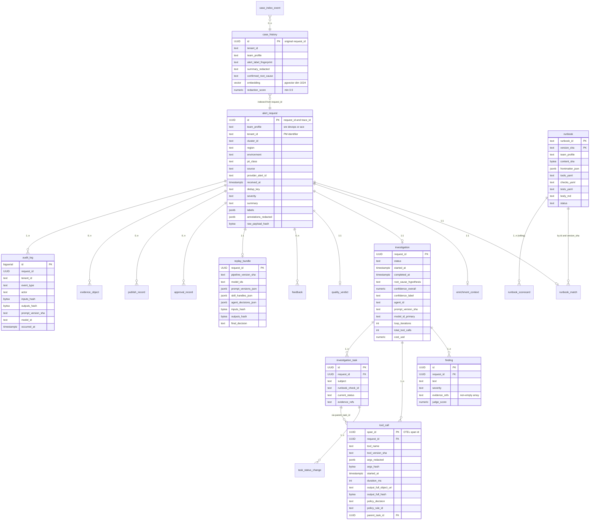

### 12.1 Principle: don't duplicate what Langfuse stores; do duplicate where compliance forces independent records

There are three datastores, each with a clean job:

| Store | Owns | Why |
|---|---|---|
| **Langfuse Postgres** | LLM-call observability: traces, spans (LLM generations), prompts, prompt versions, scores, evaluation runs, datasets | Best-of-breed UI for prompt iteration, eval, cost; we use it as the off-the-shelf tool |
| **Sentinel app Postgres** | Pipeline-grain entities (alert ingress, runbook matches, investigations, findings, tasks, tool calls, approvals, audit log, replay bundles) | Things Langfuse doesn't model natively, plus **independent** records compliance can cross-reference against Langfuse to detect tampering |
| **Object storage (S3/GCS) with KMS** | Raw evidence: full tool-call outputs (logs, kubectl describe payloads), raw alert payloads | Cheap, large-blob storage with WORM lifecycle; we store hashes in Postgres and pointers to objects |

Cross-store join key: **`request_id` (= OTEL `trace_id`)**. Same UUIDv7 in all three.

**Rule of thumb:** if you can answer the question by joining Langfuse spans alone, don't duplicate. If you need pipeline-state, tool-call audit, or compliance-grade WORM, that's Sentinel app DB.

### 12.2 What we deliberately do NOT store in our DB

- Per-call LLM prompt and completion text. Lives in Langfuse only.
- Token counts and per-call cost. Langfuse computes and stores.
- Prompt template versions and variable resolutions. Langfuse Prompts feature.
- LLM-call latency. OTEL span duration in Langfuse.
- Eval scores at the LLM-call level. Langfuse Scores.

Storing these twice means having to reconcile two sources of truth — and Langfuse is better at the LLM-call view than anything we'd build.

### 12.3 What we DO store in Sentinel app DB (and why)

#### 12.3.1 `alert_request` — the entry point

One row per alert ingestion. The `id` here is the `request_id` propagated everywhere.

| Column | Type | Notes |
|---|---|---|
| `id` | UUID PK | = `request_id` = OTEL `trace_id`. UUIDv7 (sortable, no extra `created_at` index) |
| `team_profile` | enum (`sre`, `devops`, `ace`) | Routing key for runbooks/tools/output |
| `tenant_id` | text NOT NULL | PM identifier; `'platform'` for non-PM-scoped alerts |
| `cluster_id` | text NOT NULL | Eg. `us-east-prod` |
| `region` | enum (`us-east`, `eu-west`, `apac`) NOT NULL | |
| `environment` | enum (`prod`, `dev`) NOT NULL | |
| `pii_class` | enum NOT NULL | `public/internal/confidential/mnpi` |
| `source` | enum NOT NULL | `alertmanager/datadog/pagerduty/jenkins/harness/manual` |
| `provider_alert_id` | text NOT NULL | Provider's stable id (PD incident_id, Prom fingerprint) |
| `received_at` | timestamptz NOT NULL | Gateway receive time |
| `dedup_key` | text NOT NULL | `(provider, provider_alert_id)`; partial unique index `(dedup_key) WHERE received_at > now() - interval '60 seconds'` |
| `severity` | enum NOT NULL | `P1..P5` firm-normalised |
| `summary` | text NOT NULL | Truncated to 256 chars |
| `description` | text | Truncated to 4096 chars |
| `labels` | jsonb NOT NULL | Sorted; queryable via GIN |
| `annotations_redacted` | jsonb NOT NULL | After PII scrub |
| `raw_payload_hash` | bytea NOT NULL | SHA-256 of original payload |
| `raw_payload_object_uri` | text NOT NULL | Pointer to S3 object with full payload |
| `created_at` | timestamptz NOT NULL DEFAULT now() | |

Indexes:
- PK `id`
- `(tenant_id, received_at DESC)` for per-PM timelines
- `(team_profile, received_at DESC)` for per-team dashboards
- `(provider_alert_id)` for dedup join
- GIN on `labels` for label-key queries

RLS policy:
```sql
CREATE POLICY tenant_isolation ON alert_request FOR SELECT
USING (tenant_id = current_setting('app.current_tenant_id', true)
       OR pg_has_role(current_user, 'compliance_superuser', 'MEMBER')
       OR pg_has_role(current_user, 'platform_superuser', 'MEMBER'));
```

#### 12.3.2 `runbook_match`

| Column | Type | Notes |
|---|---|---|
| `id` | UUID PK | |
| `request_id` | UUID NOT NULL FK → `alert_request.id` | |
| `tenant_id` | text NOT NULL | Denormalised for RLS (every table that has tenant data carries `tenant_id` for fast RLS) |
| `method` | enum (`tag`, `rag`, `fallback_generic`) | |
| `matched_runbook_id` | text | Eg. `k8s-crashloop`; nullable when method=fallback_generic |
| `matched_version_sha` | text | Git commit SHA where runbook was edited |
| `matched_content_sha` | bytea | SHA-256 of resolved runbook body |
| `match_confidence` | numeric(4,3) | 0..1 |
| `selection_reason` | text | Free-text human-readable |
| `candidates_json` | jsonb NOT NULL | Top-k candidates with scores for explainability |
| `decided_at` | timestamptz NOT NULL | |

Index `(request_id)`.

#### 12.3.3 `enrichment_context`

| Column | Type | Notes |
|---|---|---|
| `request_id` | UUID PK FK → `alert_request.id` | One-to-one |
| `tenant_id` | text NOT NULL | RLS |
| `cluster_state_object_uri` | text NOT NULL | S3 path to JSON snapshot |
| `cluster_state_hash` | bytea NOT NULL | SHA-256 |
| `vm_health_json` | jsonb | Small enough to keep inline; redacted |
| `recent_deploys_json` | jsonb | From Harness/Jenkins |
| `related_alerts_window_json` | jsonb | |
| `prior_incidents_json` | jsonb | |
| `enrichment_warnings` | text[] | |
| `duration_ms` | int NOT NULL | |
| `completed_at` | timestamptz NOT NULL | |

Why hashes + S3 URIs: cluster state can be 100KB+; we don't want to bloat the row, but we do want a verifiable hash for replay.

#### 12.3.4 `investigation`

The headline record per request. One row.

| Column | Type | Notes |
|---|---|---|
| `request_id` | UUID PK FK → `alert_request.id` | |
| `tenant_id` | text NOT NULL | RLS |
| `team_profile` | enum NOT NULL | |
| `status` | enum (`running`, `completed`, `failed`, `aborted`) NOT NULL | |
| `started_at` | timestamptz NOT NULL | |
| `completed_at` | timestamptz | |
| `root_cause_hypothesis` | text | |
| `confidence_overall` | numeric(4,3) | |
| `confidence_label` | enum (`LOW`, `MEDIUM`, `HIGH`) | |
| `confidence_factors_json` | jsonb | Source count, relevance, recency, weights |
| `agent_id` | text NOT NULL | Eg. `sre-investigator-v3.1`; matches Langfuse agent_role tag |
| `prompt_version_sha` | text NOT NULL | The investigator's prompt; matches Langfuse prompt id |
| `model_id_primary` | text NOT NULL | The primary investigator model used |
| `loop_iterations` | int NOT NULL | Total tool-loop iterations |
| `total_tool_calls` | int NOT NULL | |
| `cost_usd` | numeric(10,6) NOT NULL | Sum of all LLM-call costs (mirrored from Langfuse for at-rest cost queries) |
| `tokens_input` | bigint NOT NULL | |
| `tokens_output` | bigint NOT NULL | |
| `aborted_reason` | text | When status=aborted |

Indexes:
- `(tenant_id, started_at DESC)`
- `(team_profile, status, started_at DESC)`
- `(confidence_label, started_at DESC)` for quality dashboards

`cost_usd`/`tokens_*` are duplicated from Langfuse here intentionally: lets the platform team run "top 10 most expensive investigations this week" without joining Langfuse, and gives compliance an independent record that can cross-check Langfuse's numbers.

#### 12.3.5 `finding`

Many per `investigation`.

| Column | Type | Notes |
|---|---|---|
| `id` | UUID PK | |
| `request_id` | UUID NOT NULL FK → `investigation.request_id` | |
| `tenant_id` | text NOT NULL | RLS |
| `text` | text NOT NULL | The claim |
| `severity` | enum (`info`, `warn`, `critical`) NOT NULL | |
| `evidence_refs` | text[] NOT NULL CHECK (cardinality(evidence_refs) > 0) | **DB-level enforcement of groundedness.** No empty array allowed |
| `judge_score` | numeric(4,3) | LLM judge's score on whether the cited evidence supports the claim |
| `judge_reasoning` | text | |
| `created_at` | timestamptz NOT NULL | |

The `CHECK` constraint is the structural lever for groundedness. A run cannot persist a finding without evidence; the harness rejects at write time.

#### 12.3.6 `tool_call`

The audit-grade record of every tool invocation. Many per investigation.

| Column | Type | Notes |
|---|---|---|
| `span_id` | UUID PK | Same value as the OTEL span; not Langfuse-only because we need it queryable here for replay diff |
| `request_id` | UUID NOT NULL FK → `investigation.request_id` | |
| `tenant_id` | text NOT NULL | RLS |
| `tool_name` | text NOT NULL | Eg. `k8s_describe_pod` |
| `tool_version_sha` | text NOT NULL | Code SHA where the tool was defined |
| `args_redacted` | jsonb NOT NULL | After redaction |
| `args_hash` | bytea NOT NULL | SHA-256 of *pre-redaction* args (for replay) |
| `started_at` | timestamptz NOT NULL | |
| `duration_ms` | int NOT NULL | |
| `exit_code` | int | Null if exception thrown |
| `output_truncated` | text | First 1KB |
| `output_full_object_uri` | text | S3 path to full output (object-store, not DB row) |
| `output_full_hash` | bytea NOT NULL | SHA-256 of full output |
| `policy_decision` | enum (`allowed`, `blocked`) NOT NULL | |
| `policy_rule_id` | text | Eg. `cap-token-001` when blocked |
| `parent_task_id` | UUID | FK to `investigation_task.id`; nullable for tool calls outside a task |

Indexes:
- `(request_id, started_at)` for chronological replay
- `(tool_name, started_at DESC)` for tool-usage analytics
- `(policy_decision, policy_rule_id) WHERE policy_decision='blocked'` partial — for security review

Why we store this here, not just in Langfuse: Langfuse stores LLM spans, but tool calls aren't LLM calls. They're separate spans we emit ourselves. We could rely on OTEL → Langfuse for these, but compliance wants an *independent* record they can cross-reference. The Sentinel DB stores hashes; the OTEL pipeline stores attributes; if the two disagree, that's a tampering signal.

#### 12.3.7 `investigation_task` and `task_status_change`

Backs the §5.9 task list pattern.

`investigation_task`:

| Column | Type | Notes |
|---|---|---|
| `id` | UUID PK | |
| `request_id` | UUID NOT NULL FK → `investigation.request_id` | |
| `tenant_id` | text NOT NULL | RLS |
| `subject` | text NOT NULL | |
| `runbook_check_id` | text | Null when agent-generated (generic playbook) |
| `parent_task_id` | UUID | FK self-ref for hierarchical decomposition |
| `current_status` | enum (`pending`, `in_progress`, `completed`, `blocked`) NOT NULL | |
| `evidence_refs` | text[] NOT NULL DEFAULT '{}' | Required to be non-empty when status=completed (enforced at app level + trigger) |
| `created_at` | timestamptz NOT NULL | |

`task_status_change` (append-only):

| Column | Type | Notes |
|---|---|---|
| `id` | UUID PK | |
| `task_id` | UUID NOT NULL FK | |
| `request_id` | UUID NOT NULL | Denormalised |
| `tenant_id` | text NOT NULL | RLS |
| `from_status` | enum | Null on first transition |
| `to_status` | enum NOT NULL | |
| `changed_at` | timestamptz NOT NULL | |
| `notes` | text | |

#### 12.3.8 `quality_verdict` and `approval_record`

`quality_verdict`:

| Column | Type | Notes |
|---|---|---|
| `request_id` | UUID PK FK → `investigation.request_id` | One-to-one |
| `tenant_id` | text NOT NULL | RLS |
| `decision` | enum (`publish`, `human_review`, `reject`) NOT NULL | |
| `redacted_summary` | text NOT NULL | Final published text |
| `redacted_findings_json` | jsonb NOT NULL | |
| `issues_json` | jsonb NOT NULL | Array of {rule_id, severity, message} |
| `requires_approval` | bool NOT NULL | |
| `approver_role` | enum | `oncall/team_lead/compliance` when set |
| `created_at` | timestamptz NOT NULL | |

`approval_record` (append-only):

| Column | Type | Notes |
|---|---|---|
| `id` | UUID PK | |
| `request_id` | UUID NOT NULL FK | |
| `tenant_id` | text NOT NULL | RLS |
| `requested_at` | timestamptz NOT NULL | |
| `requested_via` | enum (`slack_interactive`, `pagerduty_alert`, `internal_api`) NOT NULL | |
| `approver_id` | text | Slack user_id or service principal |
| `decision` | enum (`approved`, `rejected`, `auto_approved`, `expired`) | Null until decided |
| `decided_at` | timestamptz | |
| `notes` | text | |

#### 12.3.9 `publish_record`

| Column | Type | Notes |
|---|---|---|
| `id` | UUID PK | |
| `request_id` | UUID NOT NULL FK | |
| `tenant_id` | text NOT NULL | RLS |
| `channel_kind` | enum (`slack_channel`, `slack_dm`, `pagerduty_note`, `jira_comment`) NOT NULL | |
| `channel_target` | text NOT NULL | Slack channel id, PD incident id, etc. |
| `external_message_id` | text | The id returned by the target system (Slack ts, etc.) |
| `published_at` | timestamptz NOT NULL | |
| `published_payload_hash` | bytea NOT NULL | SHA-256 of the exact text we sent |

#### 12.3.10 `audit_log` — append-only, WORM-style

The single immutable record compliance treats as canonical.

| Column | Type | Notes |
|---|---|---|
| `id` | bigserial PK | |
| `request_id` | UUID NOT NULL | |
| `tenant_id` | text NOT NULL | RLS for normal queries; compliance bypass via role |
| `event_type` | enum NOT NULL | `request_received/runbook_matched/agent_started/tool_call_made/finding_recorded/quality_decided/approval_requested/approval_decided/published/replay_executed/redaction_blocked` |
| `actor` | text NOT NULL | Eg. `agent:sre-investigator`, `human:slack-user-id`, `system:harness` |
| `subject` | text | What the action was about (eg. tool name, channel id) |
| `inputs_hash` | bytea NOT NULL | SHA-256 of the event's inputs |
| `outputs_hash` | bytea NOT NULL | SHA-256 of the outputs |
| `prompt_version_sha` | text | When applicable |
| `model_id` | text | When applicable |
| `decision` | text | Free-text decision label |
| `occurred_at` | timestamptz NOT NULL | |

Implementation:
- A separate Postgres role `audit_writer` is the only one with `INSERT` on this table. Other roles have `SELECT` only.
- Updates and deletes are revoked from all roles, including `postgres` superuser at the application layer (compliance has dedicated tooling that does not run via the app).
- Daily logical-replication snapshot to a WORM-compliant object store with object-lock retention.

#### 12.3.11 `replay_bundle`

One per investigation. The artefact you replay from.

| Column | Type | Notes |
|---|---|---|
| `request_id` | UUID PK FK → `investigation.request_id` | |
| `tenant_id` | text NOT NULL | RLS |
| `pipeline_version_sha` | text NOT NULL | Git SHA of Sentinel repo at run time |
| `model_ids` | text[] NOT NULL | Every model used |
| `prompt_versions_json` | jsonb NOT NULL | Array of {agent_role, prompt_version_sha, prompt_content_sha} |
| `skill_handles_json` | jsonb NOT NULL | Array of {runbook_id, version_sha, content_sha} |
| `mcp_server_handles_json` | jsonb NOT NULL | |
| `tool_call_count` | int NOT NULL | |
| `agent_decisions_json` | jsonb NOT NULL | The implicit-decision log (see §3.5) |
| `inputs_hash` | bytea NOT NULL | Hash of the original IngestedAlert |
| `outputs_hash` | bytea NOT NULL | Hash of PublishResult |
| `final_decision` | enum NOT NULL | `published/approved_then_published/rejected/errored` |
| `created_at` | timestamptz NOT NULL | |

The `agent_decisions_json` is what makes deterministic replay possible — without it, two runs of the agent might pick different next actions even with the same inputs.

#### 12.3.12 `evidence_object` (registry of S3 evidence pointers)

| Column | Type | Notes |
|---|---|---|
| `id` | UUID PK | |
| `request_id` | UUID NOT NULL | |
| `tenant_id` | text NOT NULL | RLS |
| `kind` | enum (`raw_alert`, `cluster_state`, `tool_output`, `enrichment_snapshot`) NOT NULL | |
| `content_type` | text NOT NULL | MIME |
| `object_uri` | text NOT NULL | S3 path |
| `content_hash` | bytea NOT NULL | SHA-256 |
| `size_bytes` | bigint NOT NULL | |
| `kms_key_id` | text NOT NULL | KMS key used at encrypt-write time |
| `expires_at` | timestamptz NOT NULL | TTL drives the object-store lifecycle policy |
| `created_at` | timestamptz NOT NULL | |

Index `(request_id)`, `(expires_at)` for retention sweeps.

#### 12.3.13 `runbook` and `runbook_scorecard`

These two are global metadata about runbooks themselves, not per-request data. Not tenant-scoped, so no RLS needed.

`runbook` (one row per (runbook_id, version_sha)):

| Column | Type | Notes |
|---|---|---|
| `runbook_id` | text NOT NULL | Eg. `k8s-crashloop` |
| `version_sha` | text NOT NULL | Git SHA |
| `team_profile` | enum NOT NULL | `sre/devops/ace` |
| `content_sha` | bytea NOT NULL | SHA-256 of resolved body |
| `frontmatter_json` | jsonb NOT NULL | |
| `tools_yaml` | text NOT NULL | The capability scope file |
| `checks_yaml` | text NOT NULL | |
| `tests_yaml` | text NOT NULL | |
| `body_md` | text NOT NULL | The free-form prompt |
| `mnpi_safe` | bool NOT NULL | |
| `status` | enum (`active`, `deprecated`, `needs_rewrite`) NOT NULL | |
| `created_at` | timestamptz NOT NULL | |
| PK | `(runbook_id, version_sha)` | |

`runbook_scorecard` (rolling, recomputed nightly):

| Column | Type | Notes |
|---|---|---|
| `runbook_id` | text NOT NULL | |
| `period_start` | date NOT NULL | |
| `period_days` | int NOT NULL | Eg. 30 |
| `match_count` | int NOT NULL | |
| `procedural_compliance_p50` | numeric(4,3) | |
| `procedural_compliance_p95` | numeric(4,3) | |
| `hypothesis_recall_at_1` | numeric(4,3) | |
| `mean_confidence` | numeric(4,3) | |
| `human_thumbs_up_rate` | numeric(4,3) | |
| `compliance_audit_pass_rate` | numeric(4,3) | |
| `computed_at` | timestamptz NOT NULL | |
| PK | `(runbook_id, period_start, period_days)` | |

#### 12.3.14a `case_history` (per-tenant) and `case_pattern` (team-anonymised)

Two tables backing the case-history retrieval (§3.3.1). pgvector required.

`case_history`:

| Column | Type | Notes |
|---|---|---|
| `id` | UUID PK | Same UUID as the source investigation's `request_id` |
| `tenant_id` | text NOT NULL | RLS — strict |
| `team_profile` | enum NOT NULL | |
| `runbook_id_used` | text | |
| `alert_label_fingerprint` | text NOT NULL | Deterministic concat of sorted alert labels — supports BM25 |
| `summary_redacted` | text NOT NULL | What gets shown to the agent on retrieval |
| `confirmed_root_cause` | text NOT NULL | Required to be present (else don't index) |
| `helpful_actions` | text[] NOT NULL | |
| `embedding` | vector(1024) NOT NULL | pgvector column; dimension matches embedding model |
| `redaction_score` | numeric(4,3) NOT NULL CHECK (redaction_score >= 0.9) | Hard gate at index time |
| `confirmation_source` | enum (`mark_cause`, `postmortem`, `manual_curate`) NOT NULL | |
| `original_occurred_at` | timestamptz NOT NULL | |
| `indexed_at` | timestamptz NOT NULL | |

Indexes:
- HNSW on `embedding` (cosine)
- GIN on `tsvector(alert_label_fingerprint || ' ' || summary_redacted)` for BM25
- `(tenant_id, team_profile, original_occurred_at DESC)` — every retrieval filters on these first

RLS enforced; the strict tenant filter is the primary leak prevention. App role for retrieval has read-only access; a separate `case_indexer` role has insert-only.

`case_pattern` (team-anonymised, no tenant_id):

| Column | Type | Notes |
|---|---|---|
| `id` | UUID PK | |
| `team_profile` | enum NOT NULL | |
| `alert_signature` | text NOT NULL | Anonymised alert pattern — labels with PM-identifying values stripped |
| `pattern_summary` | text NOT NULL | Aggressively-redacted, no per-PM specifics |
| `commonly_caused_by` | text[] NOT NULL | List of root cause categories observed |
| `helpful_action_templates` | text[] NOT NULL | Generic remediation patterns |
| `support_count` | int NOT NULL | How many original investigations contributed |
| `embedding` | vector(1024) NOT NULL | |
| `last_recomputed_at` | timestamptz NOT NULL | |

`case_pattern` is *recomputed periodically* from `case_history` via a clustering job (DBSCAN or similar on embeddings, then a cluster-summarisation LLM pass). It is *never* a 1:1 record per investigation — that would defeat the anonymisation. Minimum `support_count` to publish a pattern: 5.

#### 12.3.14b `case_index_event` (audit of every index/anonymisation/withdrawal)

| Column | Type | Notes |
|---|---|---|
| `id` | UUID PK | |
| `case_id` | UUID NOT NULL | |
| `event_type` | enum (`indexed`, `anonymised`, `withdrawn`, `re-redacted`) NOT NULL | |
| `redaction_score` | numeric(4,3) | |
| `actor` | text NOT NULL | |
| `occurred_at` | timestamptz NOT NULL | |

Compliance reads this to verify the retrieval store's hygiene without scanning the case_history rows themselves.

#### 12.3.15 `feedback`

Engineer/PM feedback events.

| Column | Type | Notes |
|---|---|---|
| `id` | UUID PK | |
| `request_id` | UUID NOT NULL FK | |
| `tenant_id` | text NOT NULL | RLS |
| `kind` | enum (`thumbs_up`, `thumbs_down`, `mark_cause`, `runbook_correct`, `runbook_wrong`, `escalation_flag`) NOT NULL | |
| `payload_json` | jsonb | Free-form body — for `mark_cause` carries the structured cause tag |
| `actor_id` | text NOT NULL | Slack user_id or service principal |
| `occurred_at` | timestamptz NOT NULL | |

This is the labelled-data feed that drives runbook scorecards, eval datasets, and prompt iteration.

### 12.4 Indexes, partitioning, retention

**Partitioning.** `alert_request`, `tool_call`, `audit_log`, `task_status_change`, `feedback` partition by month on `received_at`/`occurred_at`. At hedge fund alert volumes (~thousands of alerts/day across 3 teams × 50 PMs) the per-table size grows fast — month partitions keep individual partition size ≤ 10GB and let us drop old data with a single `DETACH PARTITION`.

**Retention.**

| Table | Retention | Reason |
|---|---|---|
| `alert_request`, `runbook_match`, `enrichment_context`, `investigation`, `finding`, `tool_call`, `task_*`, `quality_verdict`, `publish_record`, `replay_bundle` | 1 year hot, archive to cold storage to 7 years | Operational + regulatory |
| `audit_log` | 7 years all hot, then WORM-archive forever | Regulatory |
| `evidence_object` | 90 days hot, then expired by S3 lifecycle | Bounded blast radius if compromised |
| `runbook_scorecard` | Forever (small) | Trend analysis |
| `feedback` | 7 years | Eval dataset feed |

**RLS pattern.** Every tenant-scoped table has the policy:

```sql
CREATE POLICY tenant_iso_<table> ON <table>
  USING (tenant_id = current_setting('app.current_tenant_id', true)
         OR pg_has_role(current_user, 'compliance_superuser', 'MEMBER')
         OR pg_has_role(current_user, 'platform_superuser', 'MEMBER'));
```

The application sets `app.current_tenant_id` at the start of each request via `SET LOCAL`. Compliance and platform-superuser roles bypass for legitimate cross-tenant operations and are audited via `pgaudit`.

### 12.5 What lives in Langfuse instead — explicit map

For an engineer asking "where do I look up X?":

| Question | Answer source |
|---|---|
| What was the prompt sent for this LLM call? | Langfuse generation span |
| What was the model's response? | Langfuse generation span |
| How much did this LLM call cost / how many tokens? | Langfuse |
| Which prompt template version was used? | Langfuse Prompts |
| What did the agent's iteration tree look like? | Langfuse trace (span hierarchy) |
| Which model judged this finding and what score did it give? | Langfuse Scores |
| What was the ground truth for this eval case? | Langfuse Datasets |
| When was the alert received? | Sentinel app DB (`alert_request.received_at`) |
| What runbook matched this alert? | Sentinel app DB (`runbook_match`) |
| What were the pre-redaction args of this tool call? | Object store via `tool_call.args_hash` (the hash is in DB; the args are in evidence object) |
| Did the agent finish all the prescribed checks? | Sentinel app DB (`investigation_task`) |
| Was this run published to Slack? | Sentinel app DB (`publish_record`) |
| Has this run been replayed and matched? | Sentinel app DB (replay-diff CI job records, in `audit_log` with `event_type='replay_executed'`) |
| What was the WORM record of this decision? | Sentinel app DB (`audit_log`) |

### 12.6 Why Postgres for the trace store (not ClickHouse, not OpenSearch)

- We already need Postgres for the job queue, transactional state, and RLS.
- Volume is comfortably within Postgres scale (hundreds of thousands of rows/day per partitioned table).
- WORM semantics are easier with Postgres roles + replication than with multi-tenant analytical stores.
- Compliance accepts Postgres+pgaudit; ClickHouse adds a new vendor to evaluate.
- ClickHouse becomes interesting at >10M tool-call rows/day — re-evaluate at that point. We'll know we're approaching it because partition sizes will start growing.

### 12.7 Migrations

Alembic, with the Postgres role separation deployed as part of the migration (the `audit_writer` role and its grants live in migrations, not in a side-channel script). Pre-deploy job runs `alembic upgrade head` as a Helm pre-upgrade hook, identical to the prior project's pattern.

---

## 13. OTEL pipeline + Langfuse integration

### 13.1 Topology

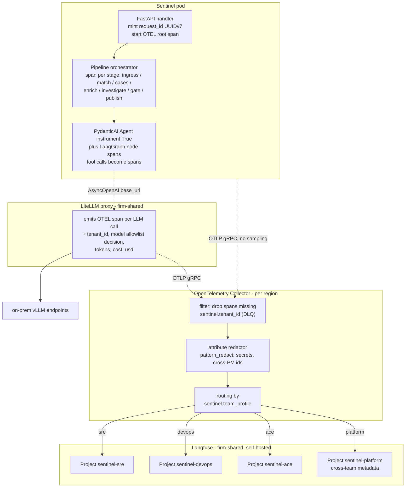

### 13.2 Span attributes contract

Every span carries this minimum set of attributes (validated by the OTEL collector — spans missing them are dropped to a dead-letter pipeline, never to Langfuse):

```
# from envelope
sentinel.request_id            (= trace_id, redundant but aids manual lookup)
sentinel.tenant_id
sentinel.team_profile          # sre / devops / ace
sentinel.cluster_id
sentinel.region
sentinel.environment
sentinel.pii_class

# from agent context (when applicable)
sentinel.agent_role            # alert_classifier / investigator / judge / redactor
sentinel.runbook_id            # when applicable
sentinel.runbook_version_sha
sentinel.runbook_content_sha
sentinel.prompt_version_sha
sentinel.prompt_content_sha
sentinel.skill_handles         # comma-separated list

# from LLM call (set by LiteLLM proxy)
gen_ai.system                  # OTEL semconv: openai/anthropic
gen_ai.request.model           # litellm:anthropic/claude-sonnet-4-6
gen_ai.usage.input_tokens
gen_ai.usage.output_tokens
gen_ai.usage.cost_usd          # LiteLLM extension

# from tool call (set by harness)
sentinel.tool.name
sentinel.tool.version_sha
sentinel.tool.policy_decision  # allowed | blocked
sentinel.tool.policy_rule_id   # when blocked
sentinel.tool.output_hash
```

The collector's enrichment processor enforces:
- `sentinel.tenant_id` present on every span (drops spans missing it; alerts the platform team).
- Redaction regexes applied to span attributes and span events before export to Langfuse.
- Routing to Langfuse project based on `sentinel.team_profile`.

### 13.3 PydanticAI + LangGraph emit OTEL natively — no custom trace processor

With D-01 v0.4 (PydanticAI + LangGraph), this is mostly a no-code section. PydanticAI ships native OTEL instrumentation; LangGraph ships an OTel instrumentor. The application bootstraps OTel once and both layers populate the trace tree without further glue.

```python
# src/sentinel/observability/otel.py
import logfire   # Logfire SDK exposes the OTel exporter PydanticAI is wired to

# PydanticAI side
def init_pydantic_ai_tracing(otlp_endpoint: str) -> None:
    logfire.configure(
        send_to_logfire=False,           # we route via OTLP, not Logfire cloud
        service_name="sentinel-agent",
        otel_endpoint=otlp_endpoint,
    )
    # Per-Agent: pass instrument=True at construction
    # Agent(..., instrument=True)


# LangGraph side
from langgraph.checkpoint.postgres import PostgresSaver
from opentelemetry.instrumentation.langgraph import LangGraphInstrumentor

def init_langgraph_tracing() -> None:
    LangGraphInstrumentor().instrument()
    # graph nodes now emit a span per transition with `langgraph.node` attributes
```

Each PydanticAI agent invocation is one OTEL span tree under the LangGraph node's span; tool calls go through the harness which wraps each one in a `sentinel.tool.*` span carrying the §13.2 attribute set. The pipeline-level spans come from the orchestrator (§15.12 consumption pattern).

> **TODO: /research** — verify LangGraph's OTel instrumentor is published as a stable package with the specific span attributes we want. As of authoring (2026-04-25) the LangGraph community OTel instrumentor was a candidate; if it lags, we wrap each node entry/exit ourselves with `tracer.start_as_current_span("langgraph.node.<name>")`. ~half a day of code if needed.

The contextvar pattern from the prior section still applies: a `current_envelope` contextvar set by the API ingress carries `tenant_id`, `team_profile`, `pii_class` so every emitted span enriches with them automatically (via a `SpanProcessor.on_start` hook).

### 13.4 LiteLLM proxy → OTEL

LiteLLM proxy supports OTEL natively as of recent versions. Configuration (`config.yaml`):

```yaml
litellm_settings:
  callbacks:
    - otel
  otel_endpoint: http://otel-collector.sentinel.svc:4317
  otel_headers: {}
  service_name: sentinel-litellm

# per-tenant virtual keys, with mandatory metadata headers
general_settings:
  master_key: <kms-managed>
  database_url: <litellm-postgres-url>

# per-tenant routing rules
router_settings:
  ...
```

Plus a custom callback (or LiteLLM logging hook) that propagates `tenant_id`, `team_profile`, `pii_class` from the request headers to the OTEL span attributes. The application sets these headers; the proxy forwards them as span attributes; the OTEL collector validates them.

### 13.5 Application code OTEL setup

```python
# sentinel/observability/otel.py
from opentelemetry import trace
from opentelemetry.sdk.trace import TracerProvider
from opentelemetry.sdk.trace.export import BatchSpanProcessor
from opentelemetry.exporter.otlp.proto.grpc.trace_exporter import OTLPSpanExporter
from opentelemetry.sdk.resources import Resource

def init_otel(service_name: str, region: str):
    resource = Resource.create({
        "service.name": service_name,
        "service.namespace": "sentinel",
        "service.version": SENTINEL_VERSION_SHA,
        "deployment.environment": ENVIRONMENT,
        "sentinel.region": region,
    })
    provider = TracerProvider(resource=resource)
    exporter = OTLPSpanExporter(endpoint=OTEL_COLLECTOR_ENDPOINT, insecure=False)
    provider.add_span_processor(BatchSpanProcessor(exporter))
    trace.set_tracer_provider(provider)
```

At request ingress:

```python
@app.post("/api/sre/webhooks/alertmanager")
async def receive_alert(payload: AlertManagerPayload, request: Request):
    request_id = uuid7()    # UUIDv7 for sortability
    envelope = build_envelope(payload, request_id=request_id)
    # Bind envelope to OTEL trace_id
    span_context = trace.SpanContext(
        trace_id=request_id.int,
        span_id=generate_span_id(),
        is_remote=False,
        trace_flags=trace.TraceFlags(0x01),
    )
    ctx = trace.set_span_in_context(NonRecordingSpan(span_context))
    with trace.get_tracer(__name__).start_as_current_span("ingress", context=ctx) as span:
        for k, v in envelope_to_otel_attrs(envelope).items():
            span.set_attribute(k, v)
        # contextvar set so SDK-emitted spans inherit
        envelope_var.set(envelope)
        await pipeline.run(envelope=envelope, payload=payload)
    return {"request_id": str(request_id)}
```

The `request_id` is returned in the API response and is the single id the engineer uses to find the trace in Langfuse, the run in the Sentinel UI, the published Slack message, the PD note, the audit log entry — everywhere.

### 13.6 OTEL collector configuration (the redaction layer)

The collector is the place to enforce universal invariants. Sample (paraphrased) config:

```yaml
processors:
  # Enforce tenant_id presence — drop spans missing it
  filter:
    spans:
      include:
        match_type: strict
        attributes:
          - key: sentinel.tenant_id
            value: ".+"

  # Redact common credential patterns from span attributes
  attributes:
    actions:
      - key: db.statement
        action: hash
      - key: http.url
        action: update
        value: "REDACTED"
      # apply pattern-based redaction on any string attribute
      - pattern_redact:
          patterns:
            - '(?i)(api[_-]?key|secret|token|password|bearer)[\s:=]+[\w\-]+'
            - '(?i)pm-(?!{tenant_id})\w+'  # cross-PM identifier scrub

  # Route to per-team Langfuse project
  routing:
    from_attribute: sentinel.team_profile
    table:
      - value: "sre"
        exporters: [langfuse_sre]
      - value: "devops"
        exporters: [langfuse_devops]
      - value: "ace"
        exporters: [langfuse_ace]

exporters:
  langfuse_sre:
    endpoint: https://langfuse.internal/api/public/otel
    headers:
      Authorization: "Basic <kms-managed-sre-token>"
  langfuse_devops:
    endpoint: https://langfuse.internal/api/public/otel
    headers:
      Authorization: "Basic <kms-managed-devops-token>"
  langfuse_ace:
    endpoint: https://langfuse.internal/api/public/otel
    headers:
      Authorization: "Basic <kms-managed-ace-token>"

service:
  pipelines:
    traces:
      receivers: [otlp]
      processors: [filter, attributes, routing]
      exporters: [langfuse_sre, langfuse_devops, langfuse_ace]
```

Langfuse exposes an OTLP endpoint (`/api/public/otel`) since v3 — we hit it directly from the collector with per-team API keys. Each team's keys are separate so a misrouted span fails with 401 instead of silently leaking into the wrong project.

### 13.7 Replay's reliance on OTEL

The `replay_bundle` row references the original `request_id`. The replay tool:

1. Loads the `replay_bundle`, the `alert_request`, and the `tool_call` rows for the original `request_id`.
2. Sets up a dummy LiteLLM proxy that, instead of calling the real model, returns the recorded model outputs from Langfuse traces (looked up by `prompt_content_sha + model_id`).
3. Re-executes the agent harness with the recorded inputs.
4. Asserts the output's hash matches `outputs_hash`.

This is why we recorded `agent_decisions_json` and `inputs_hash`/`outputs_hash`: replay needs to determinise the LLM call (otherwise we'd be re-querying live models, which would drift) and verify the output.

---

---

## 14. The 2-month delivery plan — what to build, what to defer

**Constraint: 1 engineer (you), 8 weeks, single team profile (SRE), single region, single dev cluster.** The RFC above describes the steady-state target. This section is the credible v0 to deliver in 2 months. Everything else slips to month 3+.

### 14.1 The single most important framing

You are not trying to ship the RFC. You are trying to ship **a credible end-to-end skeleton** that solves the real problem for the SRE team for ~3 PMs in dev, with the hedge-fund-grade pieces designed in but not all wired. The steady-state RFC is the destination, not the milestone.

If at the end of 2 months you have:
- A real alert from AlertManager landing in your pipeline
- A runbook matching it
- An investigation agent gathering evidence via PydanticAI + LangGraph + LiteLLM proxy
- A redacted summary posted to a Slack channel
- Every step traced via OTEL into Langfuse with a working trace_id
- A replay bundle stored
- An eval framework with 20+ golden cases that runs on every PR

…you have crossed the chasm. v1 production hardening is then 2-3 more months on top.

### 14.2 Ruthless prioritisation — keep / cut

| Component | v0 (8 weeks) | Defer |
|---|---|---|
| AlertManager webhook + dedup + envelope minting | ✅ | |
| LiteLLM proxy single-tenant | ✅ | Multi-tenant routing → month 3 |
| Postgres + Alembic with the core 8 tables | ✅ (`alert_request`, `runbook_match`, `investigation`, `finding`, `tool_call`, `investigation_task`, `quality_verdict`, `audit_log`) | The remaining 8 tables → month 3 |
| PydanticAI investigator agent inside a LangGraph state graph, with task list | ✅ | |
| Runbook structure (RUNBOOK.md + tools.yaml + checks.yaml + tests.yaml) | ✅ | |
| 5–8 hand-authored runbooks covering top SRE alerts | ✅ | More runbooks, Confluence sync → month 3 |
| Tag-based runbook matcher | ✅ | RAG fallback → month 3 |
| 12–15 primitive tools (k8s read, prom query, slack post, basic harness deploy lookup) | ✅ | Full 30-tool catalogue → month 3 |
| Quality gate — deterministic groundedness only | ✅ | LLM judge → month 3 |
| Five-layer info barrier — only layers 1 (k8s RBAC) and 2 (app tenant scope) | ✅ | Layers 3–5 (LiteLLM tenant routing, full redactor, RLS) → month 3 |
| OTEL → Langfuse self-hosted, single SRE project | ✅ | Per-region / per-team projects → month 3+ |
| Langfuse OTLP integration via collector | ✅ | Full collector redaction processor → month 3 |
| Slack publish to a single compliance/shadow channel (D-14) | ✅ | Approval Slack interactive (buttons, reactions, thread approval) → v1 |
| Approval *data structures* (`approval_record`, `quality_verdict`) persisted | ✅ | Slack interactive UI on top → v1 |
| Replay bundle write + replay CLI | ✅ | Replay-diff CI nightly job → month 3 |
| Eval framework with 20–30 golden cases | ✅ | Braintrust/DeepEval integration → month 3 |
| Audit log write path | ✅ | WORM archive job → month 3 |
| HolmesGPT integration | 🟡 stretch | If time: thin wrapper. Else: month 3 |
| Case-history retrieval (§3.3.1) | ❌ | Needs ≥100 confirmed investigations to be useful — month 4–5 |
| DevOps profile | ❌ | Month 4 |
| ACE profile + PM-self-serve flow | ❌ | Month 5–6 |
| Multi-region | ❌ | Quarter 3 |
| Replay-tooling that mocks LLM responses | ❌ | Month 4+ |
| Self-consistency double-runs | ❌ | Month 5+ |
| Compliance audit pipeline | ❌ | Month 6 (before any production rollout) |
| Per-PM Langfuse tag RBAC | ❌ | Month 4 |
| Case-pattern anonymised pool | ❌ | Month 5+ |

### 14.3 8-week milestone plan

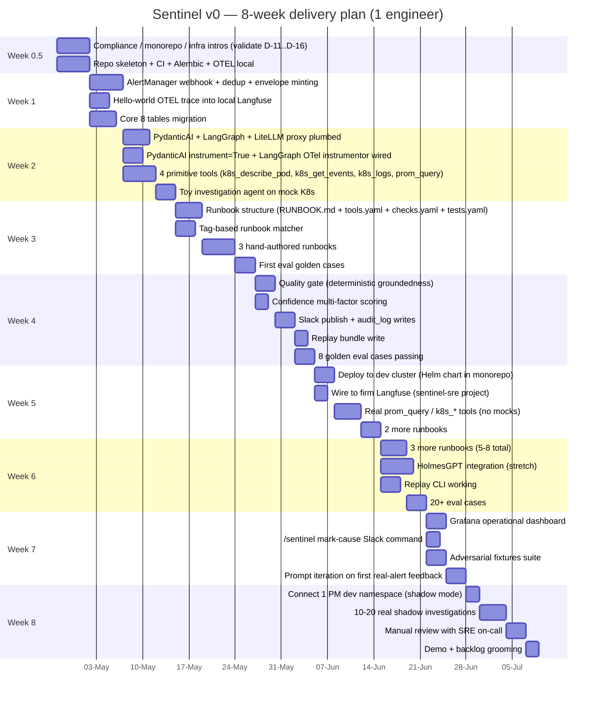


**Pre-week 0 — agreed in week 2 of role (this week):**
- This RFC circulated to reviewers; tentative decisions D-11..D-16 flagged for first-week validation per §11.4
- Working assumption: monorepo sub-package + firm-shared LiteLLM/OTEL/Langfuse/Postgres
- One named owner identified per tentative decision; intros scheduled

**Week 0.5 (first 2–3 days) — validation sprint, in parallel with skeleton build:**
- Day 1: monorepo onboarding (D-12)
- Day 2: compliance meeting on LLM policy (D-11)
- Day 3: LiteLLM operator + model allowlist (D-13, partial)
- Day 4: Langfuse operator + DBA (D-15, D-16)
- Day 5: amendment write-ups for any decisions that flipped, RFC updated

**Week 1 — skeleton**
- FastAPI app scaffold; Alembic with the 8 core tables; `request_id` end-to-end through the API and into a structlog correlation field
- OTEL SDK initialised; spans visible in a local Jaeger or Langfuse OSS Docker
- Hello-world AlertManager webhook receiver; dedup; envelope minting
- One trivial pipeline stage that writes to `alert_request` and produces an OTEL trace
- Smoke test: synthetic AlertManager payload → row in DB → trace in local Langfuse

**Week 2 — agent harness foundations**
- PydanticAI plumbed through LiteLLM proxy via `Model("litellm:...", base_url=...)`; LangGraph state graph wraps the pipeline DAG
- PydanticAI `instrument=True` + LangGraph OTel instrumentor; agent iterations appear as nested OTEL spans
- 4 primitive tools: `k8s_describe_pod`, `k8s_get_events`, `k8s_get_pod_logs`, `prom_query_range` — each with capability-token gating skeleton
- Toy investigation agent that uses the tools on a mock K8s API
- Task list pattern wired (`investigation_task_create/update`)

**Week 3 — runbook system**
- Runbook directory structure; loader; content-hashing
- Tag-based matcher with golden tests
- 3 runbooks: `k8s-crashloop`, `pod-pending-resources`, `latency-spike` — full set (RUNBOOK.md + tools.yaml + checks.yaml + tests.yaml)
- Pipeline stages 1–4 (ingress → match → enrich-stub → investigate) end-to-end on a mock cluster
- First eval golden cases

**Week 4 — quality gate + publish**
- Deterministic groundedness checker (`evidence_refs` non-empty, refs match tool_calls)
- Confidence scoring (multi-factor)
- Slack vendor adapter; publish stage with redacted summary and trace_id link
- Audit log writes for every transition
- Replay bundle write
- 8 golden eval cases passing

**Week 5 — real cluster, real Langfuse**
- Deploy to dev cluster (Helm chart); wire to a real test K8s cluster with read-only RBAC SA
- Self-hosted Langfuse in dev cluster; OTEL collector deployed
- Real `prom_query` and real `k8s_*` tools (not mocked)
- 2 more runbooks (whatever the SRE team's top 2 alerts are)
- Manual testing against real-cluster fixtures
- First end-to-end run with all real components

**Week 6 — investigation depth + Holmes**
- 3 more runbooks (5–8 total)
- HolmesGPT integration as a parallel investigator (stretch — cut if behind)
- Replay CLI working: `python -m sentinel.replay <request_id>` reproduces output
- Per-runbook scorecard skeleton (data captured, dashboard later)
- 20+ eval cases
- First trial run against real (test) AlertManager-fired alert

**Week 7 — observability + iteration**
- Grafana dashboard with the operational metrics from §5.6 (latency, runbook coverage, groundedness pass rate, cost)
- `/sentinel mark-cause` Slack slash command for label collection
- Adversarial test fixtures (cross-PM identifier injection, prompt injection in pod names)
- Prompt iteration based on first-real-alerts feedback
- Documentation: runbook authoring guide, on-call runbook for Sentinel itself

**Week 8 — soft launch**
- Connect to *one* PM's namespace in dev cluster (with explicit opt-in)
- Run in shadow mode (no Slack publish; logs to compliance channel only)
- 10–20 real shadow investigations
- Manual review of every shadow run with the SRE on-call who would have handled it
- Demo to platform leadership; demo to compliance
- Backlog grooming for month 3

### 14.4 What success looks like at week 8

- A real alert fires in AlertManager → 60–90 seconds later, an investigation appears in the compliance Slack channel with a redacted summary, a runbook link, a confidence score, evidence refs, a trace_id, and a thumbs-up/down button
- Every step is in Langfuse — collapsible trace tree, one click from the Slack message
- `python -m sentinel.replay <request_id>` reproduces the published summary on the same input
- 20+ golden eval cases pass on `git push`
- Senior SRE engineer says "I would have done basically the same thing" on ≥7 out of the 10 shadow runs

That's a credible v0. Week-9 onwards is hardening, then v1 to a single live PM, then breadth.

### 14.5 Risks specific to the 2-month timeline

| Risk | Mitigation |
|---|---|
| LLM provider/model approval drags past week 2 | Build against LiteLLM in front of a *single* compliance-approved provider first; defer multi-provider routing |
| Real K8s cluster access blocked by infra approval | Run weeks 1–4 entirely on a kind/k3d local cluster with synthetic alerts; switch only when approval lands |
| HolmesGPT integration eats a week | It's marked stretch; cut without ceremony if week 6 starts behind |
| Compliance asks for the 5-layer barrier before any deploy | Emphasise that v0 is dev-cluster-only and shadow-mode; promote-to-real-PM gates on the remaining layers |
| Eval framework choice (Braintrust/DeepEval/pydantic-evals) becomes a rabbit hole | Default to `pydantic-evals` (zero infra). Re-evaluate at month 3 |
| Solo engineer + first principles for every decision | This RFC is the leverage — every section answers "what would I have argued about for a week?" up front |

### 14.6 Things you should NOT do in the first 2 months even if tempted

- **Build a UI.** Slack + Langfuse is the UI. A web app for browsing investigations is week-12 work, not week-8.
- **Build a PromptOps system.** Prompts in git, versioned by SHA; that's it. No prompt-management abstraction layer.
- **Optimise for cost.** Cost is week-12+ work. v0 should optimise for correctness and traceability.
- **Make case-history retrieval work.** It's a force multiplier — but only after you have ≥100 confirmed investigations. Building it before you have data to feed it is wasted effort.
- **Solve multi-tenancy fully.** The barrier matters at scale; for 3 dev PMs in shadow mode, tenant_id stamping + dev cluster RBAC is enough. Don't pre-build the LiteLLM tenant routing layer until you've actually got two real tenants.
- **Pre-build the DevOps and ACE profiles.** They share the harness, but the alert sources, tools, and prompts are all different. Designing them in parallel is a way to ship neither well. Single profile, ship it, then port.

### 14.7 The single failure mode to fear

The plan dies if **the OTEL ↔ Langfuse ↔ replay-bundle triple is not bedded in by week 5**. Without it, you have an agent but no observability, no eval, no replay, no compliance story. Every week you delay this triple compounds. Bias every week-1-to-5 decision toward landing this triple.

The plan does *not* die if a runbook is half-finished, an eval case is missing, or HolmesGPT integration is cut. Those are recoverable.

---

*End of RFC-001. Review comments welcome via PR; tagged decisions will be promoted to ADRs after approval.*
