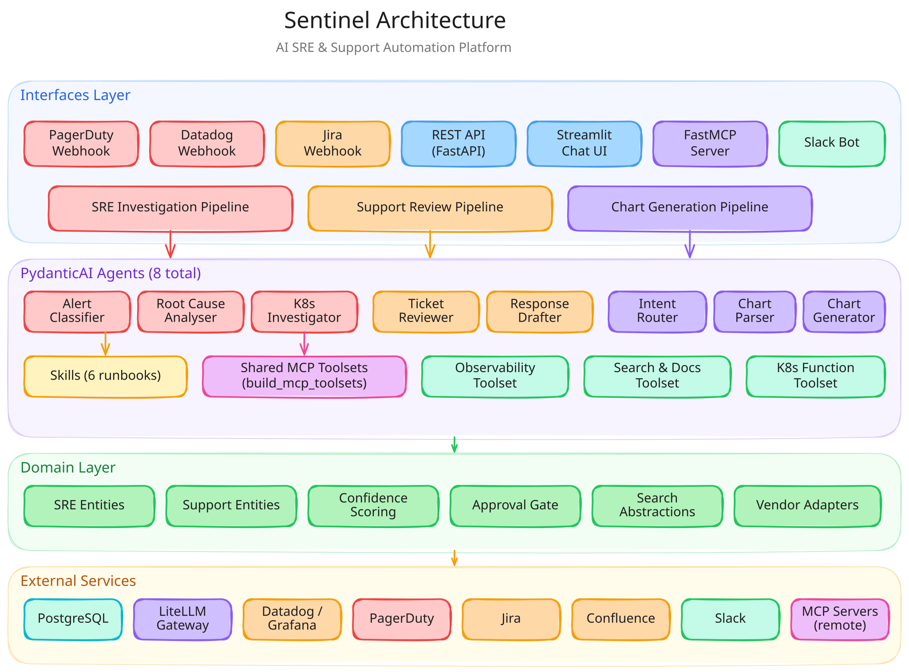
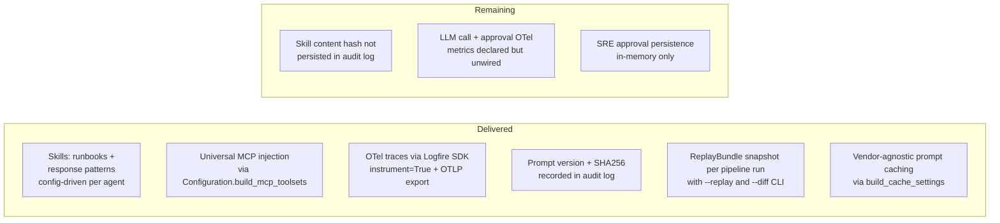

# Sentinel Architecture

## Overview

Sentinel is an AI-powered automation platform with two core capabilities:

1. **AI SRE** - Automatically triages and investigates production alerts from PagerDuty and Datadog, providing root cause analysis and remediation suggestions
2. **AI Support Agent** - Automatically reviews Jira Service Desk tickets, searches documentation (Notion, Confluence, S3), and drafts response suggestions



*[Edit diagram in Excalidraw](https://excalidraw.com/#json=wRNI3EjHOiZB6RasBgYXH,Rllv-zTRH2clCN2e4ED2gQ)*

## Design Principles

- **Clean Architecture** - Strict layered boundaries enforced by import-linter
- **Async-first** - All I/O uses async/await with asyncio.TaskGroup for parallelism
- **Vendor-agnostic** - Abstract base classes for all external integrations; implementations are swappable
- **Feature-flagged** - Pipeline behaviour controlled via environment variables
- **Observable** - Structured logging (structlog), Datadog APM, Sentry error tracking
- **Testable** - Mock adapters for all external services; no LLM calls in unit tests

## Architecture Decisions

### Execution Model

- **PostgreSQL job queue** with `SELECT ... FOR UPDATE SKIP LOCKED` instead of Redis/RabbitMQ/Celery. Supports horizontal scaling by adding worker replicas. No additional infrastructure dependency.
- **Async/await throughout** -- no blocking I/O, no Celery task serialisation overhead.
- **Worker replicas** scale independently from API replicas. Helm HPA configured (disabled by default).

### Scheduled Automations

Scheduled automations live in Sentinel, triggered by Kubernetes CronJobs. The worker gets a `--run-once` mode for CronJob execution. This avoids introducing a new runtime (kagent, Temporal, Argo Workflows) until the need is proven. For Toby's "every Thursday at 5pm" use case, a CronJob creates a K8s Job that hits the Sentinel API, which enqueues a `SCHEDULED_AUTOMATION` job for the worker.

### HolmesGPT Resolution

Two investigation adapters share the `BaseHolmesAdapter` contract:

- **`DirectToolsetAdapter` (default)** — calls DatadogClient, GrafanaClient, and K8sClient directly, providing concurrent observability and Kubernetes queries with circuit breaker protection. No external SDK dependency.
- **`HolmesAdapter` (opt-in)** — wraps the HolmesGPT SDK (`ToolCallingLLM`), using its built-in toolsets (Datadog, Kubernetes, Grafana, etc.) for data gathering. Installed via fork (`offtian/holmesgpt@httpx-compat`) which relaxes the httpx/postgrest pins that conflict with pydantic-ai>=1.0.7. Runs synchronous SDK calls via `asyncio.to_thread()`. Track upstream `robusta-dev/holmesgpt` for when they merge compatible pins — at that point switch the dependency back to PyPI.

Both adapters return `HolmesInvestigationResult` (analysis text, tool calls, sources queried) consumed by the `AnalyseRootCause` pipeline node. `build_holmes_adapter()` in `plugins/config.py` selects the adapter based on configuration.

### OSS Framework Positioning

| Framework | Position |
|-----------|----------|
| PydanticAI + Pydantic Graph | Keep -- current orchestration layer, well-integrated |
| LiteLLM | Keep — SDK mode (in-process), no proxy |
| LangFuse | Adopt via direct integration -- no proxy dependency |
| kagent | **Adopted as CRD-based K8s investigation backend** — `KagentAdapter` delegates via CRD creation/polling; comparison mode with native agent via `K8S_INVESTIGATION_BACKEND=both` |
| agentgateway | Defer until multiple MCP backends or agent runtimes need centralised routing |
| Claude Agent SDK / OpenAI Agent SDK | Evaluate -- may complement PydanticAI for specific workflows |
| LangGraph / LangChain | Evaluate -- compare with Pydantic Graph for complex branching |
| FastMCP | **Adopted everywhere** — server at `interfaces/mcp/`, client builder at `plugins/toolsets/mcp.py` consumed by every pipeline agent via `Configuration.build_mcp_toolsets()` |
| Logfire | Adopt for dev — exports PydanticAI spans via OTel; production swaps the exporter for Datadog APM OTLP |
| Anthropic prompt caching | Adopt — wired via `cache_control` on agent system prompts |
| Skills (file-based runbooks) | Adopt — `domain/skills/` catalogue loaded by `domain.skills.load_skills_for()` |

### Quality Over Time

Quality improvement relies on three feedback loops:
1. **LangFuse** -- per-call cost, latency, and prompt versioning
2. **Eval framework** -- golden test cases with automated scoring, run on prompt changes
3. **Feedback API** -- track accept/reject/modify rates on support suggestions
4. **Skill catalogue** -- when a human rejects an investigation or modifies a response, the supervisor can attach the failure context to the relevant Skill so the runbook accumulates real failure modes over time

## Layer Architecture

```
interfaces/    → FastAPI routers, Pydantic Graph pipelines, webhook handlers, PydanticAI agents, MCP server
  mcp/         → FastMCP server exposing Sentinel tools to external agents
    ↓
application/   → Use cases and orchestration (investigate, triage, review_ticket, search_docs)
  supervisor/  → Quality-gate orchestration (supervise_sre_investigation, supervise_support_review)
    ↓
domain/        → Business entities, search abstractions, vendor adapters, confidence scoring
  sre/         → Alert, Investigation, BaseInvestigationAdapter hierarchy, K8s adapters
  pipeline/    → Pipeline error types (NodeError, PipelineNodeFailed)
  approval/    → ApprovalRequest, ApprovalDecision entities
  supervisor/  → QualityVerdict, SupervisorDecision, quality gate evaluation functions
  evaluation/  → Pipeline-agnostic EvaluationMetrics, ComparisonResult for adapter comparison
    ↓
evals/         → Evaluation framework (pydantic_evals): cases/, evaluators/, runner, reporting, rendering
    ↓
plugins/       → Plugin adapters: toolsets (PydanticAI tool wrappers), MCP client builder
    ↓
data/          → SQLModel database models, Alembic migrations
    ↓
vendors/       → External SDK wrappers (Slack, PagerDuty, Jira, Datadog)
    ↓
utils/         → Logging, shared helpers
    ↓
config         → Centralised configuration (environs + Configuration class)
```

**Rule**: Lower layers cannot import from higher layers. This is enforced via `import-linter` contracts in `pyproject.toml`.

## AI SRE Pipeline

The SRE investigation pipeline is implemented as a Pydantic Graph with the following nodes:

```
ClassifyAlert
  │  PydanticAI agent classifies severity, service, category
  │  (error → NodeError with context, pipeline continues gracefully)
  ↓
InvestigateWithHolmes
  │  HolmesGPT adapter queries observability systems (Datadog, K8s, Prometheus)
  │  (error → PipelineNodeFailed wrapping NodeError)
  ↓
AnalyseRootCause
  │  PydanticAI agent synthesises findings into root cause + remediation
  ↓
DetermineConfidence
  │  Calculate confidence score; if below threshold → approval gate
  │  (requires human approval via POST .../approve or .../reject)
  ↓
PublishFindings
  │  Posts to Slack, adds PagerDuty incident note, persists to database
  ↓
End(InvestigationReply)
```

### Entry Points
- `POST /api/sre/webhooks/pagerduty` - PagerDuty V3 webhook receiver (dedup via `_handle_webhook()`)
- `POST /api/sre/webhooks/datadog` - Datadog webhook receiver (dedup via `_handle_webhook()`)
- `POST /api/sre/investigate` - Manual investigation trigger
- `POST /api/sre/investigations/{id}/approve` - Approve a pending investigation
- `POST /api/sre/investigations/{id}/reject` - Reject a pending investigation
- `GET /api/sre/investigations/{id}/approval-status` - Check approval status

### PublishFindings Integrations

The `PublishFindings` node is wired to three output channels via the `Dependencies` dataclass:

1. **Slack** - Calls `vendors.slack.post_investigation_summary()` with formatted blocks (controlled by `post_to_slack` flag)
2. **PagerDuty** - Calls `PagerDutyClient.add_incident_note()` with markdown-formatted investigation note (skipped if client not configured)
3. **Database** - Calls an injected `PersistInvestigationFn` callback that saves an `InvestigationRecord` via the application persistence layer

### Investigation Adapter Hierarchy

All investigation backends implement `BaseInvestigationAdapter` (defined in `domain/sre/investigation.py`), which provides a unified contract with typed audit trail:

```
BaseInvestigationAdapter (ABC)           domain/sre/investigation.py
├── BaseHolmesAdapter                    domain/sre/holmes_adapter.py
│   ├── HolmesAdapter (stub)
│   └── DirectToolsetAdapter             Queries Datadog/Grafana directly
└── K8sInvestigationAdapter (ABC)        domain/sre/investigation.py
    ├── NativeK8sAgent                   domain/sre/k8s_native_agent.py
    └── KagentAdapter                    domain/sre/kagent_adapter.py
```

- **DirectToolsetAdapter** — queries observability backends directly (resolves HolmesGPT pydantic-ai dependency conflict)
- **NativeK8sAgent** — PydanticAI agent with kubernetes Python client tools (pods, deployments, events, logs)
- **KagentAdapter** — delegates to kagent K8s operator via CRD creation/polling with exponential backoff, timeout handling, and degraded result fallback

All adapters return `InvestigationResult` with an `audit_trail` (typed envelope + freeform payload) for hedge fund compliance traceability. Config-driven backend selection via `K8S_INVESTIGATION_BACKEND` (native/kagent/both).

### MCP Integration

Sentinel integrates with MCP (Model Context Protocol) in both directions:

- **MCP Server** (`interfaces/mcp/server.py`) — FastMCP server exposing observability, documentation, and investigation tools to external agents
- **MCP Client** (`plugins/toolsets/mcp.py`) — consumes external MCP servers (e.g., kubectl MCP server) as PydanticAI toolsets, configured via `MCP_SERVERS` env var

## Agent Capability Plane

Sentinel agents share a uniform capability plane composed of Skills (file-based
runbooks), MCP tool servers, Anthropic prompt caching, and OTel telemetry.
Adding a new runbook, tool server, or model should be a config change, not a
code change.



### Agent Inventory

| Agent | Pipeline | Toolsets | Remaining |
|---|---|---|---|
| `alert_classifier.py` | SRE | shared MCP toolsets | + category-triggered skills |
| `root_cause_analyser.py` | SRE | `analyser_toolsets` + shared MCP | + runbook skills keyed off classifier category |
| `k8s_investigator.py` (via `k8s_runner.py`) | SRE (K8s) | `k8s_toolset` + MCP from `MCP_SERVERS` + `K8S_MCP_SERVER_URL` | complete |
| `intent_router.py` | Slack bot | none | n/a |
| `ticket_reviewer.py` | Support | `reviewer_toolsets` + shared MCP | + category-triggered skills |
| `response_drafter.py` | Support | `drafter_toolsets` + shared MCP | + response pattern skills |
| `chart_request_parser.py` | Chart-coding | none | n/a |
| `chart_generator.py` | Chart-coding | shared MCP | + chart best-practice skills |

### Skills

- On-disk layout: `src/sentinel/domain/skills/<name>/SKILL.md` with frontmatter (`name`, `description`, `applies_to`, `version`)
- Loader: `domain/skills/__init__.py:load_skills_for(category=..., max=N)` returns matching skills sorted deterministically
- Config-driven assignment: `SKILLS_BY_AGENT` dict in `config.py` maps agent names to skill names
- Injection: `compose_system_prompt(base_prompt=..., skill_names=(...))` resolves skill names against the installed catalogue
- Initial catalogue: `k8s-crashloop-runbook`, `database-connection-runbook`, `latency-spike-runbook`, `auth-error-response`, `rate-limit-response`, `chart-helm-best-practices`
- Skills are git-tracked and content-hashed (SHA-256) for replay

### Universal MCP Injection

- `Configuration.build_mcp_toolsets()` in `config.py` is the single memoised builder that parses `MCP_SERVERS` and returns a tuple of `MCPServerSSE` / `MCPServerStdio` instances
- Consumed by every non-router pipeline agent
- The K8s agent keeps its current path (already wired via `k8s_runner.py`)
- The FastMCP server at `interfaces/mcp/server.py` has a `list_skills` tool so external agents can discover the installed runbook catalogue
- New external servers can be added via `MCP_SERVERS` env var alone

## AI Support Pipeline

The support review pipeline follows the same Pydantic Graph pattern:

```
ClassifyTicket
  │  PydanticAI agent classifies category, urgency, extracts key questions + search queries
  │  (error → NodeError with context)
  ↓
SearchDocumentation
  │  Parallel search across Notion, Confluence, S3, and past tickets
  ↓
DraftResponse
  │  PydanticAI agent synthesises documentation into response suggestion
  ↓
DetermineConfidence
  │  Calculate confidence score; approval gate for low-confidence results
  ↓
End(SupportReply)
```

### Entry Points
- `POST /api/support/webhooks/jira` - Jira Service Desk webhook receiver
- `POST /api/support/review` - Manual review trigger

### Search Abstraction

All search backends implement abstract base classes from `domain/search/searcher.py`:

- `BaseDocumentSearcher` - For Notion, Confluence, S3 documents
- `BasePastTicketSearcher` - For searching resolved Jira tickets
- `BaseMetricsSearcher` - For querying metrics/logs (SRE use)

**Note**: Concrete search implementations (NotionSearcher, ConfluenceSearcher, etc.) are planned for Phase 3.

## Vendor Adapters

All vendor adapters live in `domain/vendor_adapters/` and follow a consistent pattern:

- Accept explicit constructor parameters or fall back to `settings` defaults
- Expose an `is_configured` property — operations are no-ops when not configured
- All methods are async-safe

### Observability (pluggable backend)

`domain/vendor_adapters/observability/` implements the `BaseObservabilityClient` ABC with two backends:

| Backend | SDK | When Used | Query Languages |
|---------|-----|-----------|-----------------|
| `DatadogClient` | `datadog-api-client` | Production (`OBSERVABILITY_BACKEND=datadog`) | Datadog query syntax |
| `GrafanaClient` | `httpx` | Local dev / open-source (`OBSERVABILITY_BACKEND=grafana`) | PromQL, LogQL, TraceQL |

When `OBSERVABILITY_BACKEND` is unset, auto-selects Grafana for `ENVIRONMENT=localdev` and Datadog otherwise.

The `GrafanaClient` queries Prometheus (metrics), Loki (logs), and Tempo (traces) through Grafana's unified `/api/ds/query` endpoint. One URL, one API token.

### Other Vendor Adapters

| Adapter | SDK | Key Methods |
|---------|-----|-------------|
| `PagerDutyClient` | `pdpyras` | `add_incident_note()`, `get_incident()`, `update_incident_status()` |
| `JiraClient` | `jira` | `get_issue()`, `search_issues()`, `add_internal_comment()`, `transition_issue()` |
| `ConfluenceClient` | `atlassian-python-api` | `search()`, `get_page_content()` |

## PydanticAI Agents

| Agent | Purpose | Default Model |
|-------|---------|---------------|
| `alert_classifier` | Classify alert severity, service, category | GPT-4.1-mini |
| `root_cause_analyser` | Synthesise findings into root cause + remediation | GPT-4.1 |
| `k8s_investigator` | Diagnose K8s incidents using cluster state tools | GPT-4.1 |
| `ticket_reviewer` | Classify ticket, extract questions, generate search queries | GPT-4.1-mini |
| `response_drafter` | Draft customer response from documentation | GPT-4.1 |

All agents are defined with `model="test"` at module level to avoid import-time validation. The actual model is injected at runtime via PydanticAI's `litellm:` model prefix, which delegates to LiteLLM SDK for in-process provider routing (e.g., `litellm:openai/gpt-4.1-mini`).

## Configuration

Three layers, top to bottom:

- **`settings.py`** — Pydantic `Settings` class. The only module that
  reads env vars; `get_settings()` returns a process-wide singleton.
- **`config.py`** — `BaseConfiguration` (Pydantic). Carries the
  layered configuration fields with firm-wide defaults
  (`investigation_loop_cap`, `investigation_timeout_seconds`,
  `confidence_publish_min`, `redaction_policy`, `approval_policy`,
  `runbooks_paths`, etc.). `team_id` is a property that reads
  `settings.team_profile`. `get_config()` dispatches via
  `TEAM_CONFIG_REFS` to the concrete configuration class.
- **`plugins/common/config.py`** — `CommonConfiguration` (concrete).
  Subclass of `BaseConfiguration` that wires vendor adapters, MCP
  toolsets, agent registry, and HolmesGPT / K8s investigation
  builders.

Profile dispatch lives in `config.py`:

```python
TEAM_CONFIG_REFS: dict[TeamId, str] = {
    "sre": "sentinel.plugins.common.config:CommonConfiguration",
}
```

Future DevOps and ACE profiles add an entry pointing at their own
concrete configuration class.

Policy primitives — `ApprovalPolicy`, `OutputChannel`,
`RedactionPolicy` — live as `attrs.frozen` dataclasses in
`src/sentinel/data/policies.py` and are referenced by
`BaseConfiguration` field defaults.

Key env-var groups (see `.env.default` for the full list):

- **Environment** — `ENVIRONMENT` (`localdev`/`production`),
  `DATABASE_URL`, `TEAM_PROFILE` (`sre`/`devops`/`ace`).
- **LiteLLM proxy** — `LITELLM_BASE_URL`, `LITELLM_VIRTUAL_KEY`
  (unset = in-process SDK fallback).
- **Langfuse** — `LANGFUSE_HOST`, `LANGFUSE_PUBLIC_KEY`,
  `LANGFUSE_SECRET_KEY` (unset = OTel console exporter fallback).
- **OTel collector** — `OTEL_COLLECTOR_ENDPOINT` (firm-shared,
  separate from the signal-specific `OTEL_TRACES_ENDPOINT`).
- **Runbook root** — `RUNBOOKS_ROOT` (loader resolves team-specific
  subdirectories from this path).
- **Observability** — `OBSERVABILITY_BACKEND`, Datadog or Grafana
  credentials.
- **LLM models** — per-agent model selection routed through
  PydanticAI's `litellm:` prefix.
- **SRE / Support / K8s / MCP / Slack / approval** — see
  `.env.default`.
- **Identity envelope** — `REGION`, `ENVELOPE_STRICT_MODE` (see Identity & Envelope below).

## Identity & Envelope

`Envelope` is the single value that carries request identity through every layer of the stack. RFC §3.1, R-IN-3.

```
Webhook POST ──┬─→ RequestIdMiddleware mints/echoes X-Request-Id (UUID)
               │
               ├─→ envelope_factory.envelope_from_<source>() composes Envelope
               │   from request payload + settings (cluster_id, region)
               │
               ├─→ Envelope.tenant_id derivation: namespace label > service
               │   tag > "unknown" + structured warning (or 422 in strict mode)
               │
               ├─→ Router serialises envelope identity onto queued payload
               │   and passes envelope= into investigate_alert/review_ticket
               │
               ├─→ State.envelope flows through every pipeline node
               │
               ├─→ run_node_with_envelope() (in _node_helpers.py) sets the six
               │   envelope-owned mandatory OTel attributes on the node span
               │   (request_id, tenant_id, cluster_id, region, pii_class,
               │   received_at) AND binds Envelope.to_log_context() onto
               │   structlog.contextvars (auto-cleans on exception)
               │
               └─→ Response header X-Request-Id echoes the minted/supplied id
```

`Envelope` lives at `src/sentinel/data/envelope.py` as an `attrs.frozen(kw_only=True, slots=True)` class. Construction enforces tz-aware UTC `received_at`. PII redaction is applied at the log boundary: when `pii_class` is `confidential` or `mnpi`, `to_log_context()` swaps `tenant_id` for a 12-char sha256 `tenant_hash`. Span attributes deliberately keep the raw `tenant_id` because spans are not the redaction boundary; downstream exporters apply policy. The public `is_redacted_pii_class()` predicate exposes the rule for redactor / exporter implementations.

`envelope_factory` (`src/sentinel/interfaces/webhooks/envelope_factory.py`) exposes one builder per ingress source — `envelope_from_pagerduty`, `envelope_from_datadog`, `envelope_from_jira`, plus `envelope_for_manual` for the body-driven `/investigate` and `/review` endpoints. Tenant slugs are sanitised and capped at the k8s namespace limit (63 chars). `BaseConfiguration.envelope_strict_mode` (env: `ENVELOPE_STRICT_MODE`, default `False`) flips soft-fail (warn + fall back to `"unknown"`) to hard-fail (raise `EnvelopeIngressError`, which routers surface as a 422 with a stable JSON shape: `{"error": "envelope_ingress_missing_tenant_id", "source": ..., "request_id": ...}`).

The worker (`worker.py`) rehydrates the envelope from the queued payload's `ingress_request_id` / `pii_class` / `tenant_id` / `cluster_id` / `region` fields so the worker leg keeps the same correlation id and PII classification as the ingress leg. Replay, chat, and Slack callers mint per-invocation placeholder envelopes today; F4.5 retires the replay placeholder and chat/Slack stay until those surfaces gain real tenant resolution.

## Database

PostgreSQL with SQLModel (async via asyncpg). Tables:

| Table | Purpose |
|-------|---------|
| `investigation_records` | Persisted SRE investigations with findings, root cause, confidence, trace_id |
| `ticket_review_records` | Persisted support reviews with suggested responses, sources, feedback status, trace_id |
| `job_requests` | PostgreSQL-backed job queue with FOR UPDATE SKIP LOCKED, trace_id |
| `job_results` | Job execution outcomes (completed/failed/timed_out) |
| `audit_log` | Append-only regulatory audit trail with SHA-256 input hashes |
| `comparison_runs` | Side-by-side investigation backend comparison results |
| `eval_runs` | Evaluation framework execution records |
| `pipeline_runs` | Pipeline execution traces linked by trace_id |
| `node_executions` | Per-node execution traces within a pipeline run |
| `agent_calls` | PydanticAI agent invocation records with message history |

Migrations managed by Alembic.

## Database Access

Two async database clients coexist:

- **`data/database.py`** (SQLAlchemy AsyncSession) — Session factory with connection pooling (`pool_size=5`, `max_overflow=10`). Used by application layer.
- **`data/db.py`** (`databases.Database` singleton) — `get_db()` returns a cached instance; `connect_db()`/`disconnect_db()` manage lifecycle. Used by domain layer queries/operations.

Both are initialised during FastAPI lifespan and worker startup.

## Persistence Layer

Persistence functions live in the **domain layer**, organised by category:

| Domain | Reads | Writes |
|--------|-------|--------|
| SRE | `domain/sre/queries.py` | `domain/sre/operations.py` |
| Support | `domain/support/queries.py` | `domain/support/operations.py` |
| Audit | — | `domain/audit/operations.py` |
| Jobs | `domain/jobs/queries.py` | `domain/jobs/operations.py` |
| Evaluation | `domain/evaluation/queries.py` | `domain/evaluation/operations.py` |
| Pipeline Tracing | `domain/pipeline/queries.py` | `domain/pipeline/operations.py` |

All functions accept `db: databases.Database` as an explicit keyword argument and use SQLAlchemy Core expressions (`select()`, `insert()`, `update()`) with SQLModel classes for type-safe queries.

## Pipeline Traceability

A `trace_id` UUID propagates through three levels, enabling end-to-end correlation across all tables:

```
pipeline_runs (trace_id, pipeline_type, status, duration_ms)
  └── node_executions (trace_id, node_name, node_order, status, duration_ms)
       └── agent_calls (trace_id, agent_name, model_id, messages_json, token_usage_json)
```

**Domain types:** `data/tracing_models.py` defines `PipelineRunRecord`, `NodeExecutionRecord`, `AgentCallRecord`.

**ExecutionTracer** (`domain/pipeline/tracer.py`) — DB-backed tracer that records pipeline runs, node executions, and agent calls with prompt version metadata. Each `AgentCallRecord` captures `prompt_version` (git SHA + filename) and `prompt_sha256` for regulatory traceability. `ReplayBundle` (`domain/pipeline/types.py`) aggregates the full snapshot (model, prompts, MCP servers, skills, input payload) for reproducibility via `python -m sentinel.replay`.

## Deployment

## Helm Chart

Located in `helm/sentinel/`. Multi-deployment chart supporting:

- **api** deployment - FastAPI server (webhook receivers + API endpoints)
- **worker** deployment - Background task processor (optional, configurable via `values.yaml`)
- **mcp-server** deployment - FastMCP server exposing tools (optional, `mcpServer.enabled`)
- **migration-job** - Pre-install/upgrade Helm hook running `alembic upgrade head`
- **ClusterRole/ClusterRoleBinding** - Read-only K8s API access for investigation agent (optional, `k8sAgent.enabled`)
- **HPA** - Per-deployment horizontal pod autoscaler (configurable min/max replicas, CPU target)
- **PDB** - Pod disruption budget (`minAvailable: 1`)
- **Ingress** - AWS ALB with optional Zscaler security group
- **ServiceAccount** - With IRSA annotation for AWS IAM integration

## CI/CD (CircleCI)

Pipeline: `mypy` → `test-and-lint` → `publish-image` → `package-chart`

- Uses PostgreSQL sidecar for integration tests
- Publishes Docker image and Helm chart to ECR as OCI artifacts
- Uses `krakentech/ktl-services-deployment-orb` for chart packaging

## GitOps

Deployed to Kubernetes via ArgoCD through `ktl-services-deployment` repository:

- Secrets encrypted via SOPS + KMS
- IAM roles via IRSA for AWS service access
- Datadog APM for observability

## Test Count

770+ tests covering:

- Domain entities and operations (SRE, Support, Confidence, Search, Pipeline errors, Approval, Supervisor)
- Webhook parsers (PagerDuty, Datadog) with dedup handling
- Vendor adapters (Datadog, PagerDuty, Jira, Confluence)
- DirectToolsetAdapter (14 tests)
- Persistence layer (database session management)
- API routers (support feedback, SRE approval endpoints)
- API app lifecycle
- Slack message formatting
- Pipeline node error handling tests
- Approval gate and supervisor quality gate tests
- Evaluation framework (pydantic_evals based)
- Domain layer persistence (queries and operations via databases library)
- Pipeline traceability (trace_id correlation, pipeline/node/agent recording)
- Prompt versioning (version/hash round-trip, replay bundle serialisation)
- Prompt caching (vendor-agnostic cache settings, agent integration)
- K8s investigation adapters (NativeK8sAgent, KagentAdapter, comparison wiring)
- MCP server tools (observability, documentation, investigation endpoints)
- MCP client builder (HTTP and stdio server configs)
- Kagent CRD lifecycle (creation, polling, result mapping, timeout handling)
- K8s vendor client (namespace validation, resource queries, field selector sanitization)

## Key Reference Files

| Pattern | Source File |
|---------|-----------|
| Pydantic Graph pipeline | `src/sentinel/interfaces/graphs/sre_investigation.py` |
| Search abstraction | `src/sentinel/domain/search/searcher.py` |
| PydanticAI agents | `src/sentinel/interfaces/graphs/agents/alert_classifier.py` |
| Model routing helper | `src/sentinel/interfaces/graphs/agents/utils.py` |
| Configuration pattern | `src/sentinel/config.py`, `src/sentinel/settings.py` |
| Import-linter contracts | `pyproject.toml` |
| Confidence scoring | `src/sentinel/domain/confidence/entities.py` |
| Automation runner | `src/sentinel/application/automations/runner.py` |
| Quality gate | `src/sentinel/domain/supervisor/quality_gate.py` |
| Supervisor orchestrator | `src/sentinel/application/supervisor/orchestrator.py` |
| Approval entities | `src/sentinel/domain/approval/entities.py` |
| Investigation adapter hierarchy | `src/sentinel/domain/sre/investigation.py` |
| K8s native agent | `src/sentinel/domain/sre/k8s_native_agent.py` |
| Kagent adapter | `src/sentinel/domain/sre/kagent_adapter.py` |
| K8s tools | `src/sentinel/domain/tools/kubernetes.py` |
| MCP server | `src/sentinel/interfaces/mcp/server.py` |
| MCP client builder | `src/sentinel/plugins/toolsets/mcp.py` |
| Evaluation metrics | `src/sentinel/domain/evaluation/metrics.py` |
| Helm chart | `helm/sentinel/values.yaml` |
| Skills loader | `src/sentinel/domain/skills/__init__.py` |
| Universal MCP builder | `src/sentinel/config.py` `Configuration.build_mcp_toolsets()` |
| Prompt templates | `src/sentinel/domain/prompts/` |
| Prompt cache settings | `src/sentinel/interfaces/graphs/agents/_cache_settings.py` |
| Replay CLI | `src/sentinel/replay.py` |
| ReplayBundle type | `src/sentinel/domain/pipeline/types.py` |
| OTel bootstrap | `src/sentinel/bootstrap_otel.py` |
