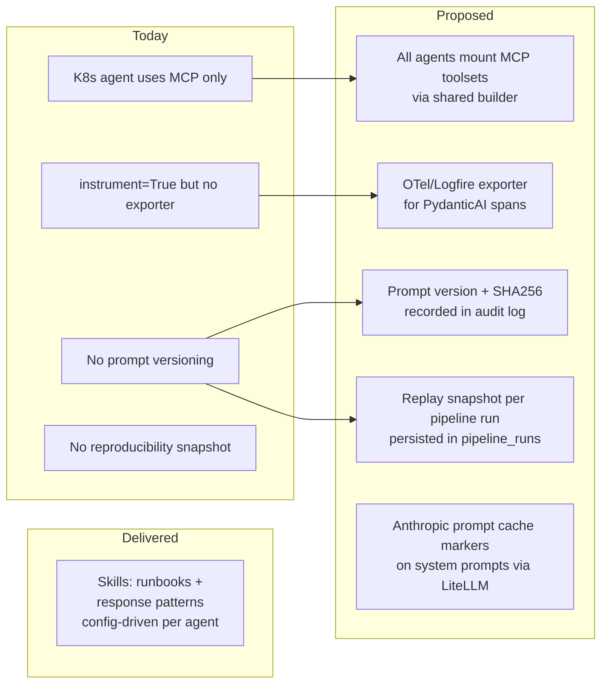

# Sentinel: AI SRE + AI Support Agent

## Context

The team needs two AI-powered automation capabilities:

1. **AI SRE** - Automatically triage and investigate production alerts from PagerDuty + Datadog, provide root cause analysis and remediation suggestions
2. **AI Support Agent** - Automatically review Jira Service Desk tickets, search mixed documentation (Notion, Confluence, S3), and suggest responses

These live in the `sentinel` repository following clean architecture patterns. The AI SRE uses a **hybrid approach** with a DirectToolsetAdapter that queries observability backends directly (replacing the HolmesGPT SDK due to a pydantic-ai dependency conflict).

> Status tracking lives in @prd.md (acceptance criteria checkboxes).
> This file contains operational context for AI sessions — architecture decisions, gotchas, and reference material.

---

## Repository Structure

```
sentinel/
├── src/sentinel/
│   ├── _config.py                    # Centralised config (pydantic-settings)
│   ├── main.py                       # Entrypoint
│   ├── version/
│   │   └── __init__.py
│   │
│   ├── interfaces/                   # Layer 1: Entry points
│   │   ├── api/                      # FastAPI app
│   │   │   ├── app.py
│   │   │   └── routers/
│   │   │       ├── sre/              # SRE endpoints (webhook receivers, investigation triggers)
│   │   │       └── support/          # Support endpoints (ticket processing, suggestion retrieval)
│   │   ├── graphs/                   # Pydantic Graph pipelines
│   │   │   ├── sre_investigation.py  # Alert triage → investigate → analyse → respond
│   │   │   ├── support_review.py     # Ticket intake → search docs → draft response
│   │   │   └── agents/              # PydanticAI agent definitions (factory pattern)
│   │   │       ├── __init__.py       # Agent registry exports
│   │   │       ├── alert_classifier.py   # build_agent(model, skills)
│   │   │       ├── root_cause_analyser.py
│   │   │       ├── k8s_investigator.py
│   │   │       ├── k8s_runner.py        # Agent runner (layer bridge for DI)
│   │   │       ├── intent_router.py
│   │   │       ├── ticket_reviewer.py
│   │   │       ├── response_drafter.py
│   │   │       ├── chart_generator.py
│   │   │       ├── chart_request_parser.py
│   │   │       └── utils.py          # LiteLLM gateway helper, append_skills_to_prompt
│   │   ├── mcp/                      # MCP server (FastMCP)
│   │   │   ├── server.py             # FastMCP app definition
│   │   │   └── tools/                # MCP tool wrappers
│   │   │       ├── observability.py
│   │   │       ├── documentation.py
│   │   │       └── investigation.py
│   │   └── webhooks/                 # PagerDuty/Datadog webhook handlers
│   │       ├── pagerduty.py
│   │       └── datadog.py
│   │
│   ├── application/                  # Layer 2: Use cases
│   │   ├── sre/
│   │   │   ├── investigate.py        # Orchestrates HolmesGPT + custom pipeline
│   │   │   └── triage.py             # Alert dedup, severity classification
│   │   ├── support/
│   │   │   ├── review_ticket.py      # Ticket analysis use case
│   │   │   └── search_docs.py        # Multi-source document retrieval
│   │   ├── supervisor/               # Quality-gate orchestration
│   │   │   └── orchestrator.py       # supervise_sre_investigation(), supervise_support_review()
│   │   └── automations/
│   │       └── runner.py             # Automation registry and execution
│   │
│   ├── domain/                       # Layer 3: Business logic
│   │   ├── sre/
│   │   │   ├── entities.py           # Alert, Investigation, RootCause, Remediation
│   │   │   ├── investigation.py      # BaseInvestigationAdapter, K8sInvestigationAdapter ABCs, AuditEntry, InvestigationResult
│   │   │   ├── holmes_adapter.py     # BaseHolmesAdapter (extends BaseInvestigationAdapter) + DirectToolsetAdapter
│   │   │   ├── k8s_native_agent.py   # NativeK8sAgent — PydanticAI agent + K8s tools
│   │   │   ├── kagent_adapter.py     # KagentAdapter — delegates to kagent CRDs
│   │   │   ├── operations.py         # Investigation lifecycle management + persist_investigation
│   │   │   └── queries.py            # fetch_investigation, fetch_by_alert_id, fetch_by_service
│   │   ├── support/
│   │   │   ├── entities.py           # Ticket, ResponseSuggestion, DocSource
│   │   │   ├── operations.py         # Ticket review lifecycle + persist_ticket_review, update_review_status
│   │   │   └── queries.py            # fetch_ticket_review, fetch_by_ticket, fetch_review_stats
│   │   ├── confidence/               # Shared confidence scoring
│   │   │   └── entities.py           # ConfidenceScore.from_factors(), from_total()
│   │   ├── search/                   # Shared search abstractions
│   │   │   └── searcher.py           # BaseDocumentSearcher, BaseMetricsSearcher
│   │   ├── pipeline/                 # Pipeline error and state types
│   │   │   ├── errors.py             # NodeError, PipelineNodeFailed
│   │   │   ├── types.py              # PipelineState, GraphRunResult, shared graph types
│   │   │   ├── operations.py         # persist/complete pipeline_run, node_execution, agent_call
│   │   │   └── queries.py            # fetch_pipeline_run, fetch_node_executions, fetch_agent_calls
│   │   ├── approval/                 # Human approval gate
│   │   │   └── entities.py           # ApprovalRequest, ApprovalDecision
│   │   ├── supervisor/               # Quality gate evaluation
│   │   │   └── quality_gate.py       # evaluate_sre_quality(), evaluate_support_quality()
│   │   ├── evaluation/               # Pipeline-agnostic evaluation metrics
│   │   │   ├── metrics.py            # EvaluationMetrics (12 dimensions)
│   │   │   ├── comparison.py         # ComparisonResult for adapter A/B testing
│   │   │   ├── operations.py         # persist_comparison_run, persist_eval_run
│   │   │   └── queries.py            # fetch_comparison_runs, fetch_eval_runs
│   │   ├── audit/                    # Regulatory audit trail
│   │   │   └── operations.py         # record_audit_entry
│   │   ├── jobs/                     # Job queue domain logic
│   │   │   ├── operations.py         # enqueue_job, claim_next_job, complete_job, fail_job
│   │   │   └── queries.py            # fetch_job
│   │   ├── tools/                    # Domain tool definitions
│   │   │   ├── documentation.py      # Documentation search tool functions
│   │   │   ├── kubernetes.py         # K8s query tool functions (pods, deployments, events, logs)
│   │   │   └── observability.py      # Observability query tool functions
│   │   └── vendor_adapters/          # Vendor-specific implementations
│   │       ├── pagerduty.py          # PagerDuty API client
│   │       ├── datadog_client.py     # Datadog API (logs, metrics, traces)
│   │       ├── jira.py               # Jira Service Desk client
│   │       ├── notion.py             # Notion search (S3-backed approach)
│   │       ├── confluence.py         # Confluence REST API client
│   │       └── s3.py                 # S3 document retrieval
│   │
│   ├── evals/                        # Evaluation framework (pydantic_evals)
│   │   ├── cases/                    # Test case definitions and golden datasets
│   │   ├── evaluators/               # Keyword coverage, structural evaluators
│   │   ├── runner.py                 # Eval runner entry point
│   │   ├── reporting.py              # EvaluationReport with assertion/score averages
│   │   └── rendering.py              # Rich console table output
│   │
│   ├── plugins/                      # Plugin adapters (toolsets, prompts, skills)
│   │   ├── toolsets/                 # PydanticAI toolset wrappers
│   │   │   ├── documentation.py      # Documentation toolset for agents
│   │   │   ├── kubernetes.py         # K8s toolset for investigation agents
│   │   │   ├── mcp.py                # MCP client toolset builder
│   │   │   └── observability.py      # Observability toolset for agents
│   │   ├── skills/                   # File-based operational runbooks
│   │   │   ├── __init__.py           # load_skills_for(), compose_system_prompt(), all_installed_skills()
│   │   │   ├── k8s-crashloop-runbook/SKILL.md
│   │   │   ├── database-connection-runbook/SKILL.md
│   │   │   ├── latency-spike-runbook/SKILL.md
│   │   │   ├── auth-error-response/SKILL.md
│   │   │   ├── rate-limit-response/SKILL.md
│   │   │   └── chart-helm-best-practices/SKILL.md
│   │   └── prompts/                  # Jinja2 agent system prompt templates
│   │
│   ├── data/                         # Layer 4: Persistence (models only)
│   │   ├── database.py               # SQLAlchemy async engine singleton
│   │   ├── db.py                     # databases.Database singleton (get_db, connect_db, disconnect_db)
│   │   ├── models.py                 # InvestigationRecord, TicketReviewRecord
│   │   ├── job_models.py             # JobRequestRecord, JobResultRecord
│   │   ├── audit_models.py           # AuditLogRecord
│   │   ├── evaluation_models.py      # ComparisonRunRecord, EvalRunRecord
│   │   ├── tracing_models.py         # PipelineRunRecord, NodeExecutionRecord, AgentCallRecord
│   │   └── migrations/               # Alembic migrations
│   │
│   ├── vendors/                      # Layer 5: External SDK wrappers
│   │   ├── pagerduty.py              # pdpyras or REST client
│   │   ├── datadog.py                # datadog-api-client
│   │   ├── jira.py                   # jira or atlassian-python-api
│   │   ├── slack.py                  # slack_bolt (for posting findings)
│   │   └── holmes.py                 # holmesgpt SDK init
│   │
│   ├── utils/
│   │   └── logs.py                   # structlog + Datadog injection
│   └── bootstrap.py
│
├── tests/
│   ├── unit/
│   ├── integration/
│   ├── functional/
│   └── factories/
│
├── helm/sentinel/                    # Helm chart
├── .github/workflows/ci.yml
├── pyproject.toml
├── Makefile
├── Dockerfile
├── CLAUDE.md
└── README.md
```

### Import-Linter Contracts (in pyproject.toml)

```toml
[tool.importlinter]
root_package = "sentinel"
include_external_packages = true

[[tool.importlinter.contracts]]
name = "Top level layers"
type = "layers"
exhaustive = true
containers = ["sentinel"]
layers = [
    "main",
    "worker",
    "config",
    "interfaces",
    "application",
    "evals",
    "plugins",
    "domain",
    "data",
    "vendors",
    "bootstrap",
    "utils",
    "settings",
    "version",
]
```

---

## Architecture Decisions

### Execution Model

- **PostgreSQL job queue** with `SELECT ... FOR UPDATE SKIP LOCKED` instead of Redis/RabbitMQ/Celery. Supports horizontal scaling by adding worker replicas. No additional infrastructure dependency.
- **Async/await throughout** -- no blocking I/O, no Celery task serialisation overhead.
- **Worker replicas** scale independently from API replicas. Helm HPA configured (disabled by default).

### Scheduled Automations

Scheduled automations live in Sentinel, triggered by Kubernetes CronJobs. The worker gets a `--run-once` mode for CronJob execution. This avoids introducing a new runtime (kagent, Temporal, Argo Workflows) until the need is proven. For Toby's "every Thursday at 5pm" use case, a CronJob creates a K8s Job that hits the Sentinel API, which enqueues a `SCHEDULED_AUTOMATION` job for the worker.

### HolmesGPT Resolution

HolmesGPT SDK has a dependency conflict with pydantic-ai>=1.0.7. Rather than waiting for an upstream fix, `DirectToolsetAdapter` calls the existing DatadogClient and PagerDutyClient vendor adapters directly. This gives real observability data without the SDK. HolmesGPT can be reconsidered later.

### OSS Framework Positioning

| Framework | Position |
|-----------|----------|
| PydanticAI + Pydantic Graph | Keep -- current orchestration layer, well-integrated |
| LiteLLM | Keep -- model routing gateway, already deployed |
| LangFuse | Adopt via LiteLLM callbacks -- no direct dependency |
| kagent | Narrow pilot for K8s troubleshooting -- not a replacement |
| agentgateway | Defer until multiple MCP backends or agent runtimes need centralised routing |
| Claude Agent SDK / OpenAI Agent SDK | Evaluate -- may complement PydanticAI for specific workflows |
| LangGraph / LangChain | Evaluate -- compare with Pydantic Graph for complex branching |
| FastMCP | **Adopted everywhere** — server at `interfaces/mcp/`, client builder at `plugins/toolsets/mcp.py` consumed by every pipeline agent via `Configuration.build_mcp_toolsets()` |
| Logfire | Adopt for dev — exports PydanticAI spans via OTel; production swaps the exporter for Datadog APM OTLP |
| Anthropic prompt caching | Adopt — wired via LiteLLM `extra_body` `cache_control` on agent system prompts |
| Skills (file-based runbooks) | Adopt — `plugins/skills/` catalogue loaded by `plugins.skills.load_skills_for()` |

### Quality Over Time

Quality improvement relies on three feedback loops:
1. **LangFuse** -- per-call cost, latency, and prompt versioning
2. **Eval framework** -- golden test cases with automated scoring, run on prompt changes
3. **Feedback API** -- track accept/reject/modify rates on support suggestions
4. **Skill catalogue** -- when a human rejects an investigation or modifies a response, the supervisor can attach the failure context to the relevant Skill so the runbook accumulates real failure modes over time

---

## Pipeline Details

### SRE Investigation Pipeline

```
ClassifyAlert → InvestigateWithHolmes → AnalyseRootCause → DetermineConfidence → PublishFindings
```

- Each node has structured error handling via `NodeError` / `PipelineNodeFailed`
- Critical nodes fail pipeline cleanly; degradable nodes continue with partial results
- `DetermineConfidence` enforces approval gate below configurable confidence threshold
- `PublishFindings` uses `gather(return_exceptions=True)` so one channel failure doesn't block others
- Supervisor orchestrator wraps the pipeline with quality gating, retry, and escalation

### Support Review Pipeline

```
ClassifyTicket → SearchDocumentation → DraftResponse → DetermineConfidence
```

- `SearchDocumentation` uses `asyncio.TaskGroup()` for parallel doc + ticket search
- Same error handling and supervisor wrapping pattern as SRE pipeline

---

## Agent Capability Plane

Sentinel agents share a uniform capability plane composed of Skills (file-based
runbooks), MCP tool servers, Anthropic prompt caching, and OTel telemetry.
Adding a new runbook, tool server, or model should be a config change, not a
code change.



### Agent inventory (current vs. proposed)

| Agent | Pipeline | Toolsets today | Proposed |
|---|---|---|---|
| `alert_classifier.py` | SRE | none | shared MCP toolsets + category-triggered skills |
| `root_cause_analyser.py` | SRE | `analyser_toolsets` | + shared MCP + runbook skills keyed off classifier category |
| `k8s_investigator.py` (via `k8s_runner.py`) | SRE (K8s) | `k8s_toolset` + MCP from `MCP_SERVERS` + `K8S_MCP_SERVER_URL` | unchanged (reference implementation) |
| `intent_router.py` | Slack bot | none | n/a |
| `ticket_reviewer.py` | Support | `reviewer_toolsets` | + shared MCP + category-triggered skills |
| `response_drafter.py` | Support | `drafter_toolsets` | + shared MCP + response pattern skills |
| `chart_request_parser.py` | Chart-coding | none | n/a |
| `chart_generator.py` | Chart-coding | none | + chart best-practice skills |

### Skills layout

- On-disk layout: `src/sentinel/plugins/skills/<name>/SKILL.md` plus any
  supporting files. Frontmatter fields: `name`, `description`, `applies_to`,
  `version`.
- Loader: `plugins/skills/__init__.py:load_skills_for(category=..., max=N)`
  returns matching skills sorted deterministically (for reproducibility).
- Config-driven assignment: `SKILLS_BY_AGENT` dict in `config.py` maps agent
  names to skill names. `Configuration.load_agents()` calls each agent's
  `build_agent(model=..., skills=(...))` factory with the configured skills.
- Injection: `compose_system_prompt(base_prompt=..., skill_names=(...))` in
  `plugins/skills/__init__.py` resolves skill names against the installed
  catalogue, raising `SkillNotFoundError` on typos.
- Legacy dynamic injection via `append_skills_to_prompt` / `render_skills_section`
  in `agents/utils.py` is deprecated in favour of the config-driven approach.
- Initial catalogue: `k8s-crashloop-runbook`, `database-connection-runbook`,
  `latency-spike-runbook`, `auth-error-response`, `rate-limit-response`,
  `chart-helm-best-practices`.
- Skills are git-tracked and content-hashed (SHA-256) for replay.

### Universal MCP injection

- `Configuration.build_mcp_toolsets()` in `config.py` becomes the single
  memoised builder that parses `MCP_SERVERS` and returns a tuple of
  `MCPServerSSE` / `MCPServerStdio` instances.
- Consumed by every non-router pipeline agent (`root_cause_analyser`,
  `alert_classifier`, `ticket_reviewer`, `response_drafter`, `chart_generator`).
- The K8s agent keeps its current path (already wired via `k8s_runner.py`).
- The FastMCP server at `interfaces/mcp/server.py` gains a `list_skills` tool
  so external agents can discover the installed runbook catalogue.
- New external servers (Datadog MCP, GitHub MCP, Confluence MCP, internal
  runbook MCPs) can be added via `MCP_SERVERS` env var alone.

### Prompt caching

- `interfaces/graphs/agents/utils.py:get_model_with_gateway()` (or a wrapper)
  is extended to attach Anthropic `cache_control` on system prompts via
  LiteLLM `extra_body`.
- Cache key = prompt SHA + model id. Targets the ~600-token static system
  prompts reused on every alert/ticket; expected -50–80% TTFT and cost.

### Telemetry exporter

- `bootstrap.initialise()` configures an OTLP exporter so the existing
  PydanticAI `instrument=True` spans land somewhere visible.
- Dev: Logfire via `logfire.configure()` (lowest-friction, ships native
  PydanticAI integration).
- Prod: Datadog APM via OTLP exporter pointed at the cluster APM agent.

---

## Reproducibility & Replay

### Prompt versioning

- `plugins/prompts/__init__.py` computes and caches, per template:
  - `prompt_version` = git SHA + file basename
  - `prompt_sha256` = SHA-256 of rendered template content
- `load_system_prompt()` returns a `PromptHandle` attrs class carrying the
  rendered text plus the version/hash triple.

### Pipeline run snapshot

- Every graph node call writes through to
  `domain/pipeline/operations.py:persist_node_execution()` (already exists)
  with input/output JSON.
- The graph entrypoint writes a `PipelineRunRecord` capturing the input
  payload, model ids, MCP server endpoints used, active skills (names +
  hashes), and the final reply.

### Audit linkage

- `domain/audit/operations.py:record_audit_entry()` is called from the
  supervisor decision step with `prompt_version`, `prompt_sha256`, `model_id`,
  `input_hash`, and the `pipeline_run_id`, so each audit row links back to
  the full snapshot.

### Replay

- New domain helper
  `domain/pipeline/queries.py:fetch_replay_bundle(run_id)` returns everything
  needed to rerun a historical investigation: prompt version/hash, model id,
  MCP endpoints, skills, and input payload.
- A future CLI `python -m sentinel.replay <run_id>` is planned separately for
  regulator playback.

### Domain Entities

```python
# domain/sre/entities.py
class Alert(BaseModel):       # id, source, title, description, severity, service, triggered_at, raw_payload
class Investigation(BaseModel): # id, alert, status, findings, root_cause, remediation, confidence
class Finding(BaseModel):      # source, summary, raw_data, relevance

# domain/support/entities.py
class Ticket(BaseModel):             # id, key, summary, description, reporter, priority, labels, comments
class ResponseSuggestion(BaseModel): # ticket_id, suggested_response, sources, confidence, category
class DocSource(BaseModel):          # title, url, source_type, excerpt, relevance

# domain/confidence/entities.py
class ConfidenceScore:  # from_factors(source_count, relevance, recency) or from_total(total)
```

---

## Deployment

### Infrastructure (separate repo)

- Terraform: ECR repos, IAM role with S3 access, Secrets Manager, ACM cert, KMS key for SOPS
- K8s config: `services-eks-test/applications/sentinel/` with config.yaml, values.yaml, values.encrypted.yaml

### Helm Chart Deployments

1. **api** - FastAPI server (webhook receivers + API)
2. **worker** - Background task processor (async PostgreSQL job queue)
3. **CronJob template** - Parameterised for scheduled automations

---

## Dependencies

```toml
[project]
dependencies = [
    # Core
    "environs",
    "fastapi[standard]",
    "sqlalchemy[asyncio]",
    "sqlmodel",
    "asyncpg",
    "alembic",
    "pydantic-ai>=1.0.7",
    "structlog",

    # HolmesGPT
    "holmesgpt",

    # Vendors
    "pdpyras",                    # PagerDuty
    "datadog-api-client",         # Datadog
    "jira",                       # Jira (or atlassian-python-api)
    "atlassian-python-api",       # Confluence
    "boto3",                      # AWS S3/Bedrock
    "aioboto3",
    "slack_bolt",                 # Slack

    # Observability
    "ddtrace",
    "sentry-sdk",
]
```

---

## Verification

### Local Development
```bash
just install                    # UV install
just run-api                    # FastAPI on localhost:8000
just run-worker                 # Background worker
just test                       # Unit tests
just test-integration           # Integration tests
just test-evals                 # Functional/eval tests
just lint                       # Ruff + MyPy + import-linter
just k8s-up                     # Deploy to local K8s
```

### SRE Testing
1. Send a mock PagerDuty webhook to `POST /api/sre/webhooks/pagerduty` -- returns 202 with `job_id`
2. Poll `GET /api/jobs/{job_id}` until status is `completed`
3. Verify investigation graph executes (check logs or job result)
4. Verify Slack message posted to test channel
5. Verify investigation persisted in `investigation_records` table

### Support Testing
1. Send a mock Jira webhook to `POST /api/support/webhooks/jira` -- returns 202 with `job_id`
2. Poll `GET /api/jobs/{job_id}` until status is `completed`
3. Verify review graph executes with doc search
4. Verify response suggestion in job result JSON

---

## Key Reference Files

| Pattern | Source File |
|---------|-----------|
| Pydantic Graph pipeline | `src/sentinel/interfaces/graphs/sre_investigation.py` |
| Search abstraction | `src/sentinel/domain/search/searcher.py` |
| PydanticAI agents | `src/sentinel/interfaces/graphs/agents/alert_classifier.py` |
| LiteLLM gateway helper | `src/sentinel/interfaces/graphs/agents/utils.py` |
| Configuration pattern | `src/sentinel/config.py`, `src/sentinel/settings.py` |
| Import-linter contracts | `pyproject.toml` |
| Confidence scoring | `src/sentinel/domain/confidence/entities.py` |
| Automation runner | `src/sentinel/application/automations/runner.py` |
| Quality gate | `src/sentinel/domain/supervisor/quality_gate.py` |
| Supervisor orchestrator | `src/sentinel/application/supervisor/orchestrator.py` |
| Approval entities | `src/sentinel/domain/approval/entities.py` |
| Investigation adapter hierarchy | `src/sentinel/domain/sre/investigation.py` |
| K8s native agent | `src/sentinel/domain/sre/k8s_native_agent.py` |
| Kagent adapter | `src/sentinel/domain/sre/kagent_adapter.py` |
| K8s tools | `src/sentinel/domain/tools/kubernetes.py` |
| MCP server | `src/sentinel/interfaces/mcp/server.py` |
| MCP client builder | `src/sentinel/plugins/toolsets/mcp.py` |
| Evaluation metrics | `src/sentinel/domain/evaluation/metrics.py` |
| Helm chart | `helm/sentinel/values.yaml` |
| Skills loader | `src/sentinel/plugins/skills/__init__.py` |
| Universal MCP builder | `src/sentinel/config.py` `Configuration.build_mcp_toolsets()` (planned) |
| Prompt versioning | `src/sentinel/plugins/prompts/__init__.py` `PromptHandle` (planned) |
| Pipeline run snapshot persistence | `src/sentinel/domain/pipeline/operations.py` (existing — needs callers) |
| Telemetry exporter setup | `src/sentinel/bootstrap.py` (planned) |
