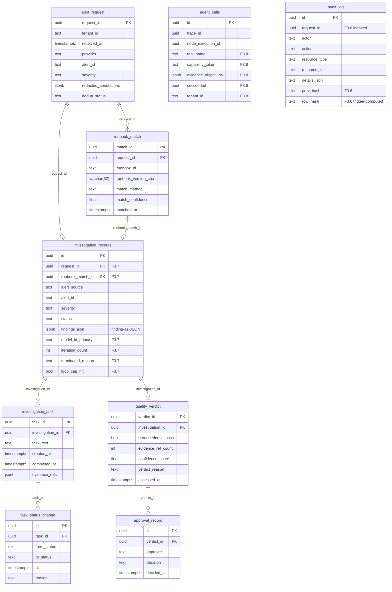

# `data/sql/` — SQLModel Tables

This folder defines every persistent table in the Sentinel app database. Each
module owns a small, related cluster of `SQLModel(table=True)` classes — no
business logic lives here, only the schema and constraints.

## Module map

| Module | Tables | Purpose | RFC reference |
|---|---|---|---|
| `alert_requests.py` | `alert_request` | Webhook ingestion row, keyed by `request_id` | §12.3.1 |
| `runbooks.py` | `runbook_match` | Runbook selection per request | §12.3.2 |
| `investigations.py` | `investigation_records` | Headline investigation row (carries `findings_json`) | §12.3.4 |
| `tasks.py` | `investigation_task`, `task_status_change` | Per-investigation task list + transitions | §12.3.7 |
| `quality.py` | `quality_verdict`, `approval_record` | Groundedness verdict + approval log | §12.3.8 |
| `audit.py` | `audit_log` | Append-only WORM trail (Postgres trigger-enforced) | §12.3.10 |
| `tracing.py` | `pipeline_runs`, `node_executions`, `agent_calls` | Pipeline / node / LLM-call telemetry; `agent_calls` doubles as the foundations `tool_call` row | §12.3.6 |
| `tickets.py` | `ticket_review_records` | Support-pipeline ticket reviews (separate domain) | — |
| `jobs.py` | `job_request_records`, `job_result_records` | Async job queue rows | — |
| `evaluation.py` | `comparison_runs`, `eval_runs` | Evaluation framework rows | — |
| `incident_memory.py` | `incident_memory` | Per-tenant/cluster long-term incident recall row | — |
| `incident_memory_embeddings.py` | `incident_memory_embeddings` | Vector index over `alert` / `root_cause` / `remediation` sections of each memory | — |

The first six rows are the **F3 RFC-canonical chain** (foundations slice). The
RFC §12.3.5 dedicated `finding` table is intentionally absent in foundations —
findings live as JSONB on `investigation_records.findings_json` until the
wk5+ groundedness work earns the dedicated table.

## Foreign-key relationships

`audit_log` carries `request_id` for chain-grouping but is **not** a foreign
key — the row chain is informational and survives the deletion of upstream
parents (deliberately, since `audit_log` is the long-term WORM record).

`agent_calls` similarly does not have a foreign key into `investigation_records`
yet — it links via `trace_id` / `node_execution_id` from the tracing pipeline.
A direct FK into `investigation_records.request_id` is wk5+ work.

## WORM enforcement on `audit_log`

Migration `012_audit_log_worm_constraints.py` installs two Postgres triggers on
`audit_log`:

- **`audit_log_compute_row_hash_trigger`** — `BEFORE INSERT`, computes
  `row_hash = sha256(coalesce(prev_hash,'') || actor || action || resource_type || resource_id || details_json || timestamp::text)`
  and writes the hex digest into `NEW.row_hash`. Provides a tamper-evident
  hash chain when callers populate `prev_hash` from the previous row in the
  same `request_id` group.
- **`audit_log_worm_guard_update_trigger`** + **`audit_log_worm_guard_delete_trigger`**
  — `BEFORE UPDATE / BEFORE DELETE`, both raise
  `audit_log is append-only - UPDATE/DELETE forbidden`. The trigger is the
  enforcement point in foundations; full role-based separation
  (`audit_writer` Postgres role) is wk5+ work per the F0.6 ADR.

The Postgres `pgcrypto` extension is created idempotently by migration 012
(`CREATE EXTENSION IF NOT EXISTS pgcrypto`) and is **not** dropped on
downgrade — it may be in use elsewhere.

## Migrations

Migrations live at `src/sentinel/data/migrations/alembic/versions/`. The F3
foundations slice spans revisions **008 → 013**:

| Revision | Adds | Module |
|---|---|---|
| `008_alert_request_table.py` | `alert_request` | `alert_requests.py` |
| `009_runbook_match_table.py` | `runbook_match` | `runbooks.py` |
| `010_investigation_task_table.py` | `investigation_task`, `task_status_change` | `tasks.py` |
| `011_quality_verdict_table.py` | `quality_verdict`, `approval_record` | `quality.py` |
| `012_audit_log_worm_constraints.py` | WORM triggers + `request_id`/`prev_hash`/`row_hash` columns on `audit_log` | `audit.py` |
| `013_extend_investigation_tool_call.py` | F3.7 columns on `investigation_records` + F3.8 columns on `agent_calls` | `investigations.py`, `tracing.py` |

Every F3 migration is reversible end-to-end (`just run-db-migrations` →
`just downgrade-db-migration` cleanly removes the changes). The full chain is
exercised by `tests/integration/test_8_canonical_tables.py`.

## Conventions

- Models use SQLModel (`SQLModel(table=True)`) — Pydantic-like field syntax
  with SQLAlchemy column declarations under the hood.
- `__tablename__` is set explicitly on every model (no relying on the
  pluraliser).
- UUID PKs use `Field(default_factory=uuid.uuid4, ...)` paired with
  `postgresql.UUID(as_uuid=True)` for new tables. Older tables (existing
  before F3) use the SQLModel default `Uuid` type; mixing is intentional and
  not unifying is a deferred cleanup.
- All timestamps are `timestamptz` (`Column(DateTime(timezone=True), nullable=False)`)
  with `default_factory=lambda: datetime.now(tz=UTC)`.
- Foreign keys carry an explicit constraint name (`fk_<child>_<parent>`) so
  alembic downgrade can drop them cleanly.
- Discriminator columns (`provider`, `match_method`, etc.) are stored as
  Text/varchar — Postgres ENUM types are deferred to a later cleanup pass.
- New SQLModel modules must be registered in
  `src/sentinel/data/migrations/alembic/env.py` so autogeneration sees them.
